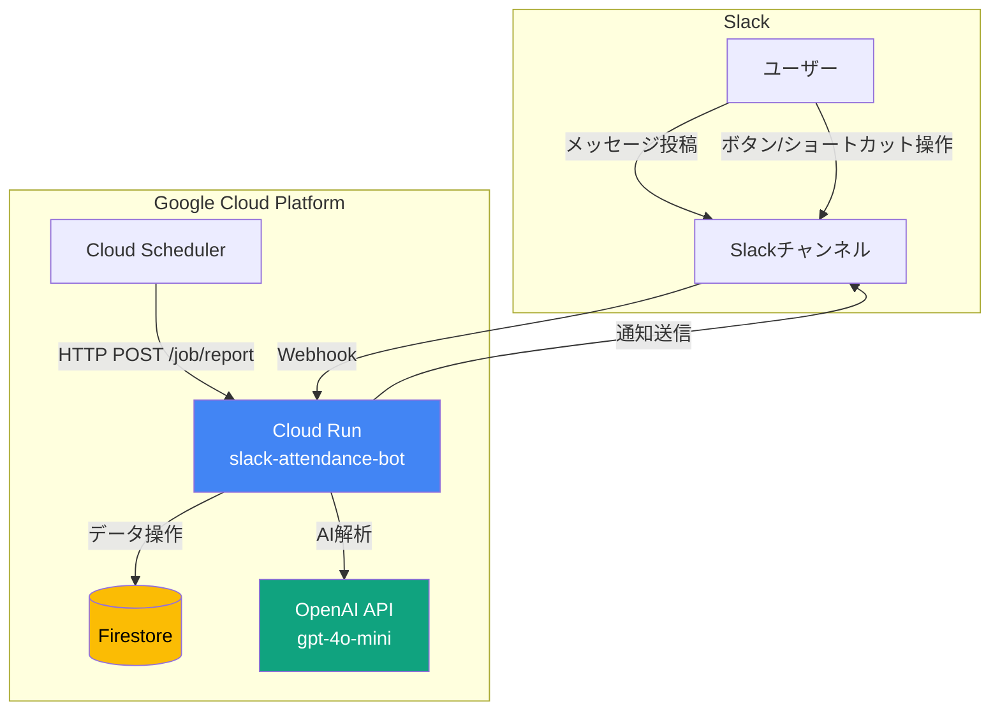
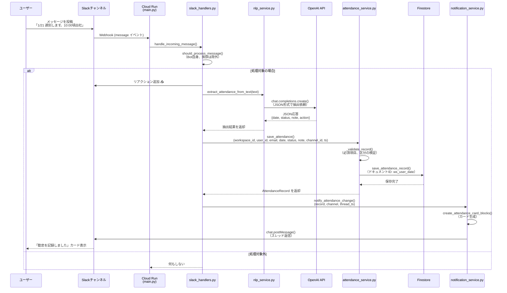
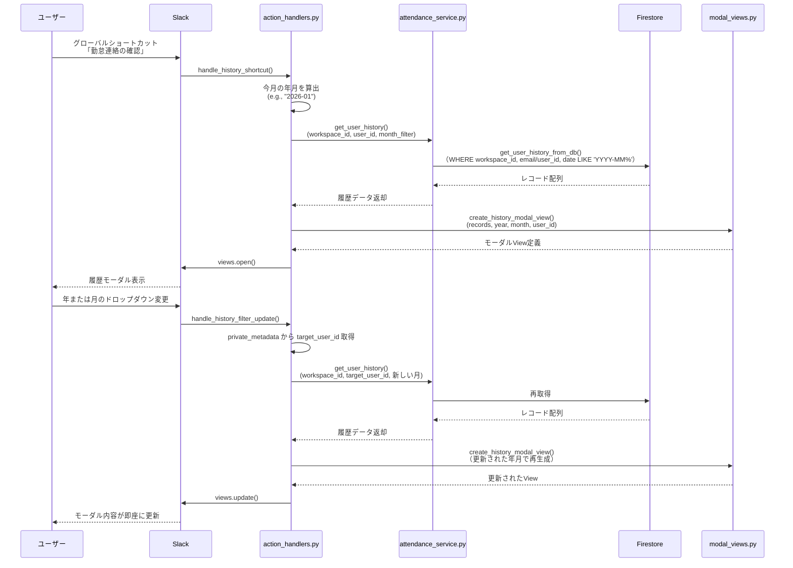
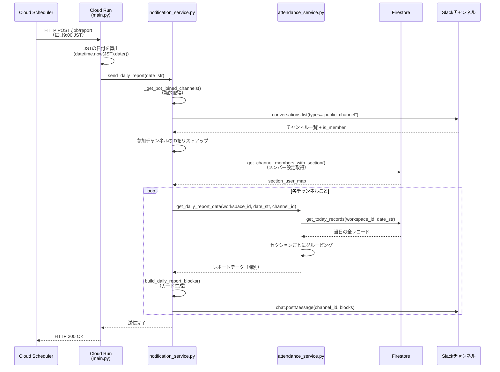

# Slack勤怠管理Bot - 現状仕様書

## 目次

1. [概要](#概要)
2. [アーキテクチャ構成](#アーキテクチャ構成)
3. [データモデル](#データモデル)
4. [AI抽出仕様](#ai抽出仕様)
5. [UI要素](#ui要素)
6. [処理フロー](#処理フロー)
7. [外部連携・権限](#外部連携権限)
8. [既知の問題点と不整合](#既知の問題点と不整合)

---

## 概要

本システムは、Slackワークスペース上で勤怠連絡を管理するBotアプリケーションです。

### 主な機能

- **AI自然言語解析**: ユーザーがチャンネルに投稿した自然文から勤怠情報（日付、区分、備考）を自動抽出
- **勤怠記録の保存・更新・削除**: Firestore上に勤怠レコードを永続化
- **履歴表示**: ユーザー自身が過去の勤怠連絡を月単位で参照可能
- **日次レポート配信**: Cloud Schedulerによって定時（9:00）にレポートをチャンネルに投稿
- **課別メンバー管理**: 管理者が各課のメンバーを設定し、レポート時に課単位で集計

### デプロイ環境

- **実行環境**: Google Cloud Run（コンテナ型のサーバーレスプラットフォーム）
- **データベース**: Google Cloud Firestore（NoSQL）
- **定期実行**: Cloud Scheduler（Cron相当）
- **AI解析**: OpenAI API（gpt-4o-mini）

### プロジェクト構造

```
slack-attendance-bot/
├── resources/
│   ├── main.py                  # エントリポイント（Cloud Functions/Run対応）
│   ├── constants.py             # 定数定義（ステータス翻訳、セクション定義など）
│   ├── handlers/                # イベントハンドラー群
│   │   ├── __init__.py          # ハンドラーの一括登録
│   │   ├── slack_handlers.py   # メッセージ受信、Bot参加イベント
│   │   ├── action_handlers.py  # ボタン押下、ショートカット
│   │   └── modal_handlers.py   # モーダル送信（勤怠保存、設定保存）
│   ├── services/                # ビジネスロジック
│   │   ├── nlp_service.py       # AI解析サービス
│   │   ├── attendance_service.py # 勤怠操作の統合
│   │   └── notification_service.py # Slack通知の送信
│   ├── views/                   # UI構築
│   │   └── modal_views.py       # モーダル・カードのBlocks生成
│   └── shared/                  # 共通モジュール
│       ├── db.py                # Firestore操作レイヤー
│       ├── errors.py            # カスタム例外クラス
│       ├── utils.py             # ユーティリティ関数
│       └── setup_logger.py      # ロガー初期化
├── Dockerfile                   # Cloud Run用コンテナ定義
├── requirements.txt             # Python依存パッケージ
├── manifest.yaml                # Slack App設定（スコープ、イベント購読）
└── docs/
    └── current_spec.md          # 本ドキュメント
```

---

## アーキテクチャ構成

### システム構成図（Mermaid）



### レイヤー構成

| レイヤー | 役割 | 主要ファイル |
|---------|------|-------------|
| **Entry Point** | HTTPリクエストの受付と振り分け | `main.py` |
| **Handlers** | Slackイベントのルーティング | `handlers/*.py` |
| **Services** | ビジネスロジックの実装 | `services/*.py` |
| **Views** | UI（Blocks）の構築 | `views/modal_views.py` |
| **Data Access** | Firestoreとの通信 | `shared/db.py` |

---

## データモデル

### Firestoreコレクション構造

#### 1. `attendance` コレクション（勤怠記録）

**ドキュメントID命名規則**: `{workspace_id}_{user_id}_{date}`

例: `T0123ABCD_U0456EFGH_2026-01-21`

**フィールド定義**:

| フィールド名 | 型 | 必須 | 説明 | 例 |
|-------------|---|------|------|-----|
| `workspace_id` | string | ○ | Slackワークスペースの一意ID | `"T0123ABCD"` |
| `user_id` | string | ○ | SlackユーザーID | `"U0456EFGH"` |
| `email` | string | △ | ユーザーのメールアドレス（取得可能な場合） | `"user@example.com"` |
| `date` | string | ○ | 対象日（ISO 8601形式） | `"2026-01-21"` |
| `status` | string | ○ | 勤怠区分（後述の固定値） | `"late"`, `"vacation"` など |
| `note` | string |  | 備考（詳細や理由） | `"私用のため10:00頃出社"` |
| `channel_id` | string |  | 投稿されたチャンネルのID | `"C01234567"` |
| `ts` | string |  | Slackメッセージのタイムスタンプ | `"1674123456.789012"` |
| `updated_at` | timestamp | ○ | Firestoreサーバータイムスタンプ | 自動生成 |

**ステータス（status）の固定値**:

| 内部値 | 日本語表示 | 用途 |
|--------|----------|------|
| `late` | 遅刻 | 定時より遅い出勤 |
| `early_leave` | 早退 | 定時より早い退勤 |
| `out` | 外出 | 外出、出張、情報センターなど |
| `remote` | 在宅 | リモートワーク、在宅勤務 |
| `vacation` | 年休 | 有給休暇、欠勤 |
| `other` | その他 | 上記に該当しない |

#### 2. `system_metadata` コレクション（システム設定）

##### ドキュメント: `member_config`（課別メンバー構成）

**フィールド定義**:

| フィールド名 | 型 | 必須 | 説明 |
|-------------|---|------|------|
| `section_user_map` | map | ○ | セクションIDをキー、ユーザーIDの配列を値とする辞書 |
| `updated_at` | string | ○ | ISO 8601形式の更新日時（楽観的ロック用） |
| `workspace_id` | string | ○ | 対象ワークスペースID（現状は単一WS運用） |

**section_user_map の構造例**:

```json
{
  "sec_1": ["U01234567", "U89ABCDEF"],
  "sec_2": ["UXXXXXXXX"],
  "sec_finance": ["UAAAAAAAA", "UBBBBBBBB"]
}
```

**セクション（課）の定義** (`constants.py` より):

| セクションID | 日本語名 |
|-------------|---------|
| `sec_1` | 1課 |
| `sec_2` | 2課 |
| `sec_3` | 3課 |
| `sec_4` | 4課 |
| `sec_5` | 5課 |
| `sec_6` | 6課 |
| `sec_7` | 7課 |
| `sec_finance` | 金融開発課 |

##### ドキュメント: `init_check`（接続確認用）

実際のデータは保存されず、DB初期化時の疎通確認に使用される。

---

## AI抽出仕様

### 概要

`resources/services/nlp_service.py` の `extract_attendance_from_text()` 関数が、OpenAI APIを使用してユーザーのメッセージから勤怠情報を抽出します。

### AIモデル

- **モデル名**: `gpt-4o-mini`
- **応答形式**: JSON Object（`response_format={"type": "json_object"}`）
- **Temperature**: `0.1`（一貫性を重視）

### プロンプト構造

#### システム指示（`system_instruction`）

```
You are a professional attendance data extractor. Analyze the user's message and output JSON.
Format: { "is_attendance": bool, "attendances": [{ "date": "YYYY-MM-DD", "status": "string", "start_time": "HH:mm", "end_time": "HH:mm", "note": "string", "action": "save" | "delete" }] }

Rules:
1. Status: '年休','休暇'->'vacation', '外出','情報センター'->'out', '在宅'->'remote', '遅刻'->'late', '早退'->'early_leave'.
2. Note: Use this for specific locations, reasons, or specific times mentioned (e.g., '8:00出勤', '終日情報センター').
   - If no specific info is provided beyond the status, leave 'note' empty ("").
   - For changes like '~A~ -> B', set note to '(予定変更) B'.
3. Code Blocks: Extract text inside ``` as official data.
4. Today: Use the provided date to infer the year.
```

#### ユーザープロンプト

```
Today: {base_date} ({曜日})
Text: {clean_text}
```

- **base_date**: 実行日の日付（`datetime.date.today()`）
- **clean_text**: 打ち消し線を `(strike-through: ...)` に変換したテキスト

### 抽出項目

AIが返すJSON形式:

```json
{
  "is_attendance": true,
  "attendances": [
    {
      "date": "2026-01-21",
      "status": "late",
      "start_time": "10:00",
      "end_time": "",
      "note": "私用のため10:00頃出社",
      "action": "save"
    }
  ]
}
```

| フィールド | 型 | 説明 |
|-----------|---|------|
| `is_attendance` | boolean | 勤怠連絡かどうかの判定（現在は未使用、`attendances`の有無で判定） |
| `attendances` | array | 抽出された勤怠情報の配列（複数日対応） |
| `date` | string | 対象日（YYYY-MM-DD形式） |
| `status` | string | 勤怠区分（英語表記） |
| `start_time` | string | 出勤時刻（現在は未使用） |
| `end_time` | string | 退勤時刻（現在は未使用） |
| `note` | string | 備考（具体的な時間、場所、理由など） |
| `action` | string | 操作種別（`save` または `delete`） |

### ステータスの正規化

AIが返した `status` は、`_normalize_status()` 関数で正規化されます。

```python
STATUS_ALIASES = {
    "late": {"late", "遅刻", "遅れ", "遅延"},
    "early_leave": {"early_leave", "早退"},
    "out": {"out", "外出"},
    "remote": {"remote", "在宅", "リモート", "テレワーク"},
    "vacation": {"vacation", "休暇", "休み", "欠勤", "有給", "お休み"},
    "other": {"other", "未分類", "その他"},
}
```

上記のエイリアスに該当しない場合は `"other"` として扱われます。

### 備考（note）のフォーマット

`_format_note()` 関数で整形されます。

- AIが `"None"`, `"null"` を返した場合 → 空文字列
- それ以外 → そのまま使用（前後の空白は除去）

**重要な仕様**: 過去のバージョンでは定型句を自動付与していましたが、現行版では **AIが抽出した文言をそのまま使用** します。

### 打ち消し線と訂正の処理

#### 前処理（`nlp_service.py`）

```python
clean_text = re.sub(r'~(.*?)~', r'(strike-through: \1)', clean_text)
```

Slackの打ち消し線記法 `~テキスト~` を `(strike-through: テキスト)` に変換し、AIに「削除対象」であることを示します。

#### 後処理（`attendance_service.py` の `process_ai_extraction_result()`）

```python
if action == "delete" and status and status in self.valid_statuses:
    logger.info(f"打ち消し線後の訂正を検知: {date} のアクションを save に変更します。")
    action = "save"
```

**ロジックの意図**:

- AIが `action="delete"` と判定しても、**有効な `status` が抽出されている場合**は、「訂正」とみなして `save` に変更
- これにより、「~8:00出勤~ 10:00出勤」のようなメッセージを「削除→新規保存」ではなく「更新」として扱う

**問題点**: このロジックは継ぎ接ぎ的で、意図が明確でない部分があります。リファクタリング時に整理が必要です。

---

## UI要素

### モーダル（Modal）

Slackのモーダルダイアログを使用してユーザー入力やデータ表示を行います。すべてのモーダルは `resources/views/modal_views.py` で定義されています。

#### 1. 勤怠入力/編集モーダル

**関数**: `create_attendance_modal_view()`

**callback_id**: `attendance_submit`

**構成要素**:

| Block要素 | タイプ | action_id | 説明 |
|----------|-------|-----------|------|
| 日付 | datepicker または section | `attendance_date_change` | 新規入力時は選択可、編集時は固定表示 |
| 区分 | static_select | `status_select` | 遅刻/早退/外出/在宅/年休/その他から選択 |
| 備考 | plain_text_input（複数行） | `note_input` | 任意入力（placeholder: "例）私用のため10:00頃出社します。"） |

**private_metadata**:

```json
{
  "is_edit": true,          // 編集モードかどうか
  "date": "2026-01-21",     // 対象日
  "channel_id": "C01234567", // チャンネルID（modal_handlers.pyで使用）
  "message_ts": "1674123456.789012" // 上書き対象メッセージのTS
}
```

**期待される挙動**:

1. ユーザーが「保存」を押すと、`modal_handlers.py` の `handle_attendance_save` が実行
2. `attendance_service.save_attendance()` で Firestore に保存
3. `notification_service.notify_attendance_change()` でチャンネルに通知（既存メッセージを上書き）

#### 2. 履歴表示モーダル

**関数**: `create_history_modal_view()`

**callback_id**: `history_view`

**構成要素**:

| Block要素 | タイプ | action_id | 説明 |
|----------|-------|-----------|------|
| 年選択 | static_select | `history_year_change` | 2025〜2035年 |
| 月選択 | static_select | `history_month_change` | 1〜12月 |
| 履歴リスト | section + context | - | 日付、ステータス、備考を表示（新しい順） |

**private_metadata**:

```json
{
  "target_user_id": "U0123456"  // 表示対象のユーザーID（年月変更時に再取得に使用）
}
```

**期待される挙動**:

1. グローバルショートカット「勤怠連絡の確認」から開く
2. 年月のドロップダウンを変更すると、`action_handlers.py` の `handle_history_filter_update` が実行
3. `attendance_service.get_user_history()` で Firestore から再取得
4. `views.update()` でモーダルをリアルタイム更新

#### 3. メンバー設定モーダル

**関数**: `create_member_settings_modal_view()`

**callback_id**: `member_settings_submit`

**構成要素**:

各課（8つのセクション）ごとに、以下のブロックが生成されます:

| Block要素 | タイプ | action_id | block_id | 説明 |
|----------|-------|-----------|----------|------|
| ユーザー選択 | multi_users_select | `user_select` | `user_select_block_{sec_id}` | 複数ユーザーを選択可能 |

例: `user_select_block_sec_1`, `user_select_block_sec_finance`

**private_metadata**:

```json
{
  "channel_id": "C01234567",  // 設定対象チャンネル（現状は未使用）
  "version": "2026-01-21T09:00:00"  // 楽観的ロック用バージョン（現状は機能していない）
}
```

**期待される挙動**:

1. グローバルショートカット「設定」またはセットアップメッセージの「設定」ボタンから開く
2. ユーザーが各課のメンバーを選択し「保存」を押す
3. `modal_handlers.py` の `handle_member_settings_save` が実行
4. `db.save_channel_members_db()` で Firestore の `system_metadata/member_config` に保存

#### 4. 削除確認モーダル

**関数**: `create_delete_confirm_modal()`

**callback_id**: `delete_attendance_confirm_callback`

**構成要素**:

| Block要素 | タイプ | 内容 |
|----------|-------|------|
| 確認メッセージ | section | 「*{date}* の勤怠連絡を削除してもよろしいですか？」 |

**private_metadata**:

```json
{
  "date": "2026-01-21",
  "message_ts": "1674123456.789012",
  "channel_id": "C01234567"
}
```

**期待される挙動**:

1. 勤怠カードの「取消」ボタンから開く
2. ユーザーが「削除する」を押すと、`action_handlers.py` の `handle_delete_confirm_submit` が実行
3. `attendance_service.delete_attendance()` で Firestore から削除
4. 元のメッセージを `chat.update` で「取り消しました」に差し替え

### メッセージカード（Message Block）

#### 1. 勤怠カード

**関数**: `create_attendance_card_blocks()`

**表示内容**:

```
ⓘ @user さんの勤怠連絡を記録しました / を修正しました

* 2026-01-21 [ 遅刻 ]
  私用のため10:00頃出社

[修正] [取消]
```

**ボタン定義**:

| ラベル | action_id | value | 処理 |
|-------|-----------|-------|------|
| 修正 | `open_update_attendance` | 対象日（"2026-01-21"） | 編集モーダルを開く |
| 取消 | `delete_attendance_request` | 対象日（"2026-01-21"） | 削除確認モーダルを開く |

**期待される挙動**:

- AI解析またはモーダル保存後に、チャンネル（またはスレッド）に投稿される
- ボタンを押せるのは **本人のみ**（`action_handlers.py` で `user_id` をチェック）

#### 2. セットアップメッセージ

**関数**: `create_setup_message_blocks()`

**表示内容**:

```
ⓘ 勤怠連絡の管理を開始します。下のボタンより各課のメンバー設定をお願いします。

[設定]
```

**ボタン定義**:

| ラベル | action_id | 処理 |
|-------|-----------|------|
| 設定 | `open_member_settings` | メンバー設定モーダルを開く |

**期待される挙動**:

- Botがチャンネルに参加したとき（`member_joined_channel` イベント）に自動投稿される

#### 3. 日次レポート

**関数**: `build_daily_report_blocks()`

**表示内容**:

```
01/21(水)の勤怠一覧
━━━━━━━━━━━━━━━━
*1課*
• @user1 - 遅刻 (10:00出勤)
• @user2 - 在宅

━━━━━━━━━━━━━━━━
*2課*
_勤怠連絡はありません_

（以下、全課分）
```

**期待される挙動**:

- Cloud Scheduler が `/job/report` を呼び出すと、`notification_service.send_daily_report()` が実行
- Botが参加している全チャンネルに送信される（環境変数 `REPORT_CHANNEL_ID` があればそちらを優先、なければ動的取得）

---

## 処理フロー

### 1. メッセージ受信からDB保存までのシーケンス



**重要なポイント**:

1. **ack() 後の処理継続**: Cloud Runでは `process_before_response=False` に設定し、ackの後も処理を継続できるようになっている
2. **重複防止**: `_processed_message_ts` セットで同一メッセージの再処理を防止（メモリ上なのでインスタンス再起動でリセット）
3. **スレッド返信**: 元のメッセージの `ts` を `thread_ts` に指定することで、スレッド内に返信

### 2. 履歴表示フロー



**重要なポイント**:

1. **private_metadata の活用**: 年月変更時に「誰の履歴を表示しているか」を維持するため、`target_user_id` を埋め込む
2. **workspace_id の必須化**: 複数ワークスペース対応のため、DB取得時に必ず `workspace_id` でフィルタリング

### 3. 日次レポート送信フロー



**重要なポイント**:

1. **タイムゾーン処理**: Cloud RunはUTCで動作するため、JSTに変換してから日付を確定
2. **動的チャンネル取得**: 環境変数に依存せず、Botが参加している全チャンネルを自動検出
3. **セクションマッピング**: Firestore の `system_metadata/member_config` からメンバー構成を読み込み、レポートに反映

---

## 外部連携・権限

### Slack App の権限（OAuth Scopes）

`manifest.yaml` で定義されています。

#### Bot Token Scopes:

| スコープ | 用途 |
|---------|------|
| `chat:write` | メッセージの送信 |
| `chat:write.public` | Botが参加していないチャンネルへの投稿（現在は未使用） |
| `reactions:write` | リアクションの追加（📤 など） |
| `users:read` | ユーザー情報の取得 |
| `users:read.email` | メールアドレスの取得 |
| `channels:read` | チャンネル一覧の取得 |
| `groups:read` | プライベートチャンネル一覧の取得 |
| `channels:history` | チャンネルメッセージの履歴読み取り |
| `groups:history` | プライベートチャンネルメッセージの履歴読み取り |
| `im:read` | DMの読み取り |
| `im:history` | DM履歴の読み取り |
| `im:write` | DMの送信 |
| `app_mentions:read` | メンションの受信 |
| `commands` | スラッシュコマンドの実行（現在は未使用） |

### イベント購読（Event Subscriptions）

| イベント | 用途 |
|---------|------|
| `message.channels` | チャンネルメッセージの受信 |
| `message.im` | DMの受信 |
| `member_joined_channel` | Botがチャンネルに参加したときの検知 |

### グローバルショートカット

| 表示名 | callback_id | 説明 |
|-------|-------------|------|
| 勤怠連絡の確認 | `open_kintai_history` | 自分の履歴を表示 |
| 設定 | `open_member_setup_modal` | メンバー設定モーダルを開く |

### 環境変数

`constants.py` および `main.py` で参照されています。

| 変数名 | 必須 | 説明 | 例 |
|-------|------|------|-----|
| `SLACK_BOT_TOKEN` | ○ | Bot User OAuth Token | `xoxb-...` |
| `SLACK_SIGNING_SECRET` | ○ | リクエスト署名検証用 | `abc123...` |
| `OPENAI_API_KEY` | ○ | OpenAI APIキー | `sk-...` |
| `ENABLE_CHANNEL_NLP` | △ | AI解析の有効/無効 | `true` / `false`（デフォルト: `true`） |
| `REPORT_CHANNEL_ID` | △ | レポート送信先チャンネルID（固定する場合） | `C01234567` |
| `ATTENDANCE_CHANNEL_ID` | △ | AI解析を動作させるチャンネルID（指定しない場合は全チャンネルで動作） | `C01234567` |
| `SLACK_WORKSPACE_ID` | △ | ワークスペースID（未指定時は `"GLOBAL_WS"`） | `T0123ABCD` |

**注意**: 現状のコードには `SLACK_CLIENT_ID`, `SLACK_CLIENT_SECRET` の参照がありますが、OAuth Flowは実装されていないため未使用です。

### Workspace ID の扱い

#### 現状の仕様

- **取得元**: Slackイベントの `body["team"]["id"]`（または `event["team"]`）
- **用途**:
  - Firestoreのドキュメント ID に含める（`{workspace_id}_{user_id}_{date}`）
  - クエリ時のフィルタリング条件（`WHERE workspace_id == ...`）
- **問題点**:
  - 環境変数 `SLACK_WORKSPACE_ID` も存在するが、使用箇所が限定的（`notification_service.py` の `send_daily_report` など）
  - **複数ワークスペースへの配布を想定した設計だが、OAuth Flowが未実装**のため、実質的には単一ワークスペース運用

#### 管理者設定の有無

- **明示的な管理者権限はなし**
- **本人チェック**:
  - 「修正」「取消」ボタンは、レコードの `user_id` と操作者の `user_id` が一致する場合のみ実行可能
  - コード例（`action_handlers.py`）:
    ```python
    if record and record.get("user_id") != user_id:
        client.chat_postEphemeral(
            channel=channel_id,
            user=user_id,
            text="⚠️ この操作は打刻した本人しか行えません。"
        )
        return
    ```
- **メンバー設定**:
  - 誰でも「設定」ボタンを押せるため、実質的には「最初に設定した人」または「チャンネル参加者全員」が管理者
  - 楽観的ロック（バージョン管理）の実装は `modal_handlers.py` にあるが、**現状は機能していない**

---

## 既知の問題点と不整合

以下は、現状のコードベースに含まれる不自然な実装や改善が必要な箇所です。リファクタリングの際の材料としてください。

### 1. 打ち消し線処理の複雑さ

**場所**: `nlp_service.py` と `attendance_service.py` の連携

**問題**:

- `nlp_service` で打ち消し線を `(strike-through: ...)` に変換し、AIに「削除」を判定させる
- しかし `attendance_service.process_ai_extraction_result()` で、「`action=delete` でも `status` があれば `save` に変更」という後処理を行う
- **意図が分散しており、AI判定と後処理の責任分界が不明確**

**推奨改善**:

- AIに「訂正」を明示的に判定させるプロンプト改善
- または、打ち消し線は前処理で削除し、「最終的な情報のみ」を抽出させる

### 2. メンバー設定の楽観的ロックが機能していない

**場所**: `modal_handlers.py` の `handle_member_settings_save()`

**問題**:

```python
if "CONCURRENCY_ERROR" in str(e) or "conflict" in str(e).lower():
    ack(response_action="errors", errors={
        "user_select_block_sec_1": "⚠️ 他の管理者が更新しました。再度開き直してください。"
    })
```

- `save_channel_members_db()` は Firestore の `set()` を使っており、**無条件で上書き**される
- バージョンチェックの実装がないため、エラーが発生しない

**推奨改善**:

- Firestore の Transactions または `updated_at` を使った明示的なバージョンチェックを実装

### 3. `workspace_id` の取得方法が統一されていない

**問題**:

- ハンドラーでは `body["team"]["id"]` から取得
- レポート送信では環境変数 `SLACK_WORKSPACE_ID` にフォールバック
- **どちらが正とされるべきか、設計意図が不明確**

**推奨改善**:

- マルチワークスペース対応を本格的に実装するなら、OAuth Flowを追加し、Firestoreに `workspaces` コレクションを作成
- 単一ワークスペース運用なら、環境変数に統一

### 4. `modal_handlers.py` での存在しないメソッド呼び出し

**場所**: `handle_attendance_save()` 内

```python
existing = attendance_service.get_specific_date_record(workspace_id, user_id, date) or {}
```

**問題**:

- `AttendanceService` に `get_specific_date_record()` メソッドは存在しない
- 正しくは `db.get_single_attendance_record()` を直接呼ぶか、サービス層にメソッドを追加すべき

**推奨改善**:

- `attendance_service.py` に以下を追加:
  ```python
  def get_specific_date_record(self, workspace_id: str, user_id: str, date: str) -> Optional[Dict[str, Any]]:
      return get_single_attendance_record(workspace_id, user_id, date)
  ```

### 5. `start_time` / `end_time` の未使用フィールド

**問題**:

- AI抽出の出力に含まれているが、Firestoreのスキーマには存在しない
- UI上でも表示・編集されない

**推奨改善**:

- 将来的に利用予定であれば、Firestoreのフィールドに追加し、モーダルに入力欄を設ける
- 不要であれば、AIのプロンプトから削除

### 6. エラー通知の不統一

**問題**:

- 一部のエラーは `chat_postEphemeral`（一時メッセージ）で通知
- 一部のエラーは `logger.error()` のみでユーザーに通知されない
- モーダルのエラー表示も `ack(response_action="errors", ...)` と `create_error_modal()` が混在

**推奨改善**:

- エラーハンドリングのガイドラインを策定し、`shared/errors.py` の `handle_error()` を活用して統一

### 7. レポート送信の対象チャンネル決定ロジックの複雑さ

**場所**: `notification_service.py` の `send_daily_report()`

```python
target_channels = self._get_bot_joined_channels()

if not target_channels:
    env_channel = os.environ.get("CHANNEL_ID")
    if env_channel:
        target_channels = [env_channel]
```

**問題**:

- 環境変数 `REPORT_CHANNEL_ID` と `CHANNEL_ID` の両方が存在するが、使い分けが不明確
- フォールバック処理が継ぎ接ぎ的で、意図が読みづらい

**推奨改善**:

- 環境変数を `REPORT_CHANNEL_IDS`（カンマ区切り）に統一
- または、Firestoreに「レポート送信先設定」を保存する

### 8. コードコメントの日英混在

**問題**:

- コメントが日本語と英語で混在しており、一貫性がない
- ドキュメントストリング（docstring）がほとんどない

**推奨改善**:

- プロジェクトのコメント言語を統一（日本語推奨）
- 主要な関数には docstring を追加

---

## まとめ

本ドキュメントは、現行の Slack勤怠管理Bot の仕様を可能な限り忠実に記録したものです。

### 現状の強み

- AI解析による自然言語対応で、ユーザーの入力負荷が低い
- Firestoreを使ったスケーラブルな設計
- Cloud Runによるサーバーレス運用で、インフラ管理が不要

### 改善が望まれる点

- **打ち消し線処理** の複雑なロジックの整理
- **楽観的ロック** の実装不足
- **workspace_id** の管理方針の明確化
- **エラーハンドリング** の統一
- **未使用フィールド**（start_time, end_time）の整理

これらの問題点を踏まえた上で、段階的なリファクタリングを推奨します。

---

**ドキュメント作成日**: 2026-01-21  
**対象バージョン**: 現行コードベース（最終更新: 2026-01-21）
