# モジュール間の依存関係図

このドキュメントは、`resources/` フォルダ内の各モジュール間の依存関係を可視化したものです。

## 依存関係の概要

```mermaid
classDiagram
    %% ========================================
    %% メインエントリポイント
    %% ========================================
    class main_py["main.py"] {
        +slack_bot(request)
        +FirestoreInstallationStore
    }
    
    %% ========================================
    %% Listeners層
    %% ========================================
    class listeners_init["listeners/__init__.py"] {
        +register_all_listeners()
    }
    
    class attendance_listener["listeners/attendance_listener.py"] {
        +register_attendance_listeners()
        +on_incoming_message()
        +on_update_button_clicked()
        +on_delete_button_clicked()
        +on_delete_confirmed()
        +on_history_shortcut_triggered()
    }
    
    class admin_listener["listeners/admin_listener.py"] {
        +register_admin_listeners()
        +on_admin_settings_shortcut()
        +on_add_group_button_clicked()
        +on_group_overflow_menu_selected()
    }
    
    class system_listener["listeners/system_listener.py"] {
        +register_system_listeners()
        +on_bot_joined_channel()
    }
    
    %% ========================================
    %% Services層
    %% ========================================
    class attendance_service["services/attendance_service.py"] {
        +save_attendance()
        +delete_attendance()
        +get_user_history()
        +get_specific_date_record()
        +process_ai_extraction_result()
    }
    
    class notification_service["services/notification_service.py"] {
        +notify_attendance_change()
        +send_daily_report()
        +fetch_user_display_name()
    }
    
    class nlp_service["services/nlp_service.py"] {
        +extract_attendance_from_text()
    }
    
    class group_service["services/group_service.py"] {
        +get_all_groups()
        +create_group()
        +update_group_members()
        +delete_group()
    }
    
    class workspace_service["services/workspace_service.py"] {
        +get_admin_ids()
        +save_admin_ids()
        +get_workspace_settings()
    }
    
    class report_service["services/report_service.py"] {
        +send_daily_report()
        <<deprecated>>
    }
    
    %% ========================================
    %% Shared層（データアクセス・ユーティリティ）
    %% ========================================
    class db_py["shared/db.py"] {
        +save_attendance_record()
        +get_single_attendance_record()
        +delete_attendance_record_db()
        +get_user_history_from_db()
        +get_today_records()
        +get_workspace_config()
        +save_workspace_config()
    }
    
    class utils_py["shared/utils.py"] {
        +get_user_email()
        +generate_time_options()
        +sanitize_group_name()
    }
    
    class errors_py["shared/errors.py"] {
        +ValidationError
        +DatabaseError
        +SlackApiError
        +handle_error()
    }
    
    class setup_logger["shared/setup_logger.py"] {
        +setup_logger()
    }
    
    %% ========================================
    %% Clients層（外部API）
    %% ========================================
    class slack_client["clients/slack_client.py"] {
        +get_slack_client()
        +SlackClientWrapper
    }
    
    %% ========================================
    %% Templates層（View）
    %% ========================================
    class cards_py["templates/cards.py"] {
        +build_attendance_card()
        +build_delete_notification()
    }
    
    class modals_py["templates/modals.py"] {
        +create_attendance_modal_view()
        +create_history_modal_view()
        +create_admin_settings_modal()
    }
    
    %% ========================================
    %% 外部API（OpenAI, Firestore, Slack）
    %% ========================================
    class OpenAI["OpenAI API"] {
        <<external>>
    }
    
    class Firestore["Google Firestore"] {
        <<external>>
    }
    
    class SlackAPI["Slack Web API"] {
        <<external>>
    }
    
    %% ========================================
    %% 依存関係: main.py → listeners
    %% ========================================
    main_py --> listeners_init : register_all_listeners()
    main_py --> attendance_service : インスタンス化
    main_py --> notification_service : インスタンス化
    main_py --> db_py : init_db(), get_workspace_config()
    main_py --> setup_logger : setup_logger()
    main_py --> slack_client : get_slack_client()
    main_py --> Firestore : FirestoreInstallationStore
    
    %% ========================================
    %% 依存関係: listeners → services
    %% ========================================
    listeners_init --> attendance_listener : register
    listeners_init --> admin_listener : register
    listeners_init --> system_listener : register
    
    attendance_listener --> attendance_service : save/delete/get_history
    attendance_listener --> notification_service : notify_attendance_change
    attendance_listener --> nlp_service : extract_attendance_from_text
    attendance_listener --> slack_client : get_slack_client()
    attendance_listener --> db_py : get_single_attendance_record
    attendance_listener --> utils_py : get_user_email()
    attendance_listener --> modals_py : create modals
    
    admin_listener --> group_service : get/create/update/delete
    admin_listener --> workspace_service : get/save_admin_ids
    admin_listener --> slack_client : get_slack_client()
    admin_listener --> modals_py : create modals
    
    system_listener --> slack_client : get_slack_client()
    system_listener --> modals_py : create_setup_message_blocks
    
    %% ========================================
    %% 依存関係: services → shared/db
    %% ========================================
    attendance_service --> db_py : save/get/delete records
    attendance_service --> errors_py : ValidationError, AuthorizationError
    
    notification_service --> slack_client : SlackClientWrapper
    notification_service --> attendance_service : get_specific_date_record
    notification_service --> group_service : get_all_groups
    notification_service --> workspace_service : get_admin_ids
    notification_service --> db_py : get_workspace_config
    notification_service --> cards_py : build cards
    
    nlp_service --> OpenAI : chat.completions.create
    nlp_service --> setup_logger : setup_logger()
    
    group_service --> Firestore : collection("groups")
    group_service --> errors_py : ValidationError
    group_service --> utils_py : sanitize_group_name()
    
    workspace_service --> Firestore : collection("workspace_settings")
    workspace_service --> errors_py : ValidationError
    
    report_service --> db_py : get_attendance_records_by_sections
    report_service --> slack_client : get_slack_client()
    
    %% ========================================
    %% 依存関係: shared → 外部
    %% ========================================
    db_py --> Firestore : Client()
    
    slack_client --> db_py : get_workspace_config()
    slack_client --> SlackAPI : WebClient
    
    %% ========================================
    %% スタイル定義
    %% ========================================
    style main_py fill:#ff6b6b,stroke:#c92a2a,color:#fff
    style listeners_init fill:#4dabf7,stroke:#1971c2,color:#fff
    style attendance_listener fill:#4dabf7,stroke:#1971c2,color:#fff
    style admin_listener fill:#4dabf7,stroke:#1971c2,color:#fff
    style system_listener fill:#4dabf7,stroke:#1971c2,color:#fff
    style attendance_service fill:#51cf66,stroke:#2f9e44,color:#fff
    style notification_service fill:#51cf66,stroke:#2f9e44,color:#fff
    style nlp_service fill:#51cf66,stroke:#2f9e44,color:#fff
    style group_service fill:#51cf66,stroke:#2f9e44,color:#fff
    style workspace_service fill:#51cf66,stroke:#2f9e44,color:#fff
    style report_service fill:#868e96,stroke:#495057,color:#fff
    style db_py fill:#ffd43b,stroke:#fab005,color:#000
    style utils_py fill:#ffd43b,stroke:#fab005,color:#000
    style errors_py fill:#ffd43b,stroke:#fab005,color:#000
    style setup_logger fill:#ffd43b,stroke:#fab005,color:#000
    style slack_client fill:#cc5de8,stroke:#9c36b5,color:#fff
    style cards_py fill:#ff8787,stroke:#f03e3e,color:#fff
    style modals_py fill:#ff8787,stroke:#f03e3e,color:#fff
    style OpenAI fill:#e9ecef,stroke:#adb5bd,color:#000
    style Firestore fill:#e9ecef,stroke:#adb5bd,color:#000
    style SlackAPI fill:#e9ecef,stroke:#adb5bd,color:#000
```



## レイヤー構造の説明

### 🔴 エントリポイント層（赤）
- **main.py**: HTTP リクエストを受け取り、各エンドポイントに分岐
  - `/slack/install`: OAuth インストールページ
  - `/slack/oauth_redirect`: OAuth コールバック
  - `/job/report`: Cloud Scheduler からの日次レポート実行
  - その他: Slack イベント処理

### 🔵 Listeners層（青）
Slackからのイベントを受け取り、適切なサービスに処理を委譲します。

- **attendance_listener.py**: 勤怠記録関連のイベント
  - メッセージ受信（AI解析）
  - 修正・削除ボタン押下
  - 履歴表示ショートカット

- **admin_listener.py**: 管理機能関連のイベント
  - レポート設定モーダル
  - グループ追加・編集・削除

- **system_listener.py**: システムイベント
  - Bot のチャンネル参加通知

### 🟢 Services層（緑）
ビジネスロジックを実装し、データの検証や加工を行います。

- **attendance_service.py**: 勤怠記録のCRUD操作
- **notification_service.py**: Slack通知の送信管理
- **nlp_service.py**: OpenAI APIを使った自然言語処理
- **group_service.py**: グループ（課）の管理
- **workspace_service.py**: ワークスペース設定の管理

### 🟡 Shared層（黄）
データアクセス、ユーティリティ、エラー処理などの共通機能を提供します。

- **db.py**: Firestoreとのデータベース操作を統括
- **utils.py**: 共通ユーティリティ関数
- **errors.py**: カスタム例外クラス
- **setup_logger.py**: ロギング設定

### 🟣 Clients層（紫）
外部APIとの通信を抽象化します。

- **slack_client.py**: Slack Web API のラッパー
  - マルチテナント対応: `get_slack_client(team_id)` で動的にクライアントを生成

### 🔴 Templates層（ピンク）
UI（Block Kit）の生成を担当します。

- **cards.py**: 勤怠カードの生成
- **modals.py**: モーダルビューの生成

### ⚪ 外部API（グレー）
- **OpenAI API**: 自然言語処理（GPT-4o-mini）
- **Google Firestore**: データベース
- **Slack Web API**: メッセージ送信、ユーザー情報取得

## 重要な依存パターン

### 1. main.py からの登録フロー
```
main.py
  → register_all_listeners()
    → register_attendance_listeners()
    → register_admin_listeners()
    → register_system_listeners()
```

### 2. メッセージ受信から勤怠記録までのフロー
```
attendance_listener.on_incoming_message()
  → nlp_service.extract_attendance_from_text() [OpenAI API呼び出し]
  → attendance_service.save_attendance()
    → db.save_attendance_record() [Firestore書き込み]
  → notification_service.notify_attendance_change()
    → slack_client.send_message() [Slack API呼び出し]
```

### 3. 日次レポート送信のフロー
```
main.py /job/report endpoint
  → notification_service.send_daily_report()
    → workspace_service.get_admin_ids() [Firestore読み取り]
    → group_service.get_all_groups() [Firestore読み取り]
    → attendance_service.get_specific_date_record() × N
      → db.get_single_attendance_record() [Firestore読み取り]
    → slack_client.send_message() [Slack API呼び出し]
```

### 4. マルチテナント対応の中核
```
どのリスナーでも:
  team_id を取得
  → slack_client.get_slack_client(team_id)
    → db.get_workspace_config(team_id) [Firestore: workspaces コレクション]
    → WebClient(token=bot_token) を動的生成
```

## アーキテクチャの特徴

### ✅ 良い点
1. **レイヤー分離**: Listeners → Services → Shared/DB の明確な階層構造
2. **マルチテナント対応**: `get_slack_client(team_id)` による動的なクライアント生成
3. **外部API分離**: OpenAI、Firestore、Slack APIがClients/Shared層に集約
4. **エラーハンドリング**: カスタム例外による統一的なエラー処理

### ⚠️ 改善の余地
1. **循環参照のリスク**: notification_service ⇄ attendance_service
2. **report_service.py**: 旧バージョンで非推奨（notification_service に統合済み）
3. **Firestoreクライアント**: services層で直接 `firestore.Client()` を呼び出している箇所がある

## ファイル一覧

### Listeners
- `listeners/__init__.py`
- `listeners/attendance_listener.py`
- `listeners/admin_listener.py`
- `listeners/system_listener.py`

### Services
- `services/attendance_service.py`
- `services/notification_service.py`
- `services/nlp_service.py`
- `services/group_service.py`
- `services/workspace_service.py`
- `services/report_service.py` (非推奨)

### Shared
- `shared/db.py`
- `shared/utils.py`
- `shared/errors.py`
- `shared/setup_logger.py`

### Clients
- `clients/slack_client.py`

### Templates
- `templates/cards.py`
- `templates/modals.py`

---

**生成日時**: 2026-01-26  
**対象バージョン**: マルチテナント対応版（v2.0以降）
