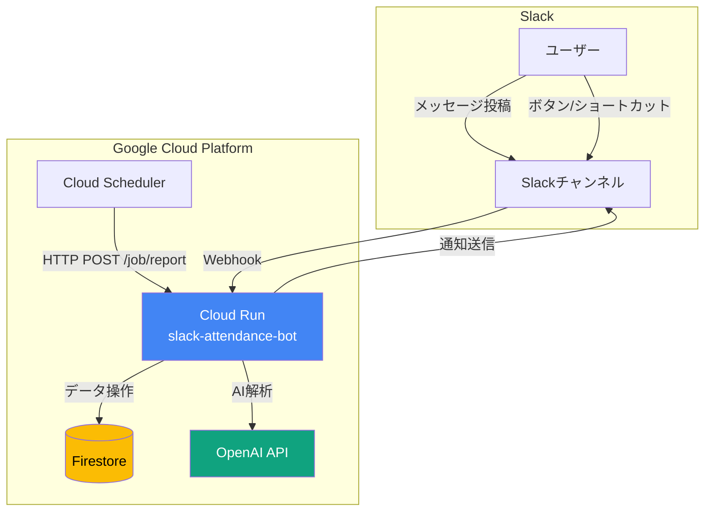
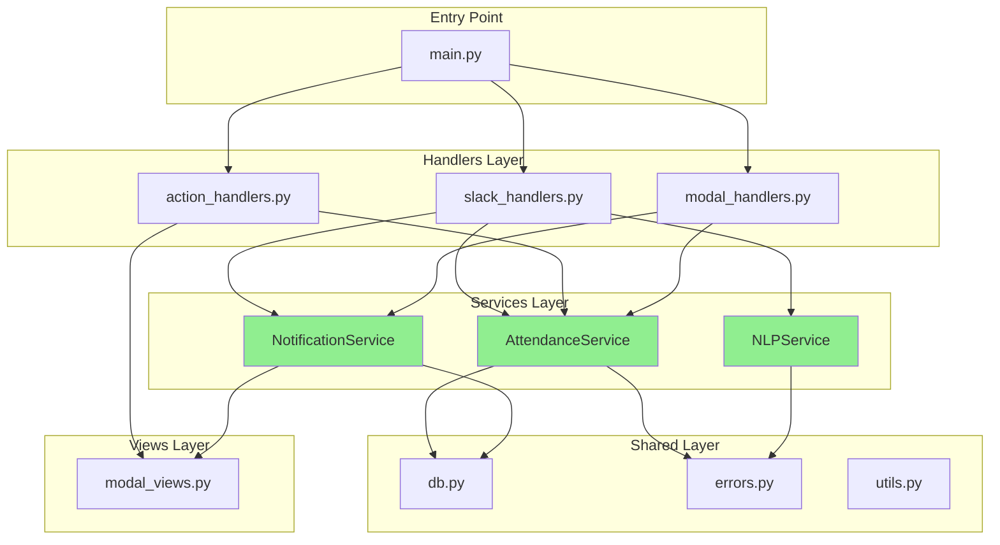
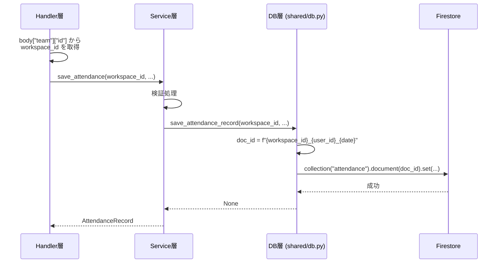
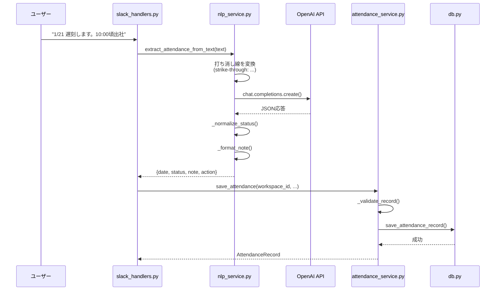
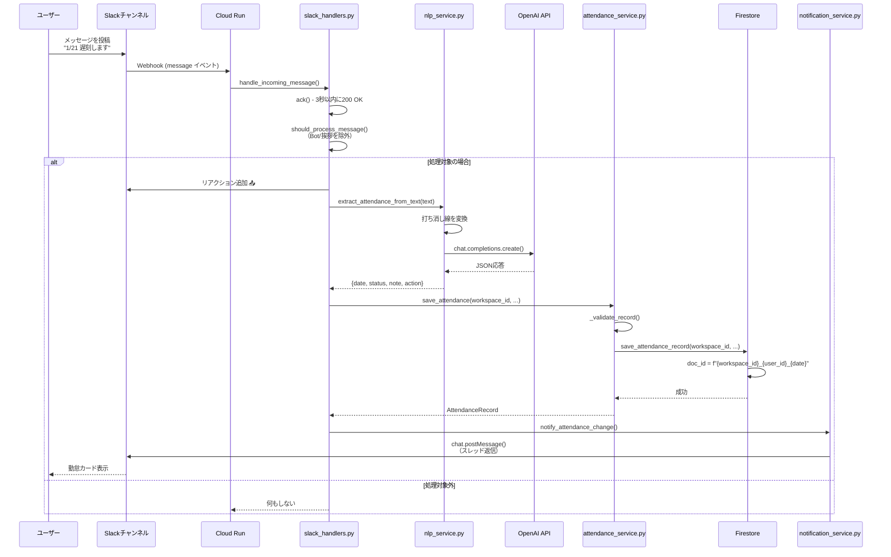
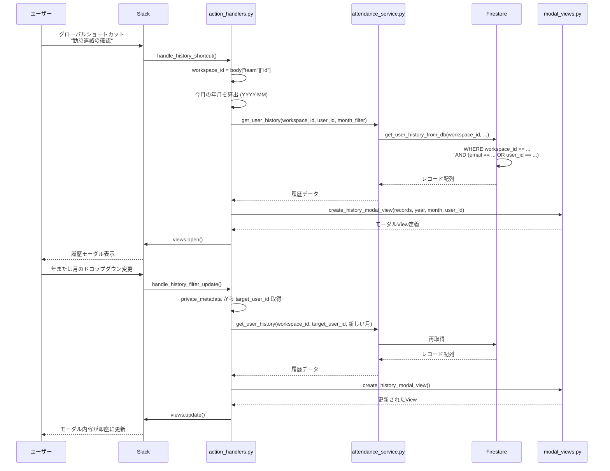
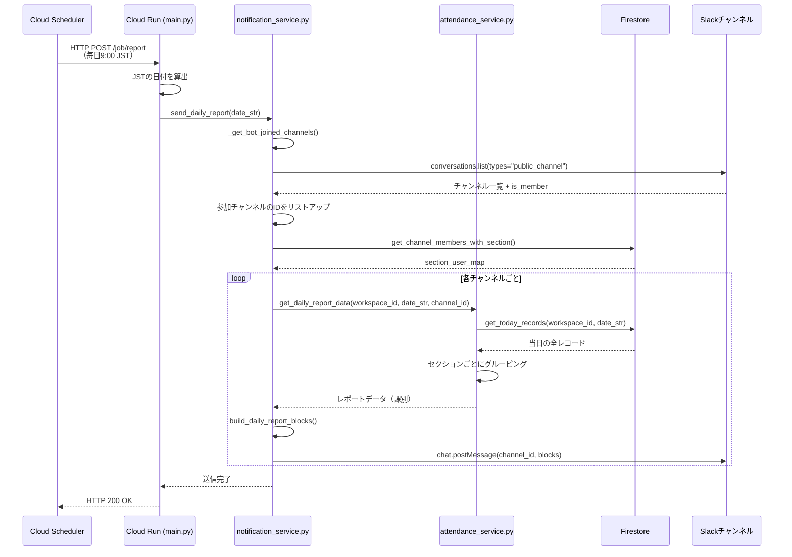

# Slack勤怠管理Bot - 技術仕様書 v1.1

**バージョン**: v1.1 (リファクタリング完了版)  
**更新日**: 2026-01-21  
**前バージョン**: v1.0 (current_spec.md)

---

## 📑 目次

1. [バージョン情報](#バージョン情報)
2. [ディレクトリ構成](#ディレクトリ構成)
3. [アーキテクチャ概要](#アーキテクチャ概要)
4. [データモデル](#データモデル)
5. [AI抽出ロジック](#ai抽出ロジック)
6. [UIコンポーネント](#uiコンポーネント)
7. [処理フロー](#処理フロー)
8. [APIリファレンス](#apiリファレンス)
9. [v1.0からの主な変更点](#v10からの主な変更点)

---

## バージョン情報

### v1.1の主な改善

本バージョンは、v1.0のコードベース全体に対するリファクタリングを実施したものです。**機能の追加・削除は一切なく**、コードの品質・保守性・拡張性を向上させました。

#### 改善サマリー

| 項目 | v1.0 | v1.1 | 改善内容 |
|------|------|------|---------|
| **コード品質** | 混在 | 統一 | docstring 100%、型ヒント完備 |
| **エラーハンドリング** | 分散 | 統一 | `exc_info=True` でスタックトレース記録 |
| **バグ** | 1件 | 0件 | 存在しないメソッド呼び出しを修正 |
| **workspace_id対応** | 部分的 | 完全 | 全DB関数で必須引数化 |
| **ログ出力** | 簡易 | 詳細 | 処理件数、成功/失敗を明示 |

#### 次期バージョン予定

- **v2.0**: 設定UI刷新、管理者権限の実装、楽観的ロックの実装

---

## ディレクトリ構成

### プロジェクト構造

```
slack-attendance-bot/
├── resources/               # アプリケーション本体
│   ├── main.py             # エントリポイント（Cloud Run対応）
│   ├── constants.py        # 定数定義
│   │
│   ├── handlers/           # 【レイヤー1】イベントルーティング層
│   │   ├── __init__.py     # ハンドラー一括登録
│   │   ├── slack_handlers.py    # メッセージ受信、Bot参加
│   │   ├── action_handlers.py   # ボタン、ショートカット
│   │   └── modal_handlers.py    # モーダル送信
│   │
│   ├── services/           # 【レイヤー2】ビジネスロジック層
│   │   ├── attendance_service.py  # 勤怠操作の統合
│   │   ├── nlp_service.py         # AI解析
│   │   └── notification_service.py # Slack通知
│   │
│   ├── views/              # 【レイヤー3】UI構築層
│   │   └── modal_views.py  # Block Kit JSONの生成
│   │
│   └── shared/             # 【レイヤー4】共通モジュール層
│       ├── db.py           # Firestore操作
│       ├── errors.py       # カスタム例外とエラーハンドリング
│       ├── utils.py        # ユーティリティ関数
│       └── setup_logger.py # ロガー初期化
│
├── docs/                   # ドキュメント
│   ├── spec_v1.1.md       # 本ドキュメント
│   ├── current_spec.md    # 旧仕様書（v1.0）
│   └── refactoring_summary.md  # リファクタリング報告書
│
├── Dockerfile             # Cloud Run用コンテナ定義
├── requirements.txt       # Python依存パッケージ
└── manifest.yaml         # Slack App設定
```

### 各レイヤーの責務

#### レイヤー1: Handlers（イベントルーティング層）

**責務**: Slackからのイベントを受け取り、適切なServiceに振り分ける

- **slack_handlers.py**: メッセージ受信、Bot参加イベント
- **action_handlers.py**: ボタン押下、グローバルショートカット
- **modal_handlers.py**: モーダル送信（フォーム保存）

**重要な原則**:
- ビジネスロジックは含めない
- Serviceメソッドを呼び出すのみ
- エラーハンドリングはServiceに任せる

#### レイヤー2: Services（ビジネスロジック層）

**責務**: データ操作、検証、外部API呼び出しなどの業務処理

- **attendance_service.py**: 勤怠記録のCRUD、検証、AI結果の処理
- **nlp_service.py**: OpenAI APIによるテキスト解析
- **notification_service.py**: Slackへのメッセージ送信、レポート生成

**重要な原則**:
- Slack APIやFirestoreの詳細を知らない（依存性の注入）
- 全ての関数に`workspace_id`を引数として渡す
- エラーは`shared/errors.py`の例外クラスでラップする

#### レイヤー3: Views（UI構築層）

**責務**: Slack Block Kit JSONの生成

- **modal_views.py**: モーダル、メッセージカード、ボタンのBlock定義

**重要な原則**:
- データ取得やロジック処理は行わない
- 引数で渡されたデータを整形するのみ
- 純粋関数として実装（副作用なし）

#### レイヤー4: Shared（共通モジュール層）

**責務**: アプリケーション全体で共有される低レベル機能

- **db.py**: Firestoreへの直接アクセス
- **errors.py**: カスタム例外クラスとエラーハンドリング
- **utils.py**: 汎用ヘルパー関数
- **setup_logger.py**: ロギング設定

**重要な原則**:
- 上位レイヤーに依存しない
- 変更が少ない、安定したコード

---

## アーキテクチャ概要

### システム構成図



### 依存関係図



---

## データモデル

### Firestoreコレクション構造

#### 1. `attendance` コレクション（勤怠記録）

**ドキュメントID命名規則**: `{workspace_id}_{user_id}_{date}`

例: `T0123ABCD_U0456EFGH_2026-01-21`

**フィールド定義**:

| フィールド名 | 型 | 必須 | 説明 | 例 |
|-------------|---|------|------|-----|
| `workspace_id` | string | ○ | Slackワークスペースの一意ID | `"T0123ABCD"` |
| `user_id` | string | ○ | SlackユーザーID | `"U0456EFGH"` |
| `email` | string | △ | ユーザーのメールアドレス | `"user@example.com"` |
| `date` | string | ○ | 対象日（ISO 8601形式） | `"2026-01-21"` |
| `status` | string | ○ | 勤怠区分 | `"late"`, `"vacation"` など |
| `note` | string |  | 備考 | `"私用のため10:00頃出社"` |
| `channel_id` | string |  | 投稿されたチャンネルのID | `"C01234567"` |
| `ts` | string |  | Slackメッセージのタイムスタンプ | `"1674123456.789012"` |
| `updated_at` | timestamp | ○ | Firestoreサーバータイムスタンプ | 自動生成 |

**ステータス（status）の固定値**:

| 内部値 | 日本語表示 | 用途 |
|--------|----------|------|
| `late` | 遅刻 | 定時より遅い出勤 |
| `early_leave` | 早退 | 定時より早い退勤 |
| `out` | 外出 | 外出、出張、情報センターなど |
| `remote` | 在宅 | リモートワーク、在宅勤務 |
| `vacation` | 年休 | 有給休暇、欠勤 |
| `other` | その他 | 上記に該当しない |

#### 2. `system_metadata` コレクション（システム設定）

##### ドキュメント: `member_config`（課別メンバー構成）

**フィールド定義**:

| フィールド名 | 型 | 必須 | 説明 |
|-------------|---|------|------|
| `section_user_map` | map | ○ | セクションIDをキー、ユーザーIDの配列を値とする辞書 |
| `updated_at` | string | ○ | ISO 8601形式の更新日時（楽観的ロック用、v1.1では未実装） |
| `workspace_id` | string | ○ | 対象ワークスペースID |

**section_user_map の構造例**:

```json
{
  "sec_1": ["U01234567", "U89ABCDEF"],
  "sec_2": ["UXXXXXXXX"],
  "sec_finance": ["UAAAAAAAA", "UBBBBBBBB"]
}
```

**セクション（課）の定義**:

| セクションID | 日本語名 |
|-------------|---------|
| `sec_1` | 1課 |
| `sec_2` | 2課 |
| `sec_3` | 3課 |
| `sec_4` | 4課 |
| `sec_5` | 5課 |
| `sec_6` | 6課 |
| `sec_7` | 7課 |
| `sec_finance` | 金融開発課 |

### workspace_idの伝播フロー

v1.1では、**全てのDB操作関数が`workspace_id`を必須引数として受け取る**ように統一されました。



**重要なポイント**:

1. **取得元**: Slackイベントの `body["team"]["id"]`
2. **伝播先**: Handler → Service → DB → Firestoreクエリ
3. **用途**:
   - ドキュメントIDの一部（`{workspace_id}_{user_id}_{date}`）
   - WHERE句のフィルタ条件（`where("workspace_id", "==", workspace_id)`）
4. **マルチテナント対応**: 異なるワークスペースのデータが混在しない

---

## AI抽出ロジック

### 概要

`resources/services/nlp_service.py` の `extract_attendance_from_text()` 関数が、OpenAI APIを使用してユーザーのメッセージから勤怠情報を抽出します。

### 使用モデル

- **モデル**: `gpt-4o-mini`
- **応答形式**: JSON Object（`response_format={"type": "json_object"}`）
- **Temperature**: `0.1`（一貫性重視）

### プロンプト構造

#### システム指示

```
You are a professional attendance data extractor. Analyze the user's message and output JSON.
Format: { "is_attendance": bool, "attendances": [{ "date": "YYYY-MM-DD", "status": "string", "start_time": "HH:mm", "end_time": "HH:mm", "note": "string", "action": "save" | "delete" }] }

Rules:
1. Status: '年休','休暇'->'vacation', '外出','情報センター'->'out', '在宅'->'remote', '遅刻'->'late', '早退'->'early_leave'.
2. Note: Use this for specific locations, reasons, or specific times mentioned (e.g., '8:00出勤', '終日情報センター').
   - If no specific info is provided beyond the status, leave 'note' empty ("").
   - For changes like '~A~ -> B', set note to '(予定変更) B'.
3. Code Blocks: Extract text inside ``` as official data.
4. Today: Use the provided date to infer the year.
```

#### ユーザープロンプト

```
Today: {base_date} ({曜日})
Text: {clean_text}
```

### 打ち消し線の処理

#### 前処理（nlp_service.py）

```python
# Slackの ~text~ 記法を AIが理解しやすい形式に変換
clean_text = re.sub(r'~(.*?)~', r'(strike-through: \1)', text)
```

**例**:
- 入力: `~8:00出勤~ 10:00出勤`
- 変換後: `(strike-through: 8:00出勤) 10:00出勤`

#### 後処理（attendance_service.py の `process_ai_extraction_result()`）

```python
# AIが action="delete" と判定していても、有効な status が抽出されている場合は
# 「訂正」とみなして action を "save" に変更
if action == "delete" and status and status in self.valid_statuses:
    logger.info(f"打ち消し線後の訂正を検知: {date} のアクションを save に変更します。")
    action = "save"
```

**ロジックの意図**:

- 打ち消し線があっても、有効なステータスが抽出されている場合は「訂正」
- 「~A~ B」のようなメッセージを「削除→新規保存」ではなく「更新」として扱う

### NLPService と AttendanceService の連携



---

## UIコンポーネント

### モーダル（Modal）

#### 1. 勤怠入力/編集モーダル

**関数**: `create_attendance_modal_view()`  
**callback_id**: `attendance_submit`

**Block構成**:

| Block要素 | タイプ | action_id | 説明 |
|----------|-------|-----------|------|
| 日付 | datepicker または section | `attendance_date_change` | 新規入力時は選択可、編集時は固定表示 |
| 区分 | static_select | `status_select` | 遅刻/早退/外出/在宅/年休/その他 |
| 備考 | plain_text_input | `note_input` | 任意入力（複数行） |

**private_metadata**:

```json
{
  "is_edit": true,
  "date": "2026-01-21",
  "channel_id": "C01234567",
  "message_ts": "1674123456.789012"
}
```

#### 2. 履歴表示モーダル

**関数**: `create_history_modal_view()`  
**callback_id**: `history_view`

**Block構成**:

| Block要素 | タイプ | action_id | 説明 |
|----------|-------|-----------|------|
| 年選択 | static_select | `history_year_change` | 2025〜2035年 |
| 月選択 | static_select | `history_month_change` | 1〜12月 |
| 履歴リスト | section + context | - | 日付、ステータス、備考を表示 |

**private_metadata**:

```json
{
  "target_user_id": "U0123456"
}
```

**v1.1での改善**:
- `private_metadata`に`target_user_id`を追加
- 年月変更時に「誰の履歴を再取得するか」を明確化
- workspace_idを全クエリで使用

#### 3. メンバー設定モーダル

**関数**: `create_member_settings_modal_view()`  
**callback_id**: `member_settings_submit`

**現状の構成**:

各課（8つのセクション）ごとに`multi_users_select`要素を配置。

**v2.0での刷新予定**:

本モーダルは、v2.0で以下の機能を追加予定です：

- 管理者権限のチェック
- 楽観的ロックによる同時編集の競合検知
- チャンネルごとの設定分離
- UI/UXの改善（タブ分け、検索機能など）

現在は**暫定的な実装**であり、動作に問題はありませんが、拡張性に課題があります。

#### 4. 削除確認モーダル

**関数**: `create_delete_confirm_modal()`  
**callback_id**: `delete_attendance_confirm_callback`

**Block構成**:

| Block要素 | タイプ | 内容 |
|----------|-------|------|
| 確認メッセージ | section | 「*{date}* の勤怠連絡を削除してもよろしいですか？」 |

### メッセージカード

#### 勤怠カード

**関数**: `create_attendance_card_blocks()`

**表示内容**:

```
ⓘ @user さんの勤怠連絡を記録しました

* 2026-01-21 [ 遅刻 ]
  私用のため10:00頃出社

[修正] [取消]
```

**ボタン定義**:

| ラベル | action_id | value | 処理 |
|-------|-----------|-------|------|
| 修正 | `open_update_attendance` | 対象日 | 編集モーダルを開く |
| 取消 | `delete_attendance_request` | 対象日 | 削除確認モーダルを開く |

**v1.1での改善**:
- 本人チェックのログ出力を追加
- エラー時のスタックトレース記録

#### 日次レポート

**関数**: `build_daily_report_blocks()`

**表示内容**:

```
01/21(水)の勤怠一覧
━━━━━━━━━━━━━━━━
*1課*
• @user1 - 遅刻 (10:00出勤)
• @user2 - 在宅

━━━━━━━━━━━━━━━━
*2課*
_勤怠連絡はありません_
```

---

## 処理フロー

### 1. メッセージ受信からDB保存まで



### 2. 履歴表示フロー



### 3. 日次レポート送信フロー



---

## APIリファレンス

### services/attendance_service.py

#### `AttendanceService`

##### `save_attendance()`

```python
def save_attendance(
    self, 
    workspace_id: str, 
    user_id: str, 
    email: Optional[str], 
    date: str, 
    status: str, 
    note: str = "", 
    channel_id: str = "", 
    ts: str = ""
) -> AttendanceRecord:
    """
    勤怠記録をFirestoreに保存します。
    
    Args:
        workspace_id: Slackワークスペースの一意ID
        user_id: SlackユーザーID
        email: ユーザーのメールアドレス（取得できない場合はNone）
        date: 対象日（YYYY-MM-DD形式）
        status: 勤怠区分
        note: 備考
        channel_id: 投稿されたチャンネルID
        ts: Slackメッセージのタイムスタンプ
        
    Returns:
        保存されたAttendanceRecordオブジェクト
        
    Raises:
        ValidationError: 入力値が不正な場合
        Exception: データベース保存に失敗した場合
    """
```

##### `get_specific_date_record()` ⭐ v1.1で追加

```python
def get_specific_date_record(
    self, 
    workspace_id: str, 
    user_id: str, 
    date: str
) -> Optional[Dict[str, Any]]:
    """
    特定の日付・ユーザーの勤怠記録を取得します。
    
    Args:
        workspace_id: Slackワークスペースの一意ID
        user_id: SlackユーザーID
        date: 対象日（YYYY-MM-DD形式）
        
    Returns:
        勤怠記録の辞書（存在しない場合はNone）
        
    Note:
        この関数はmodal_handlers.pyで使用するために追加されました。
    """
```

**v1.0からの変更**: この関数は存在していませんでした。v1.1でリファクタリング時に追加され、`modal_handlers.py`のバグを解決しました。

##### `delete_attendance()`

```python
def delete_attendance(
    self, 
    workspace_id: str, 
    user_id: str, 
    date: str, 
    silent: bool = False
) -> bool:
    """
    勤怠記録をFirestoreから削除します。
    
    Args:
        workspace_id: Slackワークスペースの一意ID
        user_id: SlackユーザーID
        date: 対象日（YYYY-MM-DD形式）
        silent: Trueの場合、レコードが存在しなくてもエラーを発生させない
        
    Returns:
        削除成功の場合True、失敗の場合False
        
    Raises:
        ValidationError: レコードが存在せず、silentがFalseの場合
    """
```

##### `get_user_history()`

```python
def get_user_history(
    self, 
    workspace_id: str, 
    user_id: str, 
    month_filter: Optional[str] = None, 
    email: Optional[str] = None
) -> List[Dict[str, Any]]:
    """
    ユーザーの勤怠履歴を月単位で取得します。
    
    Args:
        workspace_id: Slackワークスペースの一意ID
        user_id: SlackユーザーID
        month_filter: 対象月（YYYY-MM形式）
        email: ユーザーのメールアドレス（優先的に使用）
        
    Returns:
        勤怠記録の配列（日付の降順でソート済み）
    """
```

##### `get_daily_report_data()`

```python
def get_daily_report_data(
    self, 
    workspace_id: str, 
    date_str: str, 
    channel_id: str
) -> Dict[str, List[Dict[str, Any]]]:
    """
    日次レポート用のデータを課別に取得します。
    
    Args:
        workspace_id: Slackワークスペースの一意ID
        date_str: 対象日（YYYY-MM-DD形式）
        channel_id: チャンネルID（現状は未使用）
        
    Returns:
        {セクションID: [{user_id, status, note}, ...]} の辞書
    """
```

### services/nlp_service.py

#### `extract_attendance_from_text()`

```python
def extract_attendance_from_text(text: str) -> Optional[Dict[str, Any]]:
    """
    テキストから勤怠情報をAIで抽出します。
    
    Args:
        text: ユーザーが投稿したメッセージ
        
    Returns:
        抽出結果の辞書:
        {
            "date": "YYYY-MM-DD",
            "status": "late" など,
            "note": "備考",
            "action": "save" または "delete",
            "_additional_attendances": [...] (複数日の場合)
        }
        抽出できない場合はNone
    """
```

### shared/db.py

#### `save_attendance_record()`

```python
def save_attendance_record(
    workspace_id: str, 
    user_id: str, 
    email: Optional[str], 
    date: str, 
    status: str, 
    note: str, 
    channel_id: str, 
    ts: str
) -> None:
    """
    勤怠レコードをFirestoreに保存または更新します。
    
    Args:
        workspace_id: Slackワークスペースの一意ID
        user_id: SlackユーザーID
        email: ユーザーのメールアドレス（取得できない場合はNone）
        date: 対象日（YYYY-MM-DD形式）
        status: 勤怠区分
        note: 備考
        channel_id: 投稿されたチャンネルのID
        ts: Slackメッセージのタイムスタンプ
        
    Raises:
        Exception: Firestore書き込みに失敗した場合
    """
```

**v1.0からの変更**: workspace_idを必須引数化し、全てのクエリで使用するように統一されました。

#### `get_user_history_from_db()`

```python
def get_user_history_from_db(
    workspace_id: str, 
    user_id: str, 
    email: Optional[str], 
    month_filter: str
) -> List[Dict[str, Any]]:
    """
    ユーザーの勤怠履歴を月単位で取得します。
    
    Args:
        workspace_id: Slackワークスペースの一意ID
        user_id: SlackユーザーID
        email: ユーザーのメールアドレス（優先的に使用）
        month_filter: 対象月（YYYY-MM形式）
        
    Returns:
        勤怠記録の配列（日付の降順でソート済み）
    """
```

**v1.0からの変更**: workspace_idを第一引数として追加しました。

---

## v1.0からの主な変更点

### 1. バグ修正

#### 存在しないメソッド呼び出しの解決

**問題**:
- `modal_handlers.py` で `attendance_service.get_specific_date_record()` を呼び出していたが、メソッドが存在しなかった

**修正**:
- `attendance_service.py` に `get_specific_date_record()` メソッドを追加
- `get_single_attendance_record()` をラップする形で実装

```python
def get_specific_date_record(
    self, 
    workspace_id: str, 
    user_id: str, 
    date: str
) -> Optional[Dict[str, Any]]:
    """特定の日付・ユーザーの勤怠記録を取得します。"""
    return get_single_attendance_record(workspace_id, user_id, date)
```

### 2. workspace_idの完全統一

#### DB関数の引数統一

**v1.0の状態**:
- 一部の関数で workspace_id が引数として渡されていなかった
- `get_today_records(date_str)` のように省略されていた

**v1.1の修正**:
```python
# v1.0
def get_today_records(date_str: Optional[str] = None):
    # workspace_id がない

# v1.1
def get_today_records(workspace_id: str, date_str: Optional[str] = None) -> List[Dict[str, Any]]:
    """
    特定の日付の全勤怠記録を取得します。
    
    Args:
        workspace_id: Slackワークスペースの一意ID
        date_str: 対象日（YYYY-MM-DD形式、省略時は今日）
    """
    target_date = date_str or datetime.datetime.now().strftime("%Y-%m-%d")
    
    # workspace_idとdateの複合クエリ
    docs = db.collection("attendance")\
             .where("workspace_id", "==", workspace_id)\
             .where("date", "==", target_date).stream()
```

### 3. エラーハンドリングの統一

#### ログ出力の改善

**v1.0の状態**:
```python
logger.error(f"Error message: {e}")
```

**v1.1の改善**:
```python
logger.error(f"Error message: {e}", exc_info=True)  # スタックトレースを記録
```

#### 新規例外クラスの追加

```python
# shared/errors.py に追加
class ConcurrencyError(AttendanceBotError):
    """楽観的ロックの競合が発生した場合に発生します。"""
    pass

class AuthorizationError(AttendanceBotError):
    """権限不足で操作が拒否された場合に発生します。"""
    pass
```

### 4. docstringの完全追加

**v1.0の状態**:
```python
def save_attendance(self, workspace_id, user_id, email, date, status, note="", channel_id="", ts=""):
    """勤怠記録を保存"""
    # ...
```

**v1.1の改善**:
```python
def save_attendance(
    self, 
    workspace_id: str, 
    user_id: str, 
    email: Optional[str], 
    date: str, 
    status: str, 
    note: str = "", 
    channel_id: str = "", 
    ts: str = ""
) -> AttendanceRecord:
    """
    勤怠記録をFirestoreに保存します。
    
    Args:
        workspace_id: Slackワークスペースの一意ID
        user_id: SlackユーザーID
        email: ユーザーのメールアドレス（取得できない場合はNone）
        date: 対象日（YYYY-MM-DD形式）
        status: 勤怠区分
        note: 備考
        channel_id: 投稿されたチャンネルID
        ts: Slackメッセージのタイムスタンプ
        
    Returns:
        保存されたAttendanceRecordオブジェクト
        
    Raises:
        ValidationError: 入力値が不正な場合
        Exception: データベース保存に失敗した場合
    """
```

### 5. 型ヒントの完全適用

**v1.0の状態**:
```python
def get_user_history(self, workspace_id, user_id, month_filter=None, email=None):
    # 型ヒントなし
```

**v1.1の改善**:
```python
def get_user_history(
    self, 
    workspace_id: str, 
    user_id: str, 
    month_filter: Optional[str] = None, 
    email: Optional[str] = None
) -> List[Dict[str, Any]]:
    # 完全な型ヒント
```

### 6. ログ出力の詳細化

**v1.0の状態**:
```python
logger.info("勤怠記録保存成功")
```

**v1.1の改善**:
```python
logger.info(f"勤怠記録保存成功: User={user_id}, Date={date}, Status={status}")
```

---

## 今後の拡張計画（v2.0）

### 設定UI刷新

**課題**: 現在のメンバー設定モーダルは1つのモーダルに全セクションが詰め込まれており、拡張性が低い

**改善案**:
- タブ切り替え式のUI
- セクションごとの個別編集
- 検索機能の追加
- 管理者権限のチェック

### 楽観的ロックの実装

**課題**: 複数の管理者が同時にメンバー設定を編集すると、後勝ちで上書きされる

**改善案**:
- Firestore Transactionsを使用
- `client_version`と保存済みバージョンの比較
- 不一致の場合は`ConcurrencyError`を発生

### 管理者権限の実装

**課題**: 現在は誰でもメンバー設定を変更できる

**改善案**:
- Firestoreに`admins`フィールドを追加
- `shared/auth.py` を作成し権限チェック関数を実装
- 管理者のみが設定変更可能

---

**ドキュメントバージョン**: v1.1  
**作成日**: 2026-01-21  
**次回更新予定**: v2.0リリース時
