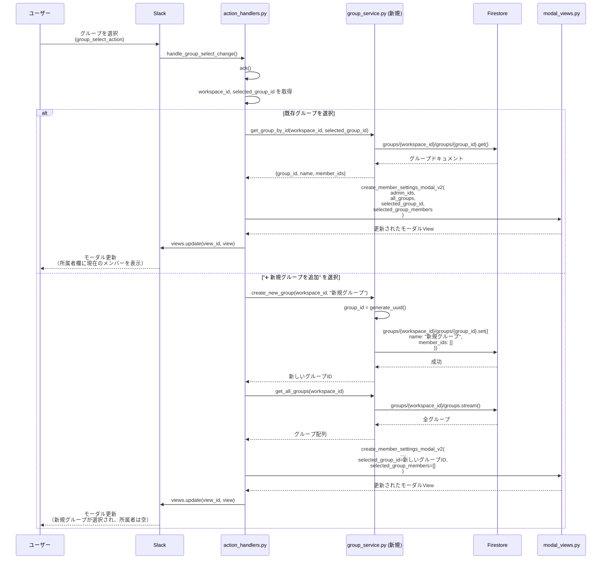
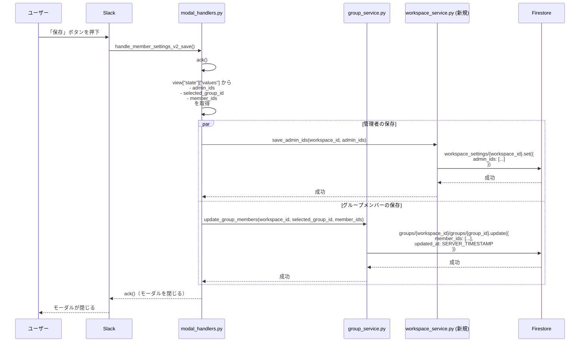
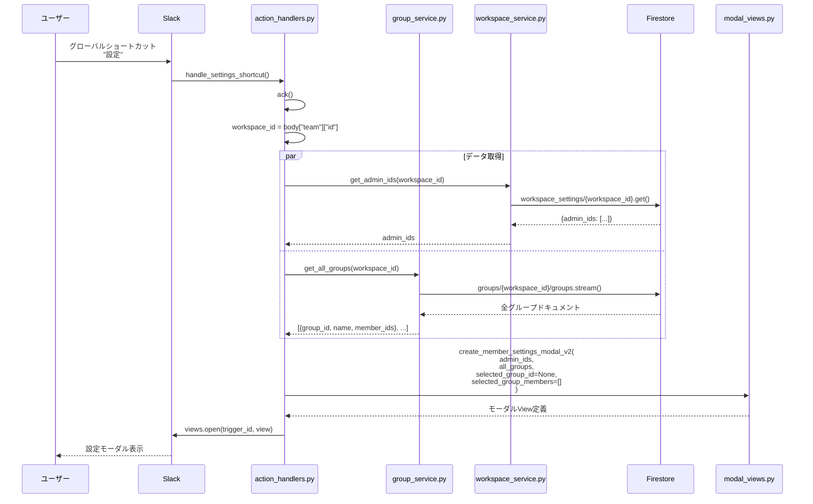
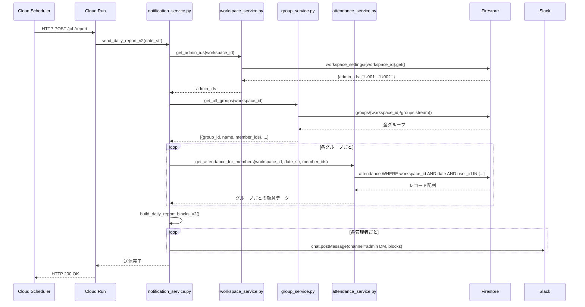

# Slack勤怠管理Bot - 技術仕様書 v2.0

**バージョン**: v2.0 (設定UI刷新版)  
**作成日**: 2026-01-21  
**前バージョン**: v1.1 (spec_v1.1.md)  
**ステータス**: 🚧 設計中

---

## 📑 目次

1. [バージョン情報](#バージョン情報)
2. [v2.0の新機能概要](#v20の新機能概要)
3. [データモデルの変更](#データモデルの変更)
4. [新しい設定UIの仕様](#新しい設定uiの仕様)
5. [処理フロー](#処理フロー)
6. [APIリファレンス](#apiリファレンス)
7. [実装計画](#実装計画)
8. [マイグレーション計画](#マイグレーション計画)

---

## バージョン情報

### v2.0の主な新機能

| 機能 | 説明 | 優先度 |
|------|------|--------|
| **動的グループ管理** | 固定的な1課〜8課から、動的に追加・編集可能なグループ管理へ移行 | 🔴 高 |
| **管理者機能** | レポート受信者（管理者）を設定可能に | 🔴 高 |
| **グループ単位の設定** | グループごとにメンバーを動的に編集 | 🔴 高 |
| **モーダルの動的更新** | グループ選択時に所属者を自動表示 | 🟡 中 |
| **楽観的ロック** | 複数管理者による同時編集の競合検知 | 🟢 低（v2.1予定） |

### v1.1からの主な変更点

#### 廃止される機能

- ❌ 固定的なセクション構造（`sec_1`〜`sec_finance`）
- ❌ `system_metadata/member_config` ドキュメント
- ❌ `SECTION_TRANSLATION` 定数の固定マッピング

#### 新規追加される機能

- ✅ `groups` コレクション（動的グループ管理）
- ✅ 管理者（レポート受信者）の設定機能
- ✅ グループの動的追加・編集・削除
- ✅ グループ選択時のメンバー自動表示

---

## v2.0の新機能概要

### 1. 動的グループ管理

#### v1.1の課題

```python
# v1.1: 固定的なセクション定義
SECTION_TRANSLATION = {
    "sec_1": "1課",
    "sec_2": "2課",
    # ... 8つ固定
}
```

- グループ数が固定（8つ）
- 名称変更ができない
- 組織変更に対応できない

#### v2.0の解決策

```python
# v2.0: Firestoreで動的管理
groups/{workspace_id}/groups/{group_id}
{
    "name": "営業1課",
    "member_ids": ["U001", "U002"],
    "created_at": "2026-01-21T10:00:00",
    "updated_at": "2026-01-21T10:00:00"
}
```

- グループ数は無制限
- 名称は自由に設定可能
- 組織変更に柔軟に対応

### 2. 管理者機能

#### 機能概要

- **管理者（レポート受信者）**: 毎朝9:00に当日の勤怠レポートを受信するユーザー
- **設定方法**: 設定モーダルで複数選択
- **権限**: v2.0では権限チェックなし（v2.1で実装予定）

#### データ構造

```json
{
  "workspace_id": "T0123ABCD",
  "admin_ids": ["U001", "U002", "U003"],
  "updated_at": "2026-01-21T10:00:00"
}
```

### 3. 新しい設定モーダル

#### UIの構成

```
┌─────────────────────────────────────┐
│  9:00レポート設定              [保存] │
├─────────────────────────────────────┤
│                                     │
│  管理者                             │
│  ┌────────────────────────────────┐ │
│  │ @user1, @user2, @user3 選択    │ │
│  └────────────────────────────────┘ │
│  ⓘ 管理者には、毎朝9:00に当日の     │
│     勤怠連絡が通知されます。        │
│                                     │
│  ─────────────────────────────────  │
│                                     │
│  課                                 │
│  ┌────────────────────────────────┐ │
│  │ ▼ 1課                         │ │
│  │   2課                          │ │
│  │   ➕ 新規グループを追加        │ │
│  └────────────────────────────────┘ │
│                                     │
│  課の所属者                         │
│  ┌────────────────────────────────┐ │
│  │ @user4, @user5 選択            │ │
│  └────────────────────────────────┘ │
│                                     │
└─────────────────────────────────────┘
```

---

## データモデルの変更

### 新しいFirestoreコレクション構造

#### 1. `groups` コレクション（新規）

**コレクションパス**: `groups/{workspace_id}/groups/{group_id}`

**ドキュメントID命名規則**: `group_{uuid}`

例: `group_a1b2c3d4-e5f6-7890-abcd-ef1234567890`

**フィールド定義**:

| フィールド名 | 型 | 必須 | 説明 | 例 |
|-------------|---|------|------|-----|
| `group_id` | string | ○ | グループの一意ID | `"group_a1b2c3d4..."` |
| `name` | string | ○ | グループ名（表示用） | `"営業1課"` |
| `member_ids` | array | ○ | グループに所属するユーザーIDの配列 | `["U001", "U002"]` |
| `created_at` | timestamp | ○ | グループ作成日時 | Firestoreタイムスタンプ |
| `updated_at` | timestamp | ○ | 最終更新日時 | Firestoreタイムスタンプ |
| `created_by` | string | △ | 作成者のユーザーID | `"U001"` |

**インデックス**:
- `workspace_id` (自動、親コレクションのため)
- `name` (検索用、将来の拡張)

#### 2. `workspace_settings` コレクション（新規）

**コレクションパス**: `workspace_settings/{workspace_id}`

**ドキュメントID**: `{workspace_id}` （1ワークスペース = 1ドキュメント）

**フィールド定義**:

| フィールド名 | 型 | 必須 | 説明 | 例 |
|-------------|---|------|------|-----|
| `workspace_id` | string | ○ | Slackワークスペースの一意ID | `"T0123ABCD"` |
| `admin_ids` | array | ○ | 管理者（レポート受信者）のユーザーID配列 | `["U001", "U002"]` |
| `report_channel_id` | string | △ | レポート送信先チャンネルID（未指定時は全参加チャンネル） | `"C01234567"` |
| `updated_at` | timestamp | ○ | 最終更新日時 | Firestoreタイムスタンプ |
| `version` | string | △ | 楽観的ロック用バージョン（v2.1で使用） | `"2026-01-21T10:00:00"` |

#### 3. `attendance` コレクション（変更なし）

v1.1と同じ構造を維持します。

#### 4. `system_metadata` コレクション（廃止予定）

**廃止するドキュメント**:
- `member_config` （`groups` コレクションに移行）

**移行方法**: [マイグレーション計画](#マイグレーション計画) を参照

### データ構造の比較

#### v1.1の構造（廃止）

```json
{
  "collection": "system_metadata",
  "document": "member_config",
  "data": {
    "section_user_map": {
      "sec_1": ["U001", "U002"],
      "sec_2": ["U003"],
      "sec_finance": ["U004"]
    },
    "updated_at": "2026-01-21T10:00:00",
    "workspace_id": "T0123ABCD"
  }
}
```

**問題点**:
- セクションIDが固定
- 名称変更ができない
- グループ追加ができない
- 管理者の概念がない

#### v2.0の構造（新規）

```json
{
  "collection": "groups",
  "document": "T0123ABCD",
  "subcollection": "groups",
  "documents": [
    {
      "id": "group_a1b2c3d4",
      "data": {
        "group_id": "group_a1b2c3d4",
        "name": "営業1課",
        "member_ids": ["U001", "U002"],
        "created_at": "2026-01-21T10:00:00",
        "updated_at": "2026-01-21T10:00:00"
      }
    },
    {
      "id": "group_e5f67890",
      "data": {
        "group_id": "group_e5f67890",
        "name": "営業2課",
        "member_ids": ["U003"],
        "created_at": "2026-01-21T10:00:00",
        "updated_at": "2026-01-21T10:00:00"
      }
    }
  ]
}

{
  "collection": "workspace_settings",
  "document": "T0123ABCD",
  "data": {
    "workspace_id": "T0123ABCD",
    "admin_ids": ["U001", "U005"],
    "updated_at": "2026-01-21T10:00:00"
  }
}
```

**改善点**:
- グループを動的に追加可能
- 名称を自由に設定可能
- 管理者を個別に設定可能
- 将来の拡張に対応しやすい

---

## 新しい設定UIの仕様

### モーダル定義

#### callback_id

```
member_settings_v2
```

#### Block構成

##### 1. 管理者選択ブロック

```json
{
  "type": "input",
  "block_id": "admin_users_block",
  "element": {
    "type": "multi_users_select",
    "placeholder": {
      "type": "plain_text",
      "text": "ユーザを選択（複数選択可）",
      "emoji": true
    },
    "action_id": "admin_users_select",
    "initial_users": ["U001", "U002"]
  },
  "label": {
    "type": "plain_text",
    "text": "管理者",
    "emoji": true
  }
}
```

**動作**:
- 既存の管理者IDを `initial_users` に設定
- ユーザーが選択を変更
- 保存時に `workspace_settings/{workspace_id}` の `admin_ids` を更新

##### 2. 説明文ブロック

```json
{
  "type": "context",
  "elements": [
    {
      "type": "mrkdwn",
      "text": "ⓘ 管理者には、毎朝9:00に当日の勤怠連絡が通知されます。"
    }
  ]
}
```

##### 3. グループ選択ブロック

```json
{
  "type": "input",
  "block_id": "group_selection_input_block",
  "element": {
    "type": "static_select",
    "placeholder": {
      "type": "plain_text",
      "text": "課を選択",
      "emoji": true
    },
    "options": [
      {
        "text": { "type": "plain_text", "text": "営業1課" },
        "value": "group_a1b2c3d4"
      },
      {
        "text": { "type": "plain_text", "text": "営業2課" },
        "value": "group_e5f67890"
      },
      {
        "text": { "type": "plain_text", "text": "➕ 新規グループを追加" },
        "value": "action_new_group"
      }
    ],
    "action_id": "group_select_action"
  },
  "label": {
    "type": "plain_text",
    "text": "課",
    "emoji": true
  }
}
```

**動作**:
1. Firestoreから `groups/{workspace_id}/groups` を取得
2. 各グループドキュメントを `options` に変換
3. 最後に「➕ 新規グループを追加」を追加
4. ユーザーが選択を変更すると `group_select_action` がトリガー
5. **モーダルを動的更新**（後述）

##### 4. 所属者選択ブロック

```json
{
  "type": "input",
  "block_id": "target_members_block",
  "element": {
    "type": "multi_users_select",
    "placeholder": {
      "type": "plain_text",
      "text": "ユーザを選択（複数選択可）",
      "emoji": true
    },
    "action_id": "target_members_select",
    "initial_users": ["U001", "U002"]
  },
  "label": {
    "type": "plain_text",
    "text": "課の所属者",
    "emoji": true
  }
}
```

**動作**:
- グループ選択時に、選択されたグループの `member_ids` を `initial_users` に設定
- ユーザーが選択を変更
- 保存時に選択されたグループの `member_ids` を更新

### モーダルの動的更新

#### トリガー

```
action_id: "group_select_action"
```

#### 更新フロー



### モーダル保存フロー



---

## 処理フロー

### 1. 設定モーダルを開く



### 2. 日次レポート送信（v2.0での変更）



---

## APIリファレンス

### 新規追加: group_service.py

#### `GroupService` クラス

##### `get_all_groups()`

```python
def get_all_groups(self, workspace_id: str) -> List[Dict[str, Any]]:
    """
    ワークスペース内の全グループを取得します。
    
    Args:
        workspace_id: Slackワークスペースの一意ID
        
    Returns:
        グループ情報の配列:
        [
            {
                "group_id": "group_a1b2c3d4",
                "name": "営業1課",
                "member_ids": ["U001", "U002"],
                "created_at": "2026-01-21T10:00:00",
                "updated_at": "2026-01-21T10:00:00"
            },
            ...
        ]
    """
```

##### `get_group_by_id()`

```python
def get_group_by_id(self, workspace_id: str, group_id: str) -> Optional[Dict[str, Any]]:
    """
    特定のグループを取得します。
    
    Args:
        workspace_id: Slackワークスペースの一意ID
        group_id: グループの一意ID
        
    Returns:
        グループ情報の辞書（存在しない場合はNone）
    """
```

##### `create_group()`

```python
def create_group(self, workspace_id: str, name: str, member_ids: List[str], created_by: str) -> str:
    """
    新しいグループを作成します。
    
    Args:
        workspace_id: Slackワークスペースの一意ID
        name: グループ名
        member_ids: 初期メンバーのユーザーID配列
        created_by: 作成者のユーザーID
        
    Returns:
        作成されたグループのgroup_id
        
    Raises:
        ValidationError: グループ名が空または重複している場合
    """
```

##### `update_group_members()`

```python
def update_group_members(self, workspace_id: str, group_id: str, member_ids: List[str]) -> None:
    """
    グループのメンバーを更新します。
    
    Args:
        workspace_id: Slackワークスペースの一意ID
        group_id: グループの一意ID
        member_ids: 新しいメンバーのユーザーID配列
        
    Raises:
        ValidationError: グループが存在しない場合
    """
```

##### `delete_group()`

```python
def delete_group(self, workspace_id: str, group_id: str) -> None:
    """
    グループを削除します。
    
    Args:
        workspace_id: Slackワークスペースの一意ID
        group_id: グループの一意ID
        
    Note:
        v2.0では未実装（v2.1で追加予定）
    """
```

### 新規追加: workspace_service.py

#### `WorkspaceService` クラス

##### `get_admin_ids()`

```python
def get_admin_ids(self, workspace_id: str) -> List[str]:
    """
    ワークスペースの管理者IDを取得します。
    
    Args:
        workspace_id: Slackワークスペースの一意ID
        
    Returns:
        管理者のユーザーID配列
    """
```

##### `save_admin_ids()`

```python
def save_admin_ids(self, workspace_id: str, admin_ids: List[str]) -> None:
    """
    ワークスペースの管理者IDを保存します。
    
    Args:
        workspace_id: Slackワークスペースの一意ID
        admin_ids: 管理者のユーザーID配列
        
    Raises:
        ValidationError: admin_idsが空の場合（少なくとも1人は必要）
    """
```

### 変更: modal_views.py

#### 新規追加: `create_member_settings_modal_v2()`

```python
def create_member_settings_modal_v2(
    admin_ids: List[str],
    all_groups: List[Dict[str, Any]],
    selected_group_id: Optional[str] = None,
    selected_group_members: List[str] = None
) -> Dict[str, Any]:
    """
    v2.0の設定モーダルを生成します。
    
    Args:
        admin_ids: 現在の管理者のユーザーID配列
        all_groups: 全グループ情報の配列
        selected_group_id: 現在選択されているグループID（初回はNone）
        selected_group_members: 選択されているグループのメンバーID配列（初回は[]）
        
    Returns:
        Slack モーダルビューの辞書
        
    Note:
        - グループ選択のoptionsを動的に生成
        - 最後に「➕ 新規グループを追加」を追加
        - selected_group_idがある場合、そのグループを初期選択
        - selected_group_membersをtarget_members_blockのinitial_usersに設定
    """
```

#### 廃止: `create_member_settings_modal_view()`

v1.1の固定セクション版は廃止されます。

### 変更: shared/db.py

#### 新規追加: グループ関連の関数

##### `get_all_groups_db()`

```python
def get_all_groups_db(workspace_id: str) -> List[Dict[str, Any]]:
    """
    ワークスペース内の全グループをFirestoreから取得します。
    
    Args:
        workspace_id: Slackワークスペースの一意ID
        
    Returns:
        グループ情報の配列
    """
```

##### `get_group_by_id_db()`

```python
def get_group_by_id_db(workspace_id: str, group_id: str) -> Optional[Dict[str, Any]]:
    """
    特定のグループをFirestoreから取得します。
    
    Args:
        workspace_id: Slackワークスペースの一意ID
        group_id: グループの一意ID
        
    Returns:
        グループ情報の辞書（存在しない場合はNone）
    """
```

##### `save_group_db()`

```python
def save_group_db(workspace_id: str, group_id: str, name: str, member_ids: List[str], created_by: str) -> None:
    """
    グループをFirestoreに保存します。
    
    Args:
        workspace_id: Slackワークスペースの一意ID
        group_id: グループの一意ID
        name: グループ名
        member_ids: メンバーのユーザーID配列
        created_by: 作成者のユーザーID
    """
```

##### `update_group_members_db()`

```python
def update_group_members_db(workspace_id: str, group_id: str, member_ids: List[str]) -> None:
    """
    グループのメンバーをFirestoreで更新します。
    
    Args:
        workspace_id: Slackワークスペースの一意ID
        group_id: グループの一意ID
        member_ids: 新しいメンバーのユーザーID配列
    """
```

#### 新規追加: ワークスペース設定関連の関数

##### `get_workspace_settings_db()`

```python
def get_workspace_settings_db(workspace_id: str) -> Dict[str, Any]:
    """
    ワークスペース設定をFirestoreから取得します。
    
    Args:
        workspace_id: Slackワークスペースの一意ID
        
    Returns:
        ワークスペース設定の辞書:
        {
            "admin_ids": ["U001", "U002"],
            "report_channel_id": "C01234567",
            "updated_at": "2026-01-21T10:00:00"
        }
    """
```

##### `save_admin_ids_db()`

```python
def save_admin_ids_db(workspace_id: str, admin_ids: List[str]) -> None:
    """
    管理者IDをFirestoreに保存します。
    
    Args:
        workspace_id: Slackワークスペースの一意ID
        admin_ids: 管理者のユーザーID配列
    """
```

---

## 実装計画

### フェーズ1: データ層の実装（優先度: 🔴 高）

#### タスク1.1: Firestore操作関数の追加

**ファイル**: `resources/shared/db.py`

**追加する関数**:
- `get_all_groups_db()`
- `get_group_by_id_db()`
- `save_group_db()`
- `update_group_members_db()`
- `get_workspace_settings_db()`
- `save_admin_ids_db()`

**見積もり**: 2-3時間

#### タスク1.2: GroupServiceの実装

**ファイル**: `resources/services/group_service.py` (新規作成)

**実装内容**:
- `GroupService` クラスの作成
- 全メソッドの実装
- ユニットテストの作成

**見積もり**: 3-4時間

#### タスク1.3: WorkspaceServiceの実装

**ファイル**: `resources/services/workspace_service.py` (新規作成)

**実装内容**:
- `WorkspaceService` クラスの作成
- 管理者ID管理のメソッド実装
- ユニットテストの作成

**見積もり**: 2-3時間

### フェーズ2: UI層の実装（優先度: 🔴 高）

#### タスク2.1: 新しいモーダルの実装

**ファイル**: `resources/views/modal_views.py`

**実装内容**:
- `create_member_settings_modal_v2()` の実装
- グループオプションの動的生成
- 選択状態の反映

**見積もり**: 2-3時間

#### タスク2.2: モーダルハンドラーの実装

**ファイル**: `resources/handlers/modal_handlers.py`

**実装内容**:
- `handle_member_settings_v2_save()` の実装
- 管理者IDの保存処理
- グループメンバーの保存処理

**見積もり**: 2-3時間

### フェーズ3: 動的更新の実装（優先度: 🟡 中）

#### タスク3.1: グループ選択時の動的更新

**ファイル**: `resources/handlers/action_handlers.py`

**実装内容**:
- `handle_group_select_change()` の実装
- モーダルの動的更新ロジック
- 新規グループ追加時の処理

**見積もり**: 3-4時間

### フェーズ4: レポート送信の改修（優先度: 🟡 中）

#### タスク4.1: 管理者へのDM送信

**ファイル**: `resources/services/notification_service.py`

**実装内容**:
- `send_daily_report_v2()` の実装
- 管理者IDの取得
- 各管理者へのDM送信

**見積もり**: 2-3時間

#### タスク4.2: レポート内容の改善

**ファイル**: `resources/services/notification_service.py`

**実装内容**:
- グループ単位でのレポート生成
- 動的なグループ名の表示

**見積もり**: 2-3時間

### フェーズ5: マイグレーション（優先度: 🟢 低）

#### タスク5.1: データ移行スクリプトの作成

**ファイル**: `scripts/migrate_v1_to_v2.py` (新規作成)

**実装内容**:
- `system_metadata/member_config` からデータ読み取り
- `groups` コレクションへの変換
- バックアップの作成

**見積もり**: 3-4時間

### 総見積もり

**合計**: 23-30時間（約3-4営業日）

---

## マイグレーション計画

### 既存データの移行

#### ステップ1: バックアップの作成

```bash
# Firestoreエクスポート
gcloud firestore export gs://[BUCKET_NAME]/backup/v1_backup

# ローカルにダウンロード
gsutil -m cp -r gs://[BUCKET_NAME]/backup/v1_backup ./backup/
```

#### ステップ2: 移行スクリプトの実行

```python
# scripts/migrate_v1_to_v2.py

import uuid
from google.cloud import firestore

db = firestore.Client()

def migrate_member_config_to_groups(workspace_id: str):
    """
    v1.1の member_config を v2.0の groups に移行します。
    """
    # 1. 既存データの読み取り
    old_config = db.collection("system_metadata").document("member_config").get()
    if not old_config.exists:
        print("No member_config found. Skipping migration.")
        return
    
    section_user_map = old_config.to_dict().get("section_user_map", {})
    
    # 2. セクション名のマッピング
    SECTION_NAMES = {
        "sec_1": "1課",
        "sec_2": "2課",
        "sec_3": "3課",
        "sec_4": "4課",
        "sec_5": "5課",
        "sec_6": "6課",
        "sec_7": "7課",
        "sec_finance": "金融開発課"
    }
    
    # 3. 各セクションをグループとして作成
    for section_id, member_ids in section_user_map.items():
        if not member_ids:
            continue  # 空のセクションはスキップ
        
        group_id = f"group_{uuid.uuid4()}"
        group_name = SECTION_NAMES.get(section_id, section_id)
        
        group_ref = db.collection("groups").document(workspace_id)\
                      .collection("groups").document(group_id)
        
        group_ref.set({
            "group_id": group_id,
            "name": group_name,
            "member_ids": member_ids,
            "created_at": firestore.SERVER_TIMESTAMP,
            "updated_at": firestore.SERVER_TIMESTAMP,
            "created_by": "migration_script"
        })
        
        print(f"Migrated: {section_id} -> {group_name} ({len(member_ids)} members)")
    
    # 4. 管理者の初期設定（空配列）
    ws_settings_ref = db.collection("workspace_settings").document(workspace_id)
    ws_settings_ref.set({
        "workspace_id": workspace_id,
        "admin_ids": [],  # 移行後に手動で設定してもらう
        "updated_at": firestore.SERVER_TIMESTAMP
    })
    
    print(f"Migration completed for workspace: {workspace_id}")

# 実行
workspace_id = "T0123ABCD"  # 環境変数または引数から取得
migrate_member_config_to_groups(workspace_id)
```

#### ステップ3: 動作確認

1. 設定モーダルを開く
2. 移行されたグループが表示されることを確認
3. 管理者を設定
4. グループメンバーを編集して保存
5. 日次レポートが正しく送信されることを確認

#### ステップ4: 旧データの削除（オプション）

```python
# 確認後、旧データを削除
db.collection("system_metadata").document("member_config").delete()
print("Old member_config deleted.")
```

### ロールバック計画

移行に失敗した場合のロールバック手順：

1. バックアップから復元
   ```bash
   gcloud firestore import gs://[BUCKET_NAME]/backup/v1_backup
   ```

2. v1.1のコードに戻す
   ```bash
   git checkout v1.1
   ```

3. デプロイ
   ```bash
   gcloud run deploy slack-attendance-bot --source .
   ```

---

## v2.1以降の拡張計画

### 機能追加予定

#### v2.1: 権限管理の実装

- 管理者のみが設定を変更可能
- 一般ユーザーは閲覧のみ
- `shared/auth.py` の作成

#### v2.2: グループ削除機能

- 設定モーダルにグループ削除ボタンを追加
- 削除確認モーダルの実装

#### v2.3: グループ名の編集

- グループ名をインラインで編集可能に
- 重複チェックの実装

#### v2.4: 楽観的ロックの実装

- Firestore Transactionsを使用
- バージョンチェックと競合検知

---

**ドキュメントバージョン**: v2.0  
**作成日**: 2026-01-21  
**ステータス**: 🚧 設計中  
**次のステップ**: フェーズ1の実装開始
