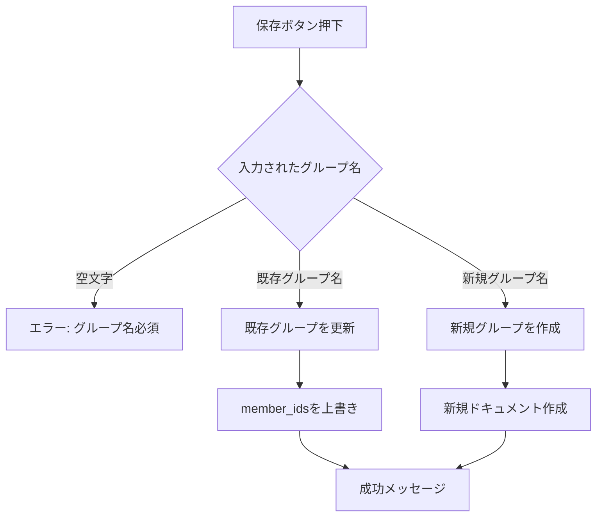
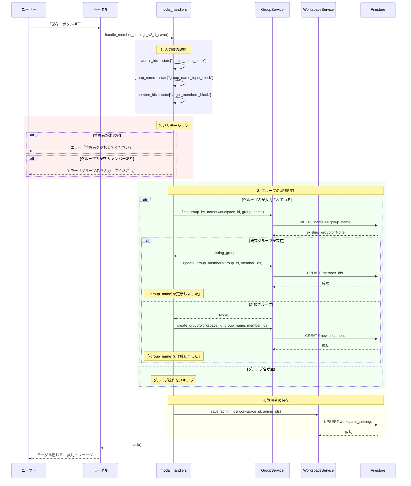
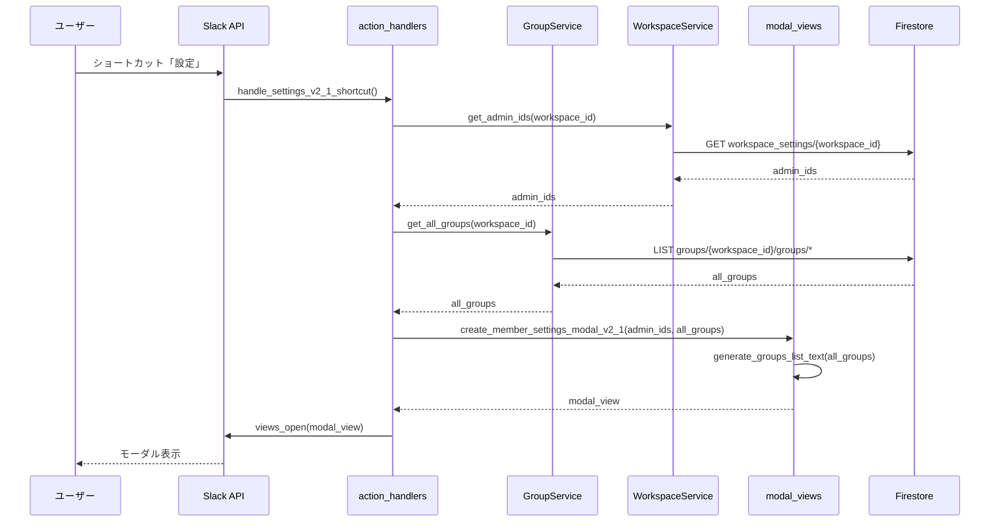
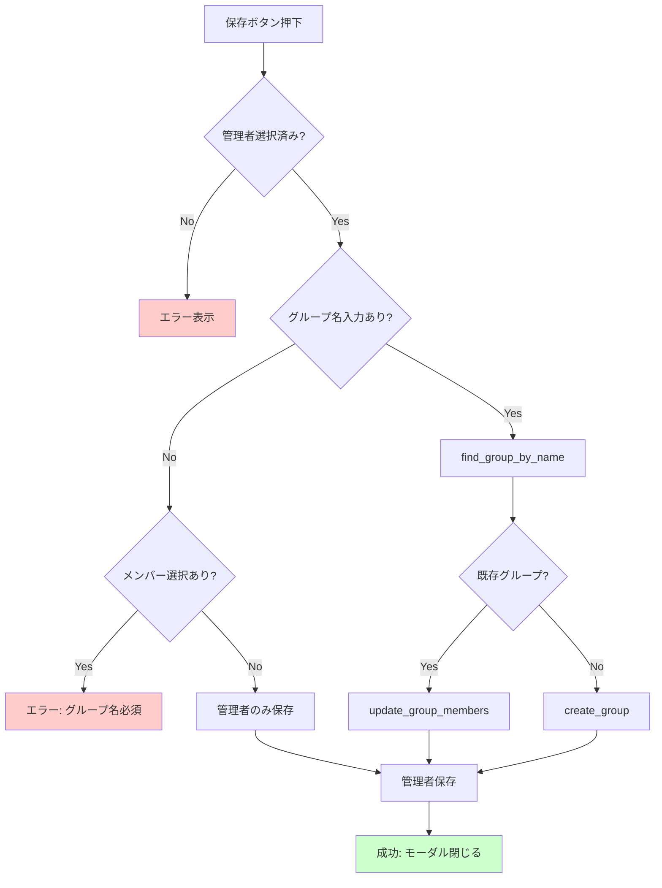
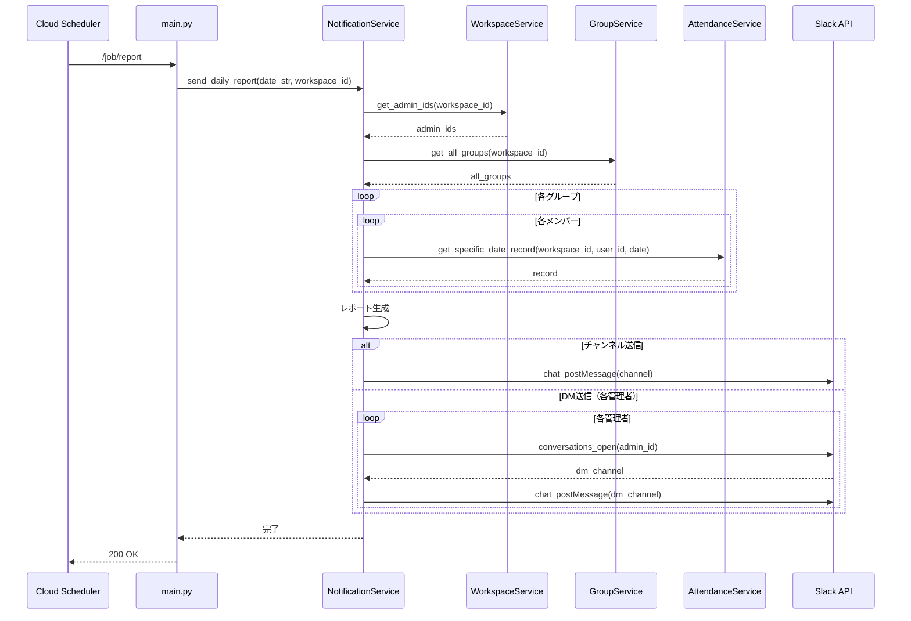

# Slack勤怠管理Bot - 技術仕様書 v2.1

**バージョン**: v2.1 (設定UI完全刷新版)  
**作成日**: 2026-01-21  
**前バージョン**: v2.0 (spec_v2.0.md)  
**ステータス**: 🎯 設計完了

---

## 📑 目次

1. [バージョン情報](#バージョン情報)
2. [v2.1の新機能概要](#v21の新機能概要)
3. [データモデル](#データモデル)
4. [設定UIの完全仕様](#設定uiの完全仕様)
5. [UPSERTロジック](#upsertロジック)
6. [処理フロー](#処理フロー)
7. [APIリファレンス](#apiリファレンス)
8. [v2.0からの変更点](#v20からの変更点)
9. [実装計画](#実装計画)

---

## バージョン情報

### v2.1の主な新機能

| 機能 | 説明 | v2.0との違い |
|------|------|-------------|
| **グループ名テキスト入力** | グループ名を直接入力する方式に変更 | v2.0はドロップダウン選択 |
| **UPSERTロジック** | 既存グループ名なら更新、新規なら作成 | v2.0は明示的な「新規追加」ボタン |
| **登録済みグループ一覧表示** | モーダル内に常時表示 | v2.0は選択肢のみ |
| **動的更新の廃止** | `views.update` を使用しないシンプルな設計 | v2.0はグループ選択時に動的更新 |
| **改善されたUX** | グループ名を見ながら入力可能 | v2.0は選択後にメンバー表示 |

### v2.0からの主な変更理由

#### 問題点の解決

| v2.0の問題 | v2.1での解決策 |
|-----------|--------------|
| グループ選択時に `views.update` が必要で複雑 | テキスト入力のみでUPSERTを実現 |
| 「➕ 新規グループを追加」の特殊処理が必要 | 新規・更新を自動判定 |
| グループ名を確認しづらい | モーダル内に常時一覧表示 |
| アクションハンドラーが増える | モーダル送信時のみで完結 |

---

## v2.1の新機能概要

### 1. グループ名テキスト入力方式

#### 設計思想

```
【従来（v2.0）】
グループ選択 → views.update → メンバー表示 → 保存

【新方式（v2.1）】
グループ名入力 + メンバー選択 → 保存（UPSERT判定）
```

#### メリット

1. **シンプルな実装**: `views.update` 不要
2. **直感的なUX**: グループ名を見ながら入力
3. **柔軟な編集**: 既存グループの名称変更も可能（将来）
4. **保守性向上**: アクションハンドラーが不要

### 2. 登録済みグループ一覧の常時表示

#### 表示方法

モーダル内の `context` ブロックに、Firestoreから取得したグループ一覧を表示：

```
登録済みグループ:
• 営業1課 (3人)
• 営業2課 (5人)
• 開発課 (8人)
```

#### 実装ポイント

- グループが0件の場合: `「まだグループが登録されていません」` を表示
- 各グループの人数も表示（視認性向上）
- Markdown形式（`type: "mrkdwn"`）で箇条書き

### 3. UPSERTロジック

#### 判定フロー



#### 実装詳細

```python
def handle_member_settings_v2_1_save(workspace_id, group_name, member_ids, admin_ids):
    """
    グループ設定の保存（UPSERT）
    
    Args:
        workspace_id: ワークスペースID
        group_name: 入力されたグループ名
        member_ids: 選択されたメンバーID配列
        admin_ids: 管理者ID配列
    """
    # 1. バリデーション
    if not group_name or not group_name.strip():
        raise ValidationError("グループ名を入力してください")
    
    if not admin_ids:
        raise ValidationError("少なくとも1人の管理者を選択してください")
    
    # 2. 既存グループの検索（グループ名で）
    existing_group = group_service.find_group_by_name(workspace_id, group_name)
    
    # 3. UPSERT処理
    if existing_group:
        # 更新
        group_service.update_group_members(
            workspace_id, 
            existing_group["group_id"], 
            member_ids
        )
        logger.info(f"グループ更新: {group_name}")
    else:
        # 作成
        group_service.create_group(
            workspace_id, 
            name=group_name, 
            member_ids=member_ids
        )
        logger.info(f"グループ作成: {group_name}")
    
    # 4. 管理者の保存
    workspace_service.save_admin_ids(workspace_id, admin_ids)
    
    return "保存しました"
```

---

## データモデル

### 変更点サマリー

| コレクション | v2.0 | v2.1 | 変更内容 |
|------------|------|------|---------|
| `groups` | 存在 | 存在 | **グループ名での検索が必要** |
| `workspace_settings` | 存在 | 存在 | 変更なし |
| `system_metadata/member_config` | 非推奨 | 廃止 | 完全削除予定 |

### 1. `groups` コレクション

#### パス

```
groups/{workspace_id}/groups/{group_id}
```

#### ドキュメント構造

```json
{
  "group_id": "group_a1b2c3d4e5f6",
  "name": "営業1課",
  "member_ids": ["U001", "U002", "U003"],
  "created_at": "2026-01-21T10:00:00Z",
  "updated_at": "2026-01-21T15:30:00Z",
  "created_by": "U000"
}
```

#### フィールド定義

| フィールド | 型 | 必須 | 説明 |
|-----------|---|------|------|
| `group_id` | string | ✅ | 一意なグループID（UUID） |
| `name` | string | ✅ | グループ名（例: "営業1課"） |
| `member_ids` | array[string] | ✅ | メンバーのSlack User ID配列 |
| `created_at` | timestamp | ✅ | 作成日時 |
| `updated_at` | timestamp | ✅ | 最終更新日時 |
| `created_by` | string | - | 作成者のUser ID |

#### インデックス要件（v2.1で新規追加）

**重要**: グループ名での検索を効率化するため、以下のインデックスを作成：

```
コレクションID: groups
フィールド: name (Ascending), __name__ (Ascending)
クエリスコープ: コレクショングループ
```

#### クエリ例

```python
# グループ名での検索（v2.1で必須）
groups_ref = db.collection("groups").document(workspace_id).collection("groups")
query = groups_ref.where("name", "==", group_name).limit(1)
docs = query.stream()
```

### 2. `workspace_settings` コレクション

#### パス

```
workspace_settings/{workspace_id}
```

#### ドキュメント構造

```json
{
  "workspace_id": "T0123ABCD",
  "admin_ids": ["U001", "U002"],
  "report_channel_id": "C01234567",
  "updated_at": "2026-01-21T10:00:00Z"
}
```

#### フィールド定義

| フィールド | 型 | 必須 | 説明 |
|-----------|---|------|------|
| `workspace_id` | string | ✅ | Slackワークスペースの一意ID |
| `admin_ids` | array[string] | ✅ | 管理者のSlack User ID配列 |
| `report_channel_id` | string | - | レポート送信先チャンネルID |
| `updated_at` | timestamp | ✅ | 最終更新日時 |

---

## 設定UIの完全仕様

### Block Kit JSON定義（正式版）

以下のJSON構造を **完全に正** として実装します。

```json
{
  "type": "modal",
  "callback_id": "member_settings_v2_1",
  "title": { 
    "type": "plain_text", 
    "text": "9:00レポート設定" 
  },
  "submit": { 
    "type": "plain_text", 
    "text": "保存" 
  },
  "close": { 
    "type": "plain_text", 
    "text": "キャンセル" 
  },
  "blocks": [
    {
      "type": "input",
      "block_id": "admin_users_block",
      "element": {
        "type": "multi_users_select",
        "action_id": "admin_users_select",
        "placeholder": { 
          "type": "plain_text", 
          "text": "ユーザを選択" 
        }
      },
      "label": { 
        "type": "plain_text", 
        "text": "管理者 (全グループ共通)" 
      }
    },
    {
      "type": "context",
      "elements": [
        { 
          "type": "mrkdwn", 
          "text": "ⓘ 管理者に設定されたユーザに当日の勤怠情報が通知されます。" 
        }
      ]
    },
    { "type": "divider" },
    {
      "type": "section",
      "text": { 
        "type": "mrkdwn", 
        "text": "*登録済みグループ:*" 
      }
    },
    {
      "type": "context",
      "block_id": "registered_groups_list",
      "elements": [
        { 
          "type": "mrkdwn", 
          "text": "• 営業1課 (3人)\n• 営業2課 (5人)\n• 開発課 (8人)" 
        }
      ]
    },
    { "type": "divider" },
    {
      "type": "section",
      "text": { 
        "type": "mrkdwn", 
        "text": "*グループを作成・更新する*" 
      }
    },
    {
      "type": "input",
      "block_id": "group_name_input_block",
      "element": {
        "type": "plain_text_input",
        "action_id": "group_name_input",
        "placeholder": { 
          "type": "plain_text", 
          "text": "例：営業1課" 
        }
      },
      "label": { 
        "type": "plain_text", 
        "text": "グループ名" 
      },
      "optional": true
    },
    {
      "type": "context",
      "elements": [
        { 
          "type": "mrkdwn", 
          "text": "ⓘ 登録済みグループ名を入力すると更新、新規グループ名を入力するとグループが作成されます。" 
        }
      ]
    },
    {
      "type": "input",
      "block_id": "target_members_block",
      "element": {
        "type": "multi_users_select",
        "action_id": "target_members_select",
        "placeholder": { 
          "type": "plain_text", 
          "text": "メンバーを選択" 
        }
      },
      "label": { 
        "type": "plain_text", 
        "text": "このグループの所属者" 
      },
      "optional": true
    }
  ]
}
```

### UI要素の詳細説明

#### 1. 管理者選択（admin_users_block）

**要素**: `multi_users_select`

**動作**:
- 複数のユーザーを選択可能
- 少なくとも1人は必須（保存時にバリデーション）
- 既存の管理者IDがある場合は `initial_users` で初期表示

**保存先**: `workspace_settings/{workspace_id}` の `admin_ids` フィールド

#### 2. 登録済みグループ一覧（registered_groups_list）

**要素**: `context` ブロック（表示のみ、入力不可）

**表示内容**:
```
• 営業1課 (3人)
• 営業2課 (5人)
• 開発課 (8人)
```

**生成ロジック**:
```python
def generate_groups_list_text(groups: List[Dict]) -> str:
    """
    登録済みグループ一覧のテキストを生成
    
    Args:
        groups: グループ情報の配列
        
    Returns:
        Markdown形式の箇条書きテキスト
    """
    if not groups:
        return "_まだグループが登録されていません_"
    
    lines = []
    for group in groups:
        name = group.get("name", "不明")
        member_count = len(group.get("member_ids", []))
        lines.append(f"• {name} ({member_count}人)")
    
    return "\n".join(lines)
```

#### 3. グループ名入力（group_name_input_block）

**要素**: `plain_text_input`

**動作**:
- 既存グループ名を入力 → 更新
- 新規グループ名を入力 → 作成
- 空欄で保存 → グループ操作をスキップ（管理者のみ保存）

**バリデーション**:
- グループ名が空で、メンバーが選択されている場合 → エラー
- グループ名があり、メンバーが空の場合 → 空のグループとして保存（将来削除予定）

#### 4. グループメンバー選択（target_members_block）

**要素**: `multi_users_select`

**動作**:
- 複数のメンバーを選択可能
- 空配列も許可（グループからメンバーを全削除）
- グループ名が入力されている場合のみ有効

---

## UPSERTロジック

### 保存処理の全体フロー



### 詳細ロジック

#### ステップ1: 入力値の取得

```python
def handle_member_settings_v2_1_save(ack, body, view):
    """
    v2.1設定モーダルの「保存」ボタン押下時の処理
    """
    workspace_id = body["team"]["id"]
    vals = view["state"]["values"]
    
    # 1. 管理者IDの取得
    admin_ids = vals["admin_users_block"]["admin_users_select"].get("selected_users", [])
    
    # 2. グループ名の取得
    group_name_raw = vals["group_name_input_block"]["group_name_input"].get("value", "")
    group_name = group_name_raw.strip() if group_name_raw else ""
    
    # 3. メンバーIDの取得
    member_ids = vals["target_members_block"]["target_members_select"].get("selected_users", [])
```

#### ステップ2: バリデーション

```python
    # バリデーション1: 管理者が必須
    if not admin_ids:
        ack(response_action="errors", errors={
            "admin_users_block": "⚠️ 少なくとも1人の管理者を選択してください。"
        })
        return
    
    # バリデーション2: グループ名が空で、メンバーが選択されている場合
    if not group_name and member_ids:
        ack(response_action="errors", errors={
            "group_name_input_block": "⚠️ グループ名を入力してください。"
        })
        return
```

#### ステップ3: グループのUPSERT

```python
    try:
        from resources.services.group_service import GroupService
        from resources.services.workspace_service import WorkspaceService
        
        group_service = GroupService()
        workspace_service = WorkspaceService()
        
        # グループ名が入力されている場合のみ処理
        if group_name:
            # 既存グループの検索
            existing_group = group_service.find_group_by_name(workspace_id, group_name)
            
            if existing_group:
                # 更新
                group_service.update_group_members(
                    workspace_id=workspace_id,
                    group_id=existing_group["group_id"],
                    member_ids=member_ids
                )
                logger.info(f"グループ更新: {group_name}, Members={len(member_ids)}")
            else:
                # 作成
                group_service.create_group(
                    workspace_id=workspace_id,
                    name=group_name,
                    member_ids=member_ids,
                    created_by=body["user"]["id"]
                )
                logger.info(f"グループ作成: {group_name}, Members={len(member_ids)}")
```

#### ステップ4: 管理者の保存

```python
        # 管理者の保存（常に実行）
        workspace_service.save_admin_ids(workspace_id, admin_ids)
        logger.info(f"管理者保存: Workspace={workspace_id}, Admins={len(admin_ids)}")
        
        # 成功
        ack()
        logger.info(f"設定保存成功(v2.1): Workspace={workspace_id}")
        
    except Exception as e:
        logger.error(f"設定保存失敗(v2.1): {e}", exc_info=True)
        ack()
```

---

## 処理フロー

### 1. 設定モーダルの表示



### 2. グループの作成・更新（UPSERT）



### 3. 日次レポート送信（v2.1）

v2.0と同じロジックを使用します。グループ構造は変わらないため、変更不要です。



---

## APIリファレンス

### GroupService（v2.1で拡張）

#### 新規メソッド: `find_group_by_name()`

```python
def find_group_by_name(self, workspace_id: str, name: str) -> Optional[Dict[str, Any]]:
    """
    グループ名でグループを検索します（v2.1で追加）。
    
    Args:
        workspace_id: Slackワークスペースの一意ID
        name: グループ名（完全一致）
        
    Returns:
        グループ情報の辞書（存在しない場合はNone）
        
    Note:
        - グループ名の大文字小文字は区別されます
        - 前後の空白はトリムしてから検索してください
        - Firestoreインデックスが必要です
    """
    try:
        groups_ref = self.db.collection("groups").document(workspace_id)\
                            .collection("groups")
        query = groups_ref.where("name", "==", name).limit(1)
        docs = list(query.stream())
        
        if not docs:
            logger.info(f"グループが見つかりません: {name}")
            return None
        
        group = docs[0].to_dict()
        logger.info(f"グループ検索成功: {name}, ID={group.get('group_id')}")
        return group
    except Exception as e:
        logger.error(f"グループ検索失敗: {e}", exc_info=True)
        return None
```

### modal_views（v2.1で拡張）

#### 新規関数: `create_member_settings_modal_v2_1()`

```python
def create_member_settings_modal_v2_1(
    admin_ids: List[str],
    all_groups: List[Dict[str, Any]]
) -> Dict[str, Any]:
    """
    v2.1の設定モーダルを生成します（テキスト入力版）。
    
    Args:
        admin_ids: 現在の管理者のユーザーID配列
        all_groups: 全グループ情報の配列
            [{"group_id": "...", "name": "...", "member_ids": [...]}, ...]
        
    Returns:
        Slack モーダルビューの辞書
        
    Note:
        - グループ選択のドロップダウンは廃止
        - グループ名をテキスト入力で指定
        - 登録済みグループ一覧を常時表示
        - 動的更新（views.update）は不要
    """
    # 登録済みグループ一覧のテキスト生成
    groups_text = _generate_groups_list_text(all_groups)
    
    return {
        "type": "modal",
        "callback_id": "member_settings_v2_1",
        "title": {"type": "plain_text", "text": "9:00レポート設定"},
        "submit": {"type": "plain_text", "text": "保存"},
        "close": {"type": "plain_text", "text": "キャンセル"},
        "blocks": [
            {
                "type": "input",
                "block_id": "admin_users_block",
                "element": {
                    "type": "multi_users_select",
                    "action_id": "admin_users_select",
                    "placeholder": {"type": "plain_text", "text": "ユーザを選択"},
                    **({"initial_users": admin_ids} if admin_ids else {})
                },
                "label": {"type": "plain_text", "text": "管理者 (全グループ共通)"}
            },
            {
                "type": "context",
                "elements": [
                    {"type": "mrkdwn", "text": "ⓘ 管理者に設定されたユーザに当日の勤怠情報が通知されます。"}
                ]
            },
            {"type": "divider"},
            {
                "type": "section",
                "text": {"type": "mrkdwn", "text": "*登録済みグループ:*"}
            },
            {
                "type": "context",
                "block_id": "registered_groups_list",
                "elements": [
                    {"type": "mrkdwn", "text": groups_text}
                ]
            },
            {"type": "divider"},
            {
                "type": "section",
                "text": {"type": "mrkdwn", "text": "*グループを作成・更新する*"}
            },
            {
                "type": "input",
                "block_id": "group_name_input_block",
                "element": {
                    "type": "plain_text_input",
                    "action_id": "group_name_input",
                    "placeholder": {"type": "plain_text", "text": "例：営業1課"}
                },
                "label": {"type": "plain_text", "text": "グループ名"},
                "optional": True
            },
            {
                "type": "context",
                "elements": [
                    {"type": "mrkdwn", "text": "ⓘ 登録済みグループ名を入力すると更新、新規グループ名を入力するとグループが作成されます。"}
                ]
            },
            {
                "type": "input",
                "block_id": "target_members_block",
                "element": {
                    "type": "multi_users_select",
                    "action_id": "target_members_select",
                    "placeholder": {"type": "plain_text", "text": "メンバーを選択"}
                },
                "label": {"type": "plain_text", "text": "このグループの所属者"},
                "optional": True
            }
        ]
    }


def _generate_groups_list_text(groups: List[Dict[str, Any]]) -> str:
    """
    登録済みグループ一覧のテキストを生成します。
    
    Args:
        groups: グループ情報の配列
        
    Returns:
        Markdown形式の箇条書きテキスト
    """
    if not groups:
        return "_まだグループが登録されていません_"
    
    lines = []
    for group in groups:
        name = group.get("name", "不明なグループ")
        member_count = len(group.get("member_ids", []))
        lines.append(f"• {name} ({member_count}人)")
    
    return "\n".join(lines)
```

### action_handlers（v2.1で簡略化）

#### 変更: `handle_settings_v2_1_shortcut()`

```python
@app.shortcut("open_member_setup_modal")
def handle_settings_v2_1_shortcut(ack, body, client):
    """
    グローバルショートカット「設定」の処理（v2.1版）。
    
    v2.0との違い:
    - グループ選択の動的更新が不要になったため、シンプルな実装
    - モーダルを開くだけで完結
    """
    ack()
    workspace_id = body["team"]["id"]
    
    try:
        from resources.services.group_service import GroupService
        from resources.services.workspace_service import WorkspaceService
        
        group_service = GroupService()
        workspace_service = WorkspaceService()
        
        # 管理者IDを取得
        admin_ids = workspace_service.get_admin_ids(workspace_id)
        
        # 全グループを取得
        all_groups = group_service.get_all_groups(workspace_id)
        
        # モーダルを生成（v2.1版）
        view = create_member_settings_modal_v2_1(
            admin_ids=admin_ids,
            all_groups=all_groups
        )
        
        client.views_open(trigger_id=body["trigger_id"], view=view)
        logger.info(f"設定モーダル表示(v2.1): Workspace={workspace_id}, Groups={len(all_groups)}")
    except Exception as e:
        logger.error(f"設定モーダル表示失敗: {e}", exc_info=True)
```

#### 廃止: `handle_group_select_change()`

v2.0で実装していた `@app.action("group_select_action")` ハンドラーは **完全に廃止** されます。

理由: グループ選択のドロップダウンを廃止したため、動的更新が不要になりました。

### modal_handlers（v2.1で変更）

#### 変更: `handle_member_settings_v2_1_save()`

```python
@app.view("member_settings_v2_1")
def handle_member_settings_v2_1_save(ack, body, view):
    """
    v2.1設定モーダルの「保存」ボタン押下時の処理。
    
    v2.0との違い:
    - グループ名をテキスト入力から取得
    - find_group_by_name() で既存グループを検索
    - UPSERT処理（既存なら更新、新規なら作成）
    """
    workspace_id = body["team"]["id"]
    vals = view["state"]["values"]
    
    try:
        from resources.services.group_service import GroupService
        from resources.services.workspace_service import WorkspaceService
        
        group_service = GroupService()
        workspace_service = WorkspaceService()
        
        # 1. 入力値の取得
        admin_ids = vals["admin_users_block"]["admin_users_select"].get("selected_users", [])
        group_name_raw = vals["group_name_input_block"]["group_name_input"].get("value", "")
        group_name = group_name_raw.strip() if group_name_raw else ""
        member_ids = vals["target_members_block"]["target_members_select"].get("selected_users", [])
        
        # 2. バリデーション
        if not admin_ids:
            ack(response_action="errors", errors={
                "admin_users_block": "⚠️ 少なくとも1人の管理者を選択してください。"
            })
            return
        
        if not group_name and member_ids:
            ack(response_action="errors", errors={
                "group_name_input_block": "⚠️ グループ名を入力してください。"
            })
            return
        
        # 3. グループのUPSERT
        if group_name:
            existing_group = group_service.find_group_by_name(workspace_id, group_name)
            
            if existing_group:
                # 更新
                group_service.update_group_members(
                    workspace_id=workspace_id,
                    group_id=existing_group["group_id"],
                    member_ids=member_ids
                )
                logger.info(f"グループ更新: {group_name}, Members={len(member_ids)}")
            else:
                # 作成
                group_service.create_group(
                    workspace_id=workspace_id,
                    name=group_name,
                    member_ids=member_ids,
                    created_by=body["user"]["id"]
                )
                logger.info(f"グループ作成: {group_name}, Members={len(member_ids)}")
        
        # 4. 管理者の保存
        workspace_service.save_admin_ids(workspace_id, admin_ids)
        logger.info(f"管理者保存: Workspace={workspace_id}, Admins={len(admin_ids)}")
        
        # 成功
        ack()
        logger.info(f"設定保存成功(v2.1): Workspace={workspace_id}")
        
    except Exception as e:
        logger.error(f"設定保存失敗(v2.1): {e}", exc_info=True)
        ack()
```

---

## v2.0からの変更点

### 主要な変更サマリー

| 項目 | v2.0 | v2.1 | 理由 |
|------|------|------|------|
| **グループ選択UI** | ドロップダウン | テキスト入力 | UX改善、実装簡略化 |
| **動的更新** | `views.update` 使用 | 不要 | 実装複雑度の低減 |
| **新規グループ作成** | 「➕ 新規追加」選択 | グループ名を入力 | 直感的な操作 |
| **グループ一覧表示** | ドロップダウンのみ | モーダル内に常時表示 | 視認性向上 |
| **アクションハンドラー** | `group_select_action` | 不要（廃止） | 保守性向上 |
| **callback_id** | `member_settings_v2` | `member_settings_v2_1` | バージョン識別 |

### 廃止される機能

#### 1. グループ選択の動的更新

**v2.0での実装**:
```python
@app.action("group_select_action")
def handle_group_select_change(ack, body, client):
    # グループ選択時にviews.updateでメンバーを更新
    ...
```

**v2.1での対応**:
- このハンドラーは完全に削除
- グループ名をテキスト入力で指定するため、動的更新不要

#### 2. 「➕ 新規グループを追加」の特殊処理

**v2.0での実装**:
```python
if selected_value == "action_new_group":
    # 新規グループを作成
    new_group_id = group_service.create_group(...)
    # モーダルを再度開く
    ...
```

**v2.1での対応**:
- 新規グループ名を入力するだけで自動判定
- 特殊な値の判定が不要

### 追加される機能

#### 1. グループ名検索

**新規メソッド**:
```python
GroupService.find_group_by_name(workspace_id, name)
```

**Firestoreインデックス**:
```
コレクション: groups
フィールド: name (Ascending)
```

#### 2. 登録済みグループ一覧の表示

**新規ヘルパー関数**:
```python
_generate_groups_list_text(groups) -> str
```

**表示例**:
```
• 営業1課 (3人)
• 営業2課 (5人)
• 開発課 (8人)
```

### コード変更箇所の一覧

| ファイル | v2.0 | v2.1 | 変更内容 |
|---------|------|------|---------|
| `group_service.py` | - | ✅ 追加 | `find_group_by_name()` メソッド |
| `modal_views.py` | `create_member_settings_modal_v2()` | `create_member_settings_modal_v2_1()` | 完全に新規作成 |
| `action_handlers.py` | `handle_group_select_change()` | 削除 | グループ選択ハンドラー不要 |
| `modal_handlers.py` | `handle_member_settings_v2_save()` | `handle_member_settings_v2_1_save()` | UPSERT処理に変更 |

---

## 実装計画

### フェーズ1: サービス層の拡張

#### タスク1-1: GroupService.find_group_by_name() の実装

**ファイル**: `resources/services/group_service.py`

**実装内容**:
```python
def find_group_by_name(self, workspace_id: str, name: str) -> Optional[Dict[str, Any]]:
    """グループ名でグループを検索"""
    try:
        groups_ref = self.db.collection("groups").document(workspace_id)\
                            .collection("groups")
        query = groups_ref.where("name", "==", name).limit(1)
        docs = list(query.stream())
        
        if not docs:
            return None
        
        return docs[0].to_dict()
    except Exception as e:
        logger.error(f"グループ検索失敗: {e}", exc_info=True)
        return None
```

**テスト項目**:
- [ ] 既存グループ名で検索できる
- [ ] 存在しないグループ名でNoneを返す
- [ ] 大文字小文字を区別する

### フェーズ2: UI層の実装

#### タスク2-1: create_member_settings_modal_v2_1() の実装

**ファイル**: `resources/views/modal_views.py`

**実装内容**:
- 提供されたBlock Kit JSONをベースに実装
- `_generate_groups_list_text()` ヘルパー関数を追加

**テスト項目**:
- [ ] 管理者が `initial_users` で初期表示される
- [ ] グループ一覧が正しく表示される
- [ ] グループが0件の場合、「まだ登録されていません」と表示される

### フェーズ3: ハンドラー層の実装

#### タスク3-1: handle_settings_v2_1_shortcut() の実装

**ファイル**: `resources/handlers/action_handlers.py`

**実装内容**:
- v2.0の `handle_settings_v2_shortcut()` をベースに簡略化
- `create_member_settings_modal_v2_1()` を呼び出す

#### タスク3-2: handle_member_settings_v2_1_save() の実装

**ファイル**: `resources/handlers/modal_handlers.py`

**実装内容**:
- UPSERTロジックの実装
- バリデーション処理
- エラーハンドリング

**テスト項目**:
- [ ] 管理者が未選択の場合、エラーが表示される
- [ ] グループ名が空でメンバーが選択されている場合、エラーが表示される
- [ ] 既存グループ名を入力すると更新される
- [ ] 新規グループ名を入力すると作成される
- [ ] グループ名が空の場合、管理者のみ保存される

### フェーズ4: v2.0コードの削除

#### タスク4-1: 不要なコードの削除

**削除対象**:
- `create_member_settings_modal_v2()` (modal_views.py)
- `handle_group_select_change()` (action_handlers.py)
- `handle_member_settings_v2_save()` (modal_handlers.py)

**注意事項**:
- v2.0のデータ構造は変更しないため、Firestoreのマイグレーションは不要
- v2.0で作成されたグループはv2.1でもそのまま使用可能

### フェーズ5: Firestoreインデックスの作成

#### タスク5-1: グループ名検索用インデックス

**作成方法**:

1. Firebase Consoleにアクセス
2. Firestore > インデックス > 複合インデックスを作成
3. 以下の設定で作成:
   - コレクションID: `groups`
   - フィールド1: `name` (Ascending)
   - フィールド2: `__name__` (Ascending)
   - クエリスコープ: コレクショングループ

**または、自動作成**:

初回実行時にFirestoreが自動的にインデックス作成リンクを生成します。ログに表示されるURLからワンクリックで作成可能です。

### フェーズ6: テスト

#### 統合テスト項目

1. **設定モーダルの表示**
   - [ ] ショートカット「設定」でモーダルが開く
   - [ ] 既存の管理者が初期表示される
   - [ ] 登録済みグループ一覧が表示される

2. **新規グループの作成**
   - [ ] グループ名を入力してメンバーを選択
   - [ ] 「保存」ボタン押下で作成される
   - [ ] Firestoreに正しく保存される

3. **既存グループの更新**
   - [ ] 既存グループ名を入力してメンバーを変更
   - [ ] 「保存」ボタン押下で更新される
   - [ ] member_idsが上書きされる

4. **管理者のみの保存**
   - [ ] グループ名を空にして管理者のみ選択
   - [ ] 「保存」ボタン押下で管理者のみ保存される
   - [ ] グループは変更されない

5. **バリデーション**
   - [ ] 管理者が未選択の場合、エラーメッセージ
   - [ ] グループ名が空でメンバー選択の場合、エラーメッセージ

6. **日次レポート**
   - [ ] v2.1で作成したグループでレポートが正しく生成される
   - [ ] v2.0で作成したグループも正常に動作する

---

## 補足事項

### Firestoreインデックスの作成タイミング

v2.1では、`find_group_by_name()` メソッドで `WHERE name == "..."` クエリを使用します。

**インデックス作成方法**:

1. **自動作成（推奨）**:
   - 初回実行時にFirestoreがエラーとログにインデックス作成URLを表示
   - URLをクリックしてワンクリックで作成

2. **手動作成**:
   - Firebase Console > Firestore > インデックス
   - 複合インデックスを作成:
     - コレクションID: `groups`
     - フィールド: `name` (Ascending), `__name__` (Ascending)

### v2.0との互換性

- **データ構造**: 変更なし（v2.0とv2.1でグループ構造は同一）
- **既存グループ**: v2.0で作成したグループはv2.1でもそのまま使用可能
- **段階的移行**: v2.0とv2.1のモーダルは共存可能（callback_idが異なるため）

### 将来の拡張計画（v2.2以降）

#### 1. グループ削除機能

**UI追加**:
- 登録済みグループ一覧の各項目に「🗑️ 削除」ボタンを追加
- 削除確認モーダルを表示

**実装**:
```python
@app.action("delete_group_button")
def handle_delete_group(ack, body, client):
    # 削除確認モーダルを表示
    ...
```

#### 2. グループ名の重複チェック

**実装箇所**: `GroupService.create_group()`

```python
def create_group(self, workspace_id: str, name: str, ...):
    # 重複チェック
    existing = self.find_group_by_name(workspace_id, name)
    if existing:
        raise ValidationError(f"グループ名「{name}」は既に存在します。")
    ...
```

#### 3. グループ名の編集機能

**UI追加**:
- 登録済みグループ一覧の各項目に「✏️ 編集」ボタンを追加
- グループ名とメンバーを編集可能なモーダルを表示

**新規メソッド**:
```python
GroupService.update_group_name(workspace_id, group_id, new_name)
```

#### 4. グループのアーカイブ機能

**データ構造拡張**:
```json
{
  "group_id": "...",
  "name": "...",
  "member_ids": [...],
  "is_archived": false,  // 新規フィールド
  ...
}
```

**クエリ変更**:
```python
# アクティブなグループのみ取得
groups_ref.where("is_archived", "==", False)
```

---

## まとめ

### v2.1の主な改善点

1. **実装の簡略化**: 動的更新（`views.update`）が不要になり、コードがシンプルに
2. **UXの向上**: グループ一覧を見ながら入力できるため、操作が直感的に
3. **保守性の向上**: アクションハンドラーが削減され、バグのリスクが低減

### 次ステップ

1. **v2.1の実装**: 本仕様書に基づいて実装
2. **テスト**: 統合テストを実施
3. **デプロイ**: Google Cloud Runにデプロイ
4. **v2.0コードの削除**: v2.1が安定したらv2.0のコードを削除
5. **v2.2の計画**: グループ削除・編集機能の実装を検討

---

**ドキュメント作成日**: 2026-01-21  
**作成者**: AI Assistant (Claude Sonnet 4.5)  
**レビュー状況**: 設計完了、実装待ち
