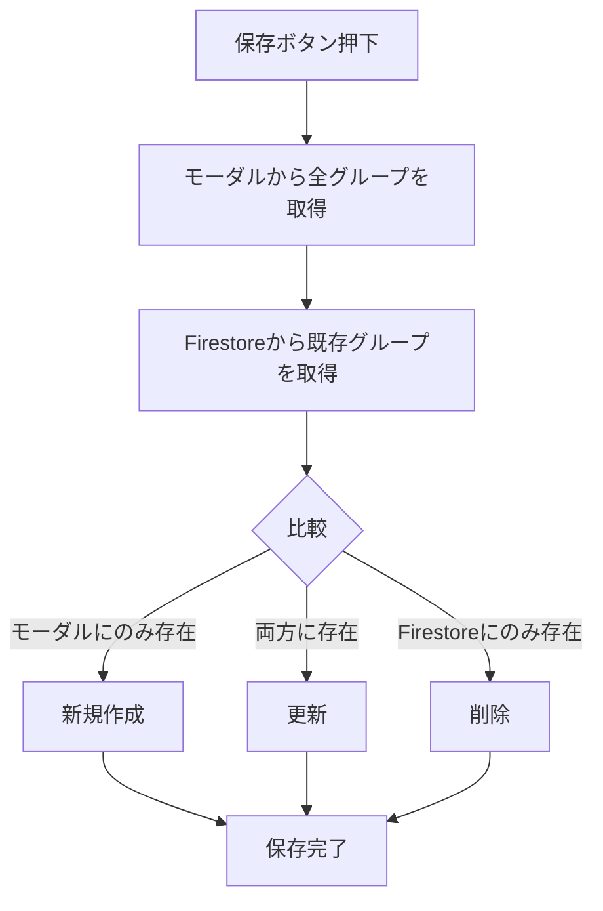
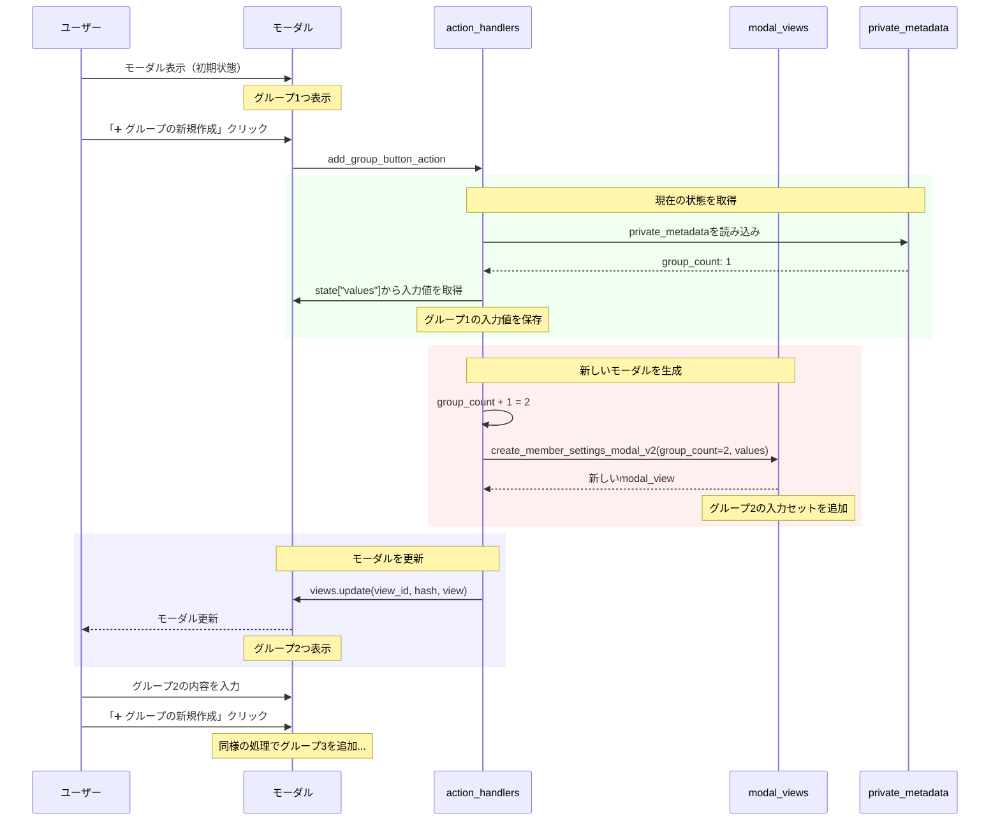
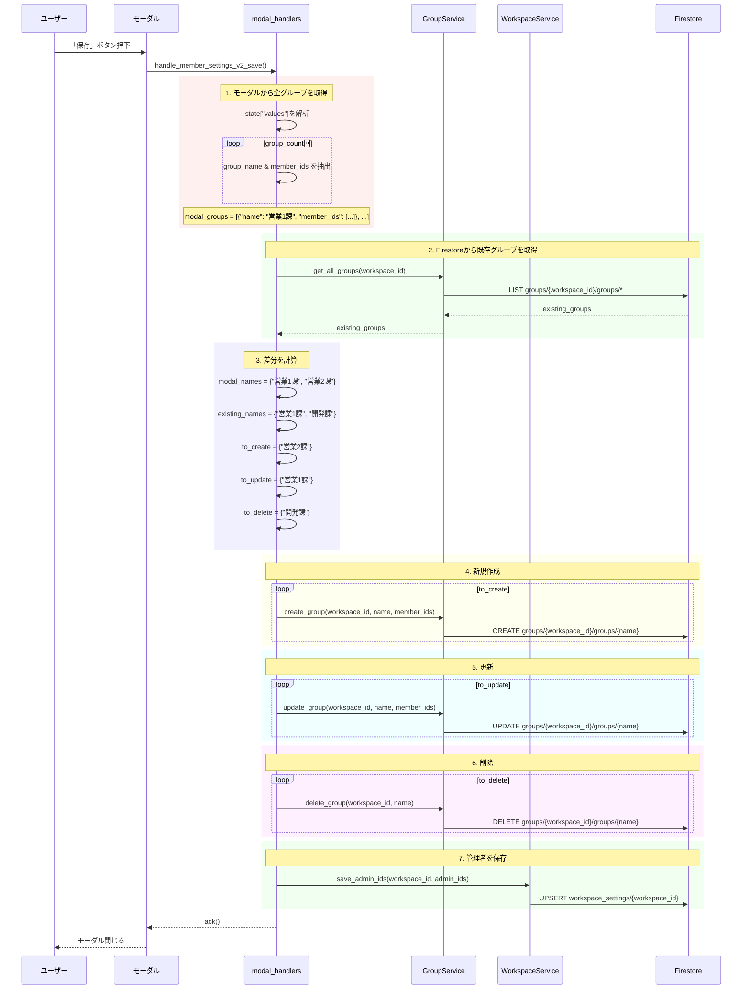
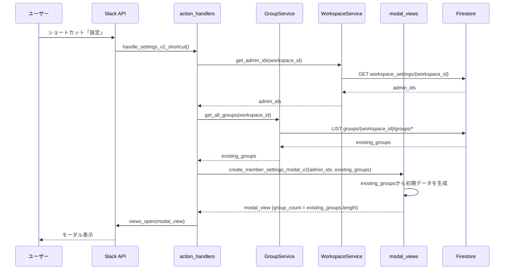

# Slack勤怠管理Bot - 技術仕様書 v2.2

**バージョン**: v2.2 (複数グループ同時編集版)  
**作成日**: 2026-01-21  
**前バージョン**: v2.1 (spec_v2.1.md)  
**ステータス**: 🎯 設計完了

---

## 📑 目次

1. [バージョン情報](#バージョン情報)
2. [v2.2の新機能概要](#v22の新機能概要)
3. [データモデル](#データモデル)
4. [設定UIの完全仕様](#設定uiの完全仕様)
5. [動的ビュー更新](#動的ビュー更新)
6. [保存ロジック（完全同期）](#保存ロジック完全同期)
7. [処理フロー](#処理フロー)
8. [APIリファレンス](#apiリファレンス)
9. [v2.1からの変更点](#v21からの変更点)
10. [実装計画](#実装計画)

---

## バージョン情報

### v2.2の主な新機能

| 機能 | 説明 | v2.1との違い |
|------|------|-------------|
| **複数グループ同時編集** | 最大10グループを1つのモーダルで編集 | v2.1は1グループずつ |
| **動的グループ追加** | ボタンで入力セットを追加 | v2.1は固定UI |
| **完全同期保存** | モーダルの内容とFirestoreを完全同期 | v2.1はUPSERTのみ |
| **グループ名をID化** | `group_id` にグループ名を使用 | v2.1はUUID |
| **views.update** | 動的にモーダルを更新 | v2.1は不使用 |

### v2.1からの主な変更理由

#### 設計思想の転換

| 従来の課題 | v2.2での解決策 |
|-----------|--------------|
| 1グループずつしか編集できない | 複数グループを一度に編集可能 |
| グループ削除が困難 | 入力から削除 = Firestoreから削除 |
| 既存グループの確認が別画面 | すべて同じモーダル内で編集 |
| 保存が複雑（UPSERT判定） | 完全同期でシンプルに |

---

## v2.2の新機能概要

### 1. 複数グループ同時編集

#### 設計思想

```
【従来（v2.1）】
モーダル開く → グループ名入力 → 保存 → 再度開く → 次のグループ...

【新方式（v2.2）】
モーダル開く → 全グループ表示 → まとめて編集 → 一括保存
```

#### メリット

1. **効率的な操作**: 1回のモーダルで全グループを編集
2. **視認性向上**: 全グループを一覧で確認
3. **直感的な削除**: 入力セットを削除 = グループ削除
4. **整合性の保証**: モーダル内容とFirestoreが完全一致

### 2. 動的グループ追加ボタン

#### UI要素

```
┌────────────────────────────────┐
│ #1：グループ名 [営業1課      ] │
│ #1：メンバー   [@user1 @user2] │
├────────────────────────────────┤
│ #2：グループ名 [営業2課      ] │
│ #2：メンバー   [@user3 @user4] │
├────────────────────────────────┤
│  ➕ グループの新規作成          │
└────────────────────────────────┘
```

#### 動作

1. 「➕ グループの新規作成」ボタンをクリック
2. 現在の入力値を保持
3. 新しいグループ入力セット（#3）を追加
4. `views.update` でモーダルを更新
5. 最大10グループまで追加可能

### 3. グループ名をIDとして使用

#### 従来（v2.1）

```
group_id: "group_a1b2c3d4"  ← UUID
name: "営業1課"
```

#### 新方式（v2.2）

```
group_id: "営業1課"  ← グループ名そのもの
name: "営業1課"      ← 同じ
```

#### メリット

- グループ名での検索が不要
- ドキュメントIDで直接アクセス可能
- データ構造がシンプルに
- 名前変更時の複雑さは増すが、v2.2では名前変更は新規作成+削除として扱う

### 4. 完全同期保存

#### 保存ロジック



#### 実装例

```python
def sync_groups(workspace_id, modal_groups, existing_groups):
    """
    モーダルの内容とFirestoreを完全同期
    
    Args:
        modal_groups: モーダルから取得したグループ配列
            [{"name": "営業1課", "member_ids": ["U001"]}, ...]
        existing_groups: Firestoreから取得した既存グループ配列
            [{"group_id": "営業1課", "member_ids": ["U001"]}, ...]
    """
    modal_names = {g["name"] for g in modal_groups}
    existing_names = {g["group_id"] for g in existing_groups}
    
    # 新規作成
    to_create = modal_names - existing_names
    for name in to_create:
        group = next(g for g in modal_groups if g["name"] == name)
        create_group(workspace_id, name, group["member_ids"])
    
    # 更新
    to_update = modal_names & existing_names
    for name in to_update:
        group = next(g for g in modal_groups if g["name"] == name)
        update_group(workspace_id, name, group["member_ids"])
    
    # 削除
    to_delete = existing_names - modal_names
    for name in to_delete:
        delete_group(workspace_id, name)
```

---

## データモデル

### 変更点サマリー

| 項目 | v2.1 | v2.2 | 変更理由 |
|------|------|------|---------|
| `group_id` | UUID | グループ名 | 検索不要、直接アクセス |
| `name` フィールド | 必須 | 任意（冗長） | group_idと同じため |
| 削除機能 | 未実装 | 実装 | 完全同期に必要 |
| インデックス | name検索用 | 不要 | group_idで検索 |

### 1. `groups` コレクション（v2.2版）

#### パス

```
groups/{workspace_id}/groups/{group_id}
```

**重要**: `{group_id}` はグループ名そのものを使用

#### ドキュメント構造

```json
{
  "group_id": "営業1課",
  "name": "営業1課",
  "member_ids": ["U001", "U002", "U003"],
  "created_at": "2026-01-21T10:00:00Z",
  "updated_at": "2026-01-21T15:30:00Z",
  "created_by": "U000"
}
```

#### フィールド定義

| フィールド | 型 | 必須 | 説明 | v2.1との違い |
|-----------|---|------|------|-------------|
| `group_id` | string | ✅ | グループ名（ドキュメントID） | UUIDではなく名前 |
| `name` | string | - | グループ名（冗長だが互換性のため） | 同じ |
| `member_ids` | array[string] | ✅ | メンバーのSlack User ID配列 | 同じ |
| `created_at` | timestamp | ✅ | 作成日時 | 同じ |
| `updated_at` | timestamp | ✅ | 最終更新日時 | 同じ |
| `created_by` | string | - | 作成者のUser ID | 同じ |

#### ドキュメントID命名規則

**許可される文字**:
- 日本語（ひらがな、カタカナ、漢字）
- 英数字
- アンダースコア `_`
- ハイフン `-`

**禁止される文字**:
- スラッシュ `/`（Firestoreのパス区切り文字）
- バックスラッシュ `\`
- 先頭または末尾のピリオド `.`

**対策**: グループ名に禁止文字が含まれる場合は、自動的に置換：
```python
def sanitize_group_name(name: str) -> str:
    """
    グループ名をFirestoreドキュメントIDとして使用可能な形式に変換
    """
    name = name.replace("/", "_").replace("\\", "_")
    name = name.strip(".")
    return name
```

### 2. `workspace_settings` コレクション

v2.1から変更なし。

---

## 設定UIの完全仕様

### Block Kit JSON定義（正式版）

以下のJSON構造を **完全に正** として実装します。

#### 初期状態（グループ1つ）

```json
{
  "type": "modal",
  "callback_id": "member_settings_v2",
  "title": { 
    "type": "plain_text", 
    "text": "勤怠レポートの設定" 
  },
  "submit": { 
    "type": "plain_text", 
    "text": "保存" 
  },
  "close": { 
    "type": "plain_text", 
    "text": "キャンセル" 
  },
  "blocks": [
    {
      "type": "input",
      "block_id": "admin_users_block",
      "element": {
        "type": "multi_users_select",
        "action_id": "admin_users_select",
        "placeholder": { 
          "type": "plain_text", 
          "text": "ユーザを選択" 
        }
      },
      "label": { 
        "type": "plain_text", 
        "text": "通知先" 
      }
    },
    {
      "type": "context",
      "elements": [
        { 
          "type": "mrkdwn", 
          "text": "ⓘ 通知先に登録されたユーザには、午前9時に下記グループの当日の勤怠連絡が通知されます。" 
        }
      ]
    },
    { "type": "divider" },
    {
      "type": "input",
      "block_id": "group_name_1",
      "element": { 
        "type": "plain_text_input", 
        "action_id": "group_name_input", 
        "placeholder": { 
          "type": "plain_text", 
          "text": "例：1課" 
        } 
      },
      "label": { 
        "type": "plain_text", 
        "text": "#1：グループ名" 
      },
      "optional": true
    },
    {
      "type": "input",
      "block_id": "group_members_1",
      "element": { 
        "type": "multi_users_select", 
        "action_id": "target_members_select", 
        "placeholder": { 
          "type": "plain_text", 
          "text": "例：1課の所属者" 
        } 
      },
      "label": { 
        "type": "plain_text", 
        "text": "#1：メンバー" 
      },
      "optional": true
    },
    { "type": "divider" },
    {
      "type": "actions",
      "block_id": "add_group_action_block",
      "elements": [
        { 
          "type": "button", 
          "text": { 
            "type": "plain_text", 
            "text": "➕ グループの新規作成" 
          }, 
          "value": "add_group", 
          "action_id": "add_group_button_action" 
        }
      ]
    }
  ]
}
```

#### グループ追加後（グループ3つの例）

```json
{
  "blocks": [
    { "...": "通知先ブロック" },
    { "...": "説明文" },
    { "type": "divider" },
    
    { "block_id": "group_name_1", "...": "グループ1名前入力" },
    { "block_id": "group_members_1", "...": "グループ1メンバー選択" },
    { "type": "divider" },
    
    { "block_id": "group_name_2", "...": "グループ2名前入力" },
    { "block_id": "group_members_2", "...": "グループ2メンバー選択" },
    { "type": "divider" },
    
    { "block_id": "group_name_3", "...": "グループ3名前入力" },
    { "block_id": "group_members_3", "...": "グループ3メンバー選択" },
    { "type": "divider" },
    
    { "...": "➕ グループの新規作成ボタン" }
  ]
}
```

### UI要素の詳細説明

#### 1. 通知先（admin_users_block）

**要素**: `multi_users_select`

**動作**:
- 複数のユーザーを選択可能
- 少なくとも1人は必須（保存時にバリデーション）
- 既存の管理者IDがある場合は `initial_users` で初期表示

**保存先**: `workspace_settings/{workspace_id}` の `admin_ids` フィールド

**v2.1との違い**: ラベルが「管理者 (全グループ共通)」→「通知先」に変更

#### 2. グループ入力セット

各グループに対して、以下の2つの入力要素で構成：

**A. グループ名入力**

- `block_id`: `group_name_{番号}` （例: `group_name_1`, `group_name_2`）
- `action_id`: `group_name_input` （全グループ共通）
- `label`: `#1：グループ名`, `#2：グループ名`, ...
- `optional`: `true` （空欄も許可）

**B. メンバー選択**

- `block_id`: `group_members_{番号}` （例: `group_members_1`, `group_members_2`）
- `action_id`: `target_members_select` （全グループ共通）
- `label`: `#1：メンバー`, `#2：メンバー`, ...
- `optional`: `true` （空欄も許可）

#### 3. グループ追加ボタン

**要素**: `button` （`actions` ブロック内）

**動作**:
1. クリック時に `add_group_button_action` がトリガー
2. 現在のグループ数を取得（1〜9）
3. 次の番号のグループ入力セットを追加
4. `views.update` でモーダルを更新
5. 10グループに達したらボタンを非表示

**制限**: 最大10グループ

### private_metadata の使用

動的にグループを追加するため、現在のグループ数を `private_metadata` で管理：

```json
{
  "group_count": 3,
  "existing_groups": [
    {"name": "営業1課", "member_ids": ["U001", "U002"]},
    {"name": "営業2課", "member_ids": ["U003"]},
    {"name": "開発課", "member_ids": ["U004", "U005"]}
  ]
}
```

---

## 動的ビュー更新

### グループ追加フロー



### 入力値の保持ロジック

`views.update` を実行すると、既存の入力値がクリアされるため、明示的に保持する必要があります。

#### 実装方法

```python
@app.action("add_group_button_action")
def handle_add_group_button(ack, body, client):
    """
    グループ追加ボタンのハンドラー
    """
    ack()
    
    # 1. 現在の状態を取得
    metadata = json.loads(body["view"].get("private_metadata", "{}"))
    current_count = metadata.get("group_count", 1)
    
    # 2. 現在の入力値を保存
    state_values = body["view"]["state"]["values"]
    groups_data = []
    
    for i in range(1, current_count + 1):
        name_block = f"group_name_{i}"
        members_block = f"group_members_{i}"
        
        name = state_values.get(name_block, {}).get("group_name_input", {}).get("value", "")
        member_ids = state_values.get(members_block, {}).get("target_members_select", {}).get("selected_users", [])
        
        groups_data.append({
            "name": name,
            "member_ids": member_ids
        })
    
    # 3. 新しいグループ数
    new_count = min(current_count + 1, 10)  # 最大10
    
    # 4. 新しいモーダルを生成
    view = create_member_settings_modal_v2(
        admin_ids=state_values["admin_users_block"]["admin_users_select"].get("selected_users", []),
        groups_data=groups_data,
        group_count=new_count
    )
    
    # 5. モーダルを更新
    client.views_update(
        view_id=body["view"]["id"],
        hash=body["view"]["hash"],
        view=view
    )
```

### 最大数制限

10グループに達した場合、追加ボタンを非表示にします：

```python
def create_member_settings_modal_v2(..., group_count):
    blocks = [...]
    
    # グループ追加ボタン（10未満の場合のみ表示）
    if group_count < 10:
        blocks.append({
            "type": "actions",
            "block_id": "add_group_action_block",
            "elements": [
                {
                    "type": "button",
                    "text": {"type": "plain_text", "text": "➕ グループの新規作成"},
                    "value": "add_group",
                    "action_id": "add_group_button_action"
                }
            ]
        })
    else:
        blocks.append({
            "type": "context",
            "elements": [
                {"type": "mrkdwn", "text": "_グループは最大10個までです_"}
            ]
        })
    
    return modal_view
```

---

## 保存ロジック（完全同期）

### 保存処理の全体フロー



### 詳細実装

#### ステップ1: モーダルから全グループを取得

```python
def extract_groups_from_modal(state_values, group_count):
    """
    モーダルの入力値から全グループを抽出
    
    Returns:
        グループ配列（空のグループは除外）
        [{"name": "営業1課", "member_ids": ["U001"]}, ...]
    """
    groups = []
    
    for i in range(1, group_count + 1):
        name_block = f"group_name_{i}"
        members_block = f"group_members_{i}"
        
        name_raw = state_values.get(name_block, {}).get("group_name_input", {}).get("value", "")
        name = name_raw.strip() if name_raw else ""
        
        member_ids = state_values.get(members_block, {}).get("target_members_select", {}).get("selected_users", [])
        
        # グループ名が空の場合はスキップ
        if not name:
            continue
        
        # グループ名のサニタイズ
        sanitized_name = sanitize_group_name(name)
        
        groups.append({
            "name": sanitized_name,
            "member_ids": member_ids
        })
    
    return groups
```

#### ステップ2: 差分計算

```python
def calculate_diff(modal_groups, existing_groups):
    """
    モーダルとFirestoreの差分を計算
    
    Returns:
        {
            "to_create": ["営業2課"],
            "to_update": ["営業1課"],
            "to_delete": ["開発課"]
        }
    """
    modal_names = {g["name"] for g in modal_groups}
    existing_names = {g["group_id"] for g in existing_groups}
    
    return {
        "to_create": modal_names - existing_names,
        "to_update": modal_names & existing_names,
        "to_delete": existing_names - modal_names
    }
```

#### ステップ3: 完全同期実行

```python
def sync_all_groups(workspace_id, modal_groups, diff, user_id):
    """
    モーダルの内容とFirestoreを完全同期
    """
    group_service = GroupService()
    
    # 新規作成
    for name in diff["to_create"]:
        group = next(g for g in modal_groups if g["name"] == name)
        group_service.create_group_with_name_as_id(
            workspace_id=workspace_id,
            name=name,
            member_ids=group["member_ids"],
            created_by=user_id
        )
        logger.info(f"グループ作成(v2.2): {name}, Members={len(group['member_ids'])}")
    
    # 更新
    for name in diff["to_update"]:
        group = next(g for g in modal_groups if g["name"] == name)
        group_service.update_group_with_name_as_id(
            workspace_id=workspace_id,
            group_id=name,
            member_ids=group["member_ids"]
        )
        logger.info(f"グループ更新(v2.2): {name}, Members={len(group['member_ids'])}")
    
    # 削除
    for name in diff["to_delete"]:
        group_service.delete_group_with_name_as_id(
            workspace_id=workspace_id,
            group_id=name
        )
        logger.info(f"グループ削除(v2.2): {name}")
```

### バリデーション

保存前に以下をチェック：

1. **通知先が必須**: 少なくとも1人の管理者を選択
2. **グループ名の重複**: モーダル内で同じ名前が複数ある場合はエラー
3. **禁止文字チェック**: グループ名に使用できない文字がないか

```python
def validate_modal_input(admin_ids, modal_groups):
    """
    モーダル入力のバリデーション
    """
    errors = {}
    
    # 1. 通知先チェック
    if not admin_ids:
        errors["admin_users_block"] = "⚠️ 少なくとも1人の通知先を選択してください。"
    
    # 2. グループ名の重複チェック
    names = [g["name"] for g in modal_groups]
    duplicates = [name for name in names if names.count(name) > 1]
    
    if duplicates:
        # 重複しているグループのblock_idを特定してエラー表示
        for i, group in enumerate(modal_groups, 1):
            if group["name"] in duplicates:
                errors[f"group_name_{i}"] = f"⚠️ グループ名「{group['name']}」が重複しています。"
    
    return errors
```

---

## 処理フロー

### 1. 設定モーダルの初回表示



### 2. グループ追加ボタンの処理

上記「動的ビュー更新」セクションのMermaid図を参照。

### 3. 保存処理

上記「保存ロジック（完全同期）」セクションのMermaid図を参照。

---

## APIリファレンス

### GroupService（v2.2で拡張）

#### 新規メソッド: `create_group_with_name_as_id()`

```python
def create_group_with_name_as_id(
    self, 
    workspace_id: str, 
    name: str, 
    member_ids: List[str], 
    created_by: str = None
) -> str:
    """
    グループ名をドキュメントIDとして使用してグループを作成します（v2.2で追加）。
    
    Args:
        workspace_id: Slackワークスペースの一意ID
        name: グループ名（ドキュメントIDとして使用）
        member_ids: 初期メンバーのユーザーID配列
        created_by: 作成者のユーザーID（省略可能）
        
    Returns:
        作成されたグループのgroup_id（= name）
        
    Raises:
        ValidationError: グループ名が空、または既に存在する場合
        
    Note:
        - v2.1のcreate_group()とは異なり、UUIDを生成せずnameをそのまま使用
        - 重複チェックは呼び出し側で行うことを推奨
    """
    if not name or not name.strip():
        raise ValidationError("グループ名が空です", "⚠️ グループ名を入力してください。")
    
    sanitized_name = sanitize_group_name(name.strip())
    
    try:
        group_ref = self.db.collection("groups").document(workspace_id)\
                            .collection("groups").document(sanitized_name)
        
        # 既存チェック
        if group_ref.get().exists:
            raise ValidationError(
                f"グループ名が既に存在します: {sanitized_name}",
                f"⚠️ グループ名「{sanitized_name}」は既に存在します。"
            )
        
        data = {
            "group_id": sanitized_name,
            "name": sanitized_name,
            "member_ids": member_ids or [],
            "created_at": firestore.SERVER_TIMESTAMP,
            "updated_at": firestore.SERVER_TIMESTAMP
        }
        
        if created_by:
            data["created_by"] = created_by
        
        group_ref.set(data)
        logger.info(f"グループ作成成功(v2.2): {sanitized_name}, Members={len(member_ids or [])}")
        return sanitized_name
    except ValidationError:
        raise
    except Exception as e:
        logger.error(f"グループ作成失敗(v2.2): {e}", exc_info=True)
        raise
```

#### 新規メソッド: `update_group_with_name_as_id()`

```python
def update_group_with_name_as_id(
    self, 
    workspace_id: str, 
    group_id: str, 
    member_ids: List[str]
) -> None:
    """
    グループのメンバーを更新します（v2.2版、group_id = グループ名）。
    
    Args:
        workspace_id: Slackワークスペースの一意ID
        group_id: グループ名（ドキュメントID）
        member_ids: 新しいメンバーのユーザーID配列
        
    Raises:
        ValidationError: グループが存在しない場合
    """
    try:
        group_ref = self.db.collection("groups").document(workspace_id)\
                            .collection("groups").document(group_id)
        
        # 存在確認
        if not group_ref.get().exists:
            raise ValidationError(
                f"グループが存在しません: {group_id}",
                "⚠️ 指定されたグループが見つかりません。"
            )
        
        group_ref.update({
            "member_ids": member_ids,
            "updated_at": firestore.SERVER_TIMESTAMP
        })
        logger.info(f"グループメンバー更新成功(v2.2): {group_id}, Members={len(member_ids)}")
    except ValidationError:
        raise
    except Exception as e:
        logger.error(f"グループメンバー更新失敗(v2.2): {e}", exc_info=True)
        raise
```

#### 実装: `delete_group_with_name_as_id()`

```python
def delete_group_with_name_as_id(self, workspace_id: str, group_id: str) -> None:
    """
    グループを削除します（v2.2で実装）。
    
    Args:
        workspace_id: Slackワークスペースの一意ID
        group_id: グループ名（ドキュメントID）
        
    Raises:
        ValidationError: グループが存在しない場合
    """
    try:
        group_ref = self.db.collection("groups").document(workspace_id)\
                            .collection("groups").document(group_id)
        
        # 存在確認
        if not group_ref.get().exists:
            raise ValidationError(
                f"グループが存在しません: {group_id}",
                "⚠️ 指定されたグループが見つかりません。"
            )
        
        group_ref.delete()
        logger.info(f"グループ削除成功(v2.2): {group_id}")
    except ValidationError:
        raise
    except Exception as e:
        logger.error(f"グループ削除失敗(v2.2): {e}", exc_info=True)
        raise
```

### modal_views（v2.2で刷新）

#### 新規関数: `create_member_settings_modal_v2()`

```python
def create_member_settings_modal_v2(
    admin_ids: List[str],
    groups_data: List[Dict[str, Any]],
    group_count: int = None
) -> Dict[str, Any]:
    """
    v2.2の設定モーダルを生成します（複数グループ同時編集版）。
    
    Args:
        admin_ids: 現在の管理者のユーザーID配列
        groups_data: 既存グループデータの配列
            [
                {"name": "営業1課", "member_ids": ["U001", "U002"]},
                {"name": "営業2課", "member_ids": ["U003"]},
                ...
            ]
        group_count: 表示するグループ数（Noneの場合はgroups_dataの長さ、最小1）
        
    Returns:
        Slack モーダルビューの辞書
        
    Note:
        - group_countを指定することで、空のグループ入力セットを追加可能
        - 最大10グループ
        - 各グループの入力セットには初期値（groups_data）を設定
    """
    if group_count is None:
        group_count = max(len(groups_data), 1)
    
    group_count = min(group_count, 10)  # 最大10
    
    blocks = [
        {
            "type": "input",
            "block_id": "admin_users_block",
            "element": {
                "type": "multi_users_select",
                "action_id": "admin_users_select",
                "placeholder": {"type": "plain_text", "text": "ユーザを選択"},
                **({"initial_users": admin_ids} if admin_ids else {})
            },
            "label": {"type": "plain_text", "text": "通知先"}
        },
        {
            "type": "context",
            "elements": [
                {"type": "mrkdwn", "text": "ⓘ 通知先に登録されたユーザには、午前9時に下記グループの当日の勤怠連絡が通知されます。"}
            ]
        },
        {"type": "divider"}
    ]
    
    # グループ入力セットを追加
    for i in range(1, group_count + 1):
        # 既存データがあれば初期値として設定
        initial_name = ""
        initial_members = []
        
        if i <= len(groups_data):
            initial_name = groups_data[i - 1].get("name", "")
            initial_members = groups_data[i - 1].get("member_ids", [])
        
        # グループ名入力
        blocks.append({
            "type": "input",
            "block_id": f"group_name_{i}",
            "element": {
                "type": "plain_text_input",
                "action_id": "group_name_input",
                "placeholder": {"type": "plain_text", "text": "例：1課"},
                **({"initial_value": initial_name} if initial_name else {})
            },
            "label": {"type": "plain_text", "text": f"#{i}：グループ名"},
            "optional": True
        })
        
        # メンバー選択
        blocks.append({
            "type": "input",
            "block_id": f"group_members_{i}",
            "element": {
                "type": "multi_users_select",
                "action_id": "target_members_select",
                "placeholder": {"type": "plain_text", "text": f"例：{i}課の所属者"},
                **({"initial_users": initial_members} if initial_members else {})
            },
            "label": {"type": "plain_text", "text": f"#{i}：メンバー"},
            "optional": True
        })
        
        blocks.append({"type": "divider"})
    
    # グループ追加ボタン（10未満の場合のみ）
    if group_count < 10:
        blocks.append({
            "type": "actions",
            "block_id": "add_group_action_block",
            "elements": [
                {
                    "type": "button",
                    "text": {"type": "plain_text", "text": "➕ グループの新規作成"},
                    "value": "add_group",
                    "action_id": "add_group_button_action"
                }
            ]
        })
    else:
        blocks.append({
            "type": "context",
            "elements": [
                {"type": "mrkdwn", "text": "_グループは最大10個までです_"}
            ]
        })
    
    return {
        "type": "modal",
        "callback_id": "member_settings_v2",
        "title": {"type": "plain_text", "text": "勤怠レポートの設定"},
        "submit": {"type": "plain_text", "text": "保存"},
        "close": {"type": "plain_text", "text": "キャンセル"},
        "blocks": blocks,
        "private_metadata": json.dumps({
            "group_count": group_count
        })
    }
```

### action_handlers（v2.2で更新）

#### 更新: `handle_settings_v2_shortcut()`

```python
@app.shortcut("open_member_setup_modal")
def handle_settings_v2_shortcut(ack, body, client):
    """
    グローバルショートカット「設定」の処理（v2.2版）。
    
    v2.1との違い:
    - 既存グループを全て表示
    - 複数グループを同時編集可能
    """
    ack()
    workspace_id = body["team"]["id"]
    
    try:
        from resources.services.group_service import GroupService
        from resources.services.workspace_service import WorkspaceService
        
        group_service = GroupService()
        workspace_service = WorkspaceService()
        
        # 管理者IDを取得
        admin_ids = workspace_service.get_admin_ids(workspace_id)
        
        # 全グループを取得
        existing_groups = group_service.get_all_groups(workspace_id)
        
        # グループデータを整形
        groups_data = [
            {
                "name": g.get("group_id", g.get("name")),
                "member_ids": g.get("member_ids", [])
            }
            for g in existing_groups
        ]
        
        # モーダルを生成（v2.2版）
        view = create_member_settings_modal_v2(
            admin_ids=admin_ids,
            groups_data=groups_data
        )
        
        client.views_open(trigger_id=body["trigger_id"], view=view)
        logger.info(f"設定モーダル表示(v2.2): Workspace={workspace_id}, Groups={len(groups_data)}")
    except Exception as e:
        logger.error(f"設定モーダル表示失敗: {e}", exc_info=True)
```

#### 新規: `handle_add_group_button()`

```python
@app.action("add_group_button_action")
def handle_add_group_button(ack, body, client):
    """
    グループ追加ボタンのハンドラー（v2.2で追加）。
    
    現在の入力値を保持しつつ、新しいグループ入力セットを追加してモーダルを更新します。
    """
    ack()
    
    try:
        # 1. 現在の状態を取得
        metadata = json.loads(body["view"].get("private_metadata", "{}"))
        current_count = metadata.get("group_count", 1)
        
        # 2. 現在の入力値を保存
        state_values = body["view"]["state"]["values"]
        admin_ids = state_values["admin_users_block"]["admin_users_select"].get("selected_users", [])
        
        groups_data = []
        for i in range(1, current_count + 1):
            name_block = f"group_name_{i}"
            members_block = f"group_members_{i}"
            
            name = state_values.get(name_block, {}).get("group_name_input", {}).get("value", "")
            member_ids = state_values.get(members_block, {}).get("target_members_select", {}).get("selected_users", [])
            
            groups_data.append({
                "name": name.strip() if name else "",
                "member_ids": member_ids
            })
        
        # 3. 新しいグループ数
        new_count = min(current_count + 1, 10)
        
        # 4. 新しいモーダルを生成
        view = create_member_settings_modal_v2(
            admin_ids=admin_ids,
            groups_data=groups_data,
            group_count=new_count
        )
        
        # 5. モーダルを更新
        client.views_update(
            view_id=body["view"]["id"],
            hash=body["view"]["hash"],
            view=view
        )
        logger.info(f"グループ追加: {current_count} → {new_count}")
    except Exception as e:
        logger.error(f"グループ追加失敗: {e}", exc_info=True)
```

### modal_handlers（v2.2で更新）

#### 更新: `handle_member_settings_v2_save()`

```python
@app.view("member_settings_v2")
def handle_member_settings_v2_save(ack, body, view):
    """
    v2.2設定モーダルの「保存」ボタン押下時の処理。
    
    v2.1との違い:
    - 複数グループを一度に処理
    - 完全同期（作成・更新・削除）
    """
    workspace_id = body["team"]["id"]
    metadata = json.loads(view.get("private_metadata", "{}"))
    vals = view["state"]["values"]
    
    try:
        from resources.services.group_service import GroupService
        from resources.services.workspace_service import WorkspaceService
        from resources.shared.errors import ValidationError
        
        group_service = GroupService()
        workspace_service = WorkspaceService()
        
        # 1. 管理者IDを取得
        admin_ids = vals["admin_users_block"]["admin_users_select"].get("selected_users", [])
        
        if not admin_ids:
            ack(response_action="errors", errors={
                "admin_users_block": "⚠️ 少なくとも1人の通知先を選択してください。"
            })
            return
        
        # 2. モーダルから全グループを取得
        group_count = metadata.get("group_count", 1)
        modal_groups = extract_groups_from_modal(vals, group_count)
        
        # 3. バリデーション
        validation_errors = validate_modal_input(admin_ids, modal_groups)
        if validation_errors:
            ack(response_action="errors", errors=validation_errors)
            return
        
        # 4. Firestoreから既存グループを取得
        existing_groups = group_service.get_all_groups(workspace_id)
        
        # 5. 差分を計算
        diff = calculate_diff(modal_groups, existing_groups)
        
        # 6. 完全同期
        sync_all_groups(
            workspace_id=workspace_id,
            modal_groups=modal_groups,
            diff=diff,
            user_id=body["user"]["id"]
        )
        
        # 7. 管理者の保存
        workspace_service.save_admin_ids(workspace_id, admin_ids)
        logger.info(f"管理者保存(v2.2): Workspace={workspace_id}, Admins={len(admin_ids)}")
        
        # 成功
        ack()
        logger.info(f"設定保存成功(v2.2): Workspace={workspace_id}, Groups={len(modal_groups)}")
        
    except ValidationError as ve:
        logger.warning(f"バリデーションエラー(v2.2): {ve}")
        ack(response_action="errors", errors={
            "admin_users_block": ve.user_message
        })
    except Exception as e:
        logger.error(f"設定保存失敗(v2.2): {e}", exc_info=True)
        ack()
```

---

## v2.1からの変更点

### 主要な変更サマリー

| 項目 | v2.1 | v2.2 | 理由 |
|------|------|------|------|
| **編集方式** | 1グループずつ | 複数グループ同時 | 効率化 |
| **グループ追加** | 固定UI | 動的追加ボタン | 柔軟性 |
| **group_id** | UUID | グループ名 | シンプル化 |
| **保存ロジック** | UPSERT | 完全同期 | 整合性保証 |
| **削除機能** | 未実装 | 実装 | 必須機能 |
| **views.update** | 不使用 | 使用 | 動的UI必須 |
| **callback_id** | `member_settings_v2_1` | `member_settings_v2` | 統一 |

### 廃止される機能（v2.1）

#### 1. 1グループずつの編集方式

**v2.1での実装**:
- 1つのグループ入力セット
- 登録済みグループ一覧を表示（編集不可）
- UPSERTで1グループずつ保存

**v2.2での対応**:
- 全グループを同時表示・編集
- 1回の保存で全グループを同期

#### 2. UUIDベースのgroup_id

**v2.1での実装**:
```python
group_id = f"group_{uuid.uuid4()}"  # "group_a1b2c3d4"
```

**v2.2での対応**:
```python
group_id = sanitize_group_name(name)  # "営業1課"
```

### 追加される機能（v2.2）

#### 1. 動的グループ追加

**新規UI要素**:
- 「➕ グループの新規作成」ボタン
- `views.update` による動的モーダル更新

**新規ハンドラー**:
```python
@app.action("add_group_button_action")
def handle_add_group_button(ack, body, client):
    ...
```

#### 2. グループ削除機能

**新規メソッド**:
```python
GroupService.delete_group_with_name_as_id(workspace_id, group_id)
```

**動作**:
- モーダルから削除（入力セットを削除） = Firestoreから削除
- 完全同期の一環として自動実行

#### 3. 完全同期保存

**新規ヘルパー関数**:
```python
extract_groups_from_modal(state_values, group_count)
calculate_diff(modal_groups, existing_groups)
sync_all_groups(workspace_id, modal_groups, diff, user_id)
```

### コード変更箇所の一覧

| ファイル | v2.1 | v2.2 | 変更内容 |
|---------|------|------|---------|
| `group_service.py` | `find_group_by_name()` | 廃止、新メソッド追加 | name-as-id方式へ |
| `modal_views.py` | `create_member_settings_modal_v2_1()` | `create_member_settings_modal_v2()` | 複数グループ対応 |
| `action_handlers.py` | - | `handle_add_group_button()` 追加 | 動的追加機能 |
| `modal_handlers.py` | `handle_member_settings_v2_1_save()` | `handle_member_settings_v2_save()` | 完全同期処理 |

---

## 実装計画

### フェーズ1: データ構造の準備

#### タスク1-1: グループ名サニタイズ関数の実装

**ファイル**: `resources/shared/utils.py`

```python
def sanitize_group_name(name: str) -> str:
    """
    グループ名をFirestoreドキュメントIDとして使用可能な形式に変換
    """
    name = name.replace("/", "_").replace("\\", "_")
    name = name.strip(".")
    return name
```

#### タスク1-2: GroupServiceの新メソッド実装

**ファイル**: `resources/services/group_service.py`

- `create_group_with_name_as_id()`
- `update_group_with_name_as_id()`
- `delete_group_with_name_as_id()`

### フェーズ2: UI層の実装

#### タスク2-1: create_member_settings_modal_v2() の実装

**ファイル**: `resources/views/modal_views.py`

- 複数グループ入力セットの生成
- 動的な初期値設定
- グループ追加ボタンの条件付き表示

### フェーズ3: ハンドラー層の実装

#### タスク3-1: handle_add_group_button() の実装

**ファイル**: `resources/handlers/action_handlers.py`

- 現在の入力値の保持
- views.updateによるモーダル更新

#### タスク3-2: handle_member_settings_v2_save() の実装

**ファイル**: `resources/handlers/modal_handlers.py`

- モーダルからのグループ抽出
- 差分計算
- 完全同期処理

### フェーズ4: ヘルパー関数の実装

**ファイル**: `resources/handlers/modal_handlers.py`

- `extract_groups_from_modal()`
- `calculate_diff()`
- `sync_all_groups()`
- `validate_modal_input()`

### フェーズ5: テスト

#### 統合テスト項目

1. **設定モーダルの表示**
   - [ ] 既存グループが全て表示される
   - [ ] 管理者が初期表示される
   - [ ] グループが0件の場合、1つの空入力セットが表示される

2. **グループの追加**
   - [ ] 「➕ グループの新規作成」ボタンで入力セットが追加される
   - [ ] 既存の入力値が保持される
   - [ ] 10グループに達するとボタンが非表示になる

3. **グループの作成**
   - [ ] 新しいグループ名とメンバーを入力して保存
   - [ ] Firestoreに正しく保存される
   - [ ] group_idがグループ名と同じ

4. **グループの更新**
   - [ ] 既存グループのメンバーを変更して保存
   - [ ] member_idsが更新される

5. **グループの削除**
   - [ ] モーダルからグループを削除して保存
   - [ ] Firestoreから削除される

6. **完全同期**
   - [ ] 作成・更新・削除が同時に実行される
   - [ ] モーダルの内容とFirestoreが一致する

7. **バリデーション**
   - [ ] 通知先が未選択の場合、エラーが表示される
   - [ ] グループ名が重複している場合、エラーが表示される

8. **既存機能の互換性**
   - [ ] 日次レポートがv2.2のグループで正常に生成される
   - [ ] v2.1で作成したグループ（UUID方式）も表示・編集可能

---

## 補足事項

### v2.1データの移行

v2.1で作成したグループ（UUID方式）とv2.2のグループ（name-as-id方式）が混在する場合：

**対策**:
1. 初回モーダル表示時に、v2.1形式のグループを検出
2. 自動的にv2.2形式へ移行（group_idをnameに変更）
3. 旧ドキュメントを削除

**実装**（オプション）:
```python
def migrate_v21_to_v22(workspace_id, groups):
    """
    v2.1形式のグループをv2.2形式へ移行
    """
    for group in groups:
        group_id = group.get("group_id")
        name = group.get("name")
        
        # UUIDパターンを検出
        if group_id.startswith("group_") and len(group_id) > 10:
            # v2.1形式
            # 新しいgroup_id（name）でドキュメントを作成
            create_group_with_name_as_id(workspace_id, name, group["member_ids"])
            # 旧ドキュメントを削除
            delete_old_group(workspace_id, group_id)
```

### グループ名の制限

**最大文字数**: 50文字（推奨）

**理由**:
- Firestore ドキュメントIDの最大長は1500バイト
- 日本語は1文字3バイトなので、500文字まで可能
- ただし、UI表示の観点から50文字を推奨

### 禁止文字の自動置換

グループ名に禁止文字が含まれる場合、自動的に置換してユーザーに通知：

```python
original_name = "営業/開発"
sanitized_name = "営業_開発"

# 保存後、ユーザーにエフェメラルメッセージで通知
client.chat_postEphemeral(
    channel=body["channel"]["id"],
    user=body["user"]["id"],
    text=f"ⓘ グループ名「{original_name}」は「{sanitized_name}」として保存されました。"
)
```

---

## まとめ

### v2.2の主な成果

1. **効率的な編集**: 複数グループを1回のモーダルで編集可能
2. **直感的な削除**: モーダルから削除 = Firestore から削除
3. **データ整合性**: 完全同期により常に一致を保証
4. **シンプルなID**: グループ名をIDとして使用

### v2.1との比較

| 観点 | v2.1 | v2.2 | 優位性 |
|------|------|------|--------|
| **操作回数** | グループ数分 | 1回 | v2.2 |
| **視認性** | 一覧表示のみ | 全グループ編集可 | v2.2 |
| **削除機能** | なし | あり | v2.2 |
| **実装複雑度** | 低 | 中 | v2.1 |
| **データ構造** | 複雑（UUID） | シンプル（name-as-id） | v2.2 |

### 次のステップ

1. **v2.2の実装**: 本仕様書に基づいて実装
2. **テスト**: 統合テストを実施
3. **v2.1データの移行**: UUID方式からname-as-id方式へ
4. **デプロイ**: Google Cloud Runにデプロイ
5. **v2.1コードの削除**: v2.2が安定したらv2.1のコードを削除

---

**ドキュメント作成日**: 2026-01-21  
**作成者**: AI Assistant (Claude Sonnet 4.5)  
**レビュー状況**: 設計完了、実装待ち
