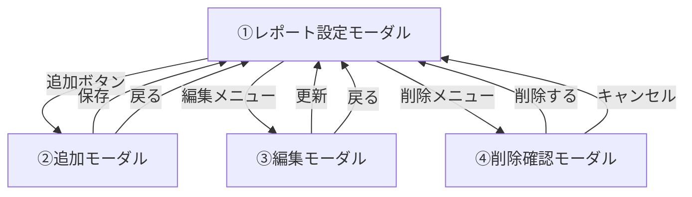
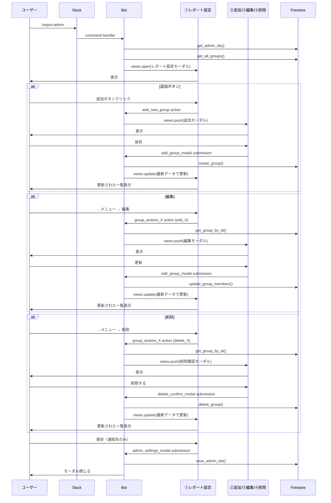

# Slack勤怠管理Bot - 技術仕様書 v2.22

**バージョン**: v2.22 (レポート設定UI全面刷新版)  
**作成日**: 2026-01-22  
**前バージョン**: v2.2 (複数グループ一括管理版)  
**ステータス**: 🎯 設計完了

---

## 📑 目次

1. [バージョン情報](#バージョン情報)
2. [v2.22の新機能概要](#v222の新機能概要)
3. [画面遷移設計](#画面遷移設計)
4. [UI定義（Block Kit JSON）](#ui定義block-kit-json)
5. [データモデル](#データモデル)
6. [処理フロー](#処理フロー)
7. [APIリファレンス](#apiリファレンス)
8. [v2.2からの変更点](#v22からの変更点)
9. [実装計画](#実装計画)

---

## バージョン情報

### v2.22の主な新機能

| 機能 | 説明 | v2.2との違い |
|------|------|-------------|
| **一覧表示UI** | グループを一覧形式で表示 | v2.2は入力フォーム形式 |
| **views.push** | モーダルをスタックで管理 | v2.2はviews.update |
| **個別編集** | 各グループを個別に編集 | v2.2は全グループを同時編集 |
| **オーバーフローメニュー** | `...`メニューで編集/削除 | v2.2はボタン |
| **スラッシュコマンド** | `/report-admin`で起動 | v2.2はショートカット |

### v2.2からの主な変更理由

#### UXの改善

| v2.2の課題 | v2.22での解決策 |
|-----------|--------------|
| 全グループを同時編集するため、操作が複雑 | 一覧表示で視認性向上、個別編集でシンプルに |
| views.updateで入力値の保持が必要 | views.pushで自動的に前の画面に戻る |
| グループ数が増えると縦に長くなる | 一覧形式でコンパクト |
| 削除が分かりにくい（空欄にして保存） | 明示的な削除確認モーダル |

---

## v2.22の新機能概要

### 1. スラッシュコマンドからの起動

#### 設計思想

```
【従来（v2.2）】
グローバルショートカット「設定」 → モーダル表示

【新方式（v2.22）】
スラッシュコマンド /report-admin → モーダル表示
```

#### メリット

1. **明示的なアクセス**: コマンド名で機能が分かりやすい
2. **権限管理**: 管理者のみに公開可能
3. **発見しやすい**: `/` で補完候補に表示

### 2. 一覧表示UI

#### 表示方法

グループを`section`ブロックで一覧表示：

```
┌─────────────────────────────────┐
│ レポート通知先                   │
│ [@user1 @user2]                 │
├─────────────────────────────────┤
│ *1課*                      ...  │
│ @user3, @user4                  │
├─────────────────────────────────┤
│ *2課*                      ...  │
│ @user5, @user6                  │
├─────────────────────────────────┤
│ ➕ 新しいグループを追加   [追加] │
└─────────────────────────────────┘
```

#### 実装ポイント

- グループが0件の場合: 「まだグループが登録されていません」を表示
- 各グループに`overflow`メニュー（`...`）を配置
- メンバーはメンション形式で表示（`<@U12345>`）

### 3. モーダルスタック（views.push）

#### 遷移フロー



#### メリット

1. **自動的に戻る**: `close`ボタンで前の画面に自動復帰
2. **状態保持**: 前の画面の状態が自動的に保持される
3. **シンプル**: views.updateのような複雑な処理が不要

### 4. オーバーフローメニュー

#### UI要素

```
*1課*                          ...
@user1, @user2                  │
                                ▼
                        ┌───────────────┐
                        │ 🔄 編集       │
                        │ ❌削除        │
                        └───────────────┘
```

#### 動作

1. `...`をクリック
2. メニューが表示（編集 / 削除）
3. 「編集」→ 編集モーダルをpush
4. 「削除」→ 削除確認モーダルをpush

---

## 画面遷移設計

### 全体フロー



### 詳細フロー

#### 1. 初回表示

```
ユーザー
  → /report-admin
  → handle_report_admin_command()
    → WorkspaceService.get_admin_ids()
    → GroupService.get_all_groups()
    → create_admin_settings_modal()
  → views.open()
  → ①レポート設定モーダル表示
```

#### 2. グループ追加

```
ユーザー
  → 追加ボタンクリック
  → handle_add_new_group_button()
    → create_add_group_modal()
  → views.push()
  → ②追加モーダル表示

ユーザー
  → 保存ボタンクリック
  → handle_add_group_submission()
    → GroupService.create_group()
    → _update_parent_modal()
      → GroupService.get_all_groups()
      → create_admin_settings_modal()
      → views.update(parent_view_id)
  → ①レポート設定モーダル更新（追加されたグループが表示）
```

#### 3. グループ編集

```
ユーザー
  → ...メニュー → 編集
  → handle_group_overflow_menu()
    → action_value = "edit_X"
    → GroupService.get_group_by_id(group_id)
    → create_edit_group_modal(group_data)
  → views.push()
  → ③編集モーダル表示

ユーザー
  → 更新ボタンクリック
  → handle_edit_group_submission()
    → GroupService.update_group_members()
    → _update_parent_modal()
  → ①レポート設定モーダル更新
```

#### 4. グループ削除

```
ユーザー
  → ...メニュー → 削除
  → handle_group_overflow_menu()
    → action_value = "delete_X"
    → GroupService.get_group_by_id(group_id)
    → create_delete_confirm_modal(group_data)
  → views.push()
  → ④削除確認モーダル表示

ユーザー
  → 削除するボタンクリック
  → handle_delete_confirm_submission()
    → GroupService.delete_group()
    → _update_parent_modal()
  → ①レポート設定モーダル更新（削除されたグループが消える）
```

---

## UI定義（Block Kit JSON）

### ①レポート設定モーダル（メイン一覧）

```json
{
  "type": "modal",
  "callback_id": "admin_settings_modal",
  "title": {
    "type": "plain_text",
    "text": "レポート設定",
    "emoji": true
  },
  "submit": {
    "type": "plain_text",
    "text": "保存",
    "emoji": true
  },
  "close": {
    "type": "plain_text",
    "text": "キャンセル",
    "emoji": true
  },
  "blocks": [
    {
      "type": "input",
      "block_id": "admin_block",
      "element": {
        "type": "multi_users_select",
        "action_id": "admin_select",
        "placeholder": {
          "type": "plain_text",
          "text": "ユーザを選択"
        },
        "initial_users": ["U12345", "U67890"]
      },
      "label": {
        "type": "plain_text",
        "text": "レポート通知先"
      }
    },
    {
      "type": "context",
      "elements": [
        {
          "type": "mrkdwn",
          "text": "ⓘ ここに登録されたユーザには9:00に勤怠情報が通知されます。"
        }
      ]
    },
    {
      "type": "divider"
    },
    {
      "type": "section",
      "text": {
        "type": "mrkdwn",
        "text": "*1課*\n<@U12345>, <@U67890>"
      },
      "accessory": {
        "type": "overflow",
        "action_id": "group_actions_1",
        "options": [
          {
            "text": {
              "type": "plain_text",
              "text": "🔄 編集",
              "emoji": true
            },
            "value": "edit_group_abc123"
          },
          {
            "text": {
              "type": "plain_text",
              "text": "❌ 削除",
              "emoji": true
            },
            "value": "delete_group_abc123"
          }
        ]
      }
    },
    {
      "type": "divider"
    },
    {
      "type": "section",
      "text": {
        "type": "mrkdwn",
        "text": "*➕ 新しいグループを追加*"
      },
      "accessory": {
        "type": "button",
        "text": {
          "type": "plain_text",
          "text": "追加",
          "emoji": true
        },
        "style": "primary",
        "action_id": "add_new_group"
      }
    }
  ]
}
```

#### 動的生成ロジック

```python
def create_admin_settings_modal(admin_ids, groups):
    """
    レポート設定モーダル（一覧）を生成
    
    Args:
        admin_ids: 管理者のUser ID配列
        groups: グループ配列 [{"group_id": "...", "name": "...", "member_ids": [...]}, ...]
    """
    blocks = [
        # 通知先
        {
            "type": "input",
            "block_id": "admin_block",
            "element": {
                "type": "multi_users_select",
                "action_id": "admin_select",
                "placeholder": {"type": "plain_text", "text": "ユーザを選択"},
                **({"initial_users": admin_ids} if admin_ids else {})
            },
            "label": {"type": "plain_text", "text": "レポート通知先"}
        },
        {"type": "context", "elements": [{"type": "mrkdwn", "text": "ⓘ ここに登録されたユーザには9:00に勤怠情報が通知されます。"}]},
        {"type": "divider"}
    ]
    
    # グループ一覧
    for i, group in enumerate(groups, 1):
        members_text = ", ".join([f"<@{uid}>" for uid in group["member_ids"]])
        
        blocks.append({
            "type": "section",
            "text": {
                "type": "mrkdwn",
                "text": f"*{group['name']}*\n{members_text if members_text else '（メンバーなし）'}"
            },
            "accessory": {
                "type": "overflow",
                "action_id": f"group_actions_{i}",
                "options": [
                    {"text": {"type": "plain_text", "text": "🔄 編集", "emoji": True}, "value": f"edit_{group['group_id']}"},
                    {"text": {"type": "plain_text", "text": "❌ 削除", "emoji": True}, "value": f"delete_{group['group_id']}"}
                ]
            }
        })
        blocks.append({"type": "divider"})
    
    # グループが0件の場合
    if not groups:
        blocks.append({
            "type": "section",
            "text": {"type": "mrkdwn", "text": "_まだグループが登録されていません_"}
        })
        blocks.append({"type": "divider"})
    
    # 追加ボタン
    blocks.append({
        "type": "section",
        "text": {"type": "mrkdwn", "text": "*➕ 新しいグループを追加*"},
        "accessory": {
            "type": "button",
            "text": {"type": "plain_text", "text": "追加", "emoji": True},
            "style": "primary",
            "action_id": "add_new_group"
        }
    })
    
    return {
        "type": "modal",
        "callback_id": "admin_settings_modal",
        "title": {"type": "plain_text", "text": "レポート設定", "emoji": True},
        "submit": {"type": "plain_text", "text": "保存", "emoji": True},
        "close": {"type": "plain_text", "text": "キャンセル", "emoji": True},
        "blocks": blocks
    }
```

### ②新しいグループの追加モーダル

```json
{
  "type": "modal",
  "callback_id": "add_group_modal",
  "title": {
    "type": "plain_text",
    "text": "グループの追加"
  },
  "submit": {
    "type": "plain_text",
    "text": "保存"
  },
  "close": {
    "type": "plain_text",
    "text": "戻る"
  },
  "blocks": [
    {
      "type": "input",
      "block_id": "name_block",
      "element": {
        "type": "plain_text_input",
        "action_id": "name_input",
        "placeholder": {
          "type": "plain_text",
          "text": "グループ名称を入力"
        }
      },
      "label": {
        "type": "plain_text",
        "text": "グループ名称"
      }
    },
    {
      "type": "input",
      "block_id": "members_block",
      "element": {
        "type": "multi_users_select",
        "action_id": "members_select",
        "placeholder": {
          "type": "plain_text",
          "text": "メンバーを選択"
        }
      },
      "label": {
        "type": "plain_text",
        "text": "所属メンバー"
      },
      "optional": true
    }
  ]
}
```

### ③グループの編集モーダル

```json
{
  "type": "modal",
  "callback_id": "edit_group_modal",
  "title": {
    "type": "plain_text",
    "text": "グループの編集"
  },
  "submit": {
    "type": "plain_text",
    "text": "更新"
  },
  "close": {
    "type": "plain_text",
    "text": "戻る"
  },
  "blocks": [
    {
      "type": "input",
      "block_id": "name_block",
      "element": {
        "type": "plain_text_input",
        "action_id": "name_input",
        "initial_value": "1課"
      },
      "label": {
        "type": "plain_text",
        "text": "グループ名称"
      }
    },
    {
      "type": "input",
      "block_id": "members_block",
      "element": {
        "type": "multi_users_select",
        "action_id": "members_select",
        "initial_users": ["U12345678", "U87654321"]
      },
      "label": {
        "type": "plain_text",
        "text": "所属メンバー"
      },
      "optional": true
    }
  ],
  "private_metadata": "{\"group_id\": \"group_abc123\"}"
}
```

### ④削除の確認モーダル

```json
{
  "type": "modal",
  "callback_id": "delete_confirm_modal",
  "title": {
    "type": "plain_text",
    "text": "削除の確認"
  },
  "submit": {
    "type": "plain_text",
    "text": "削除する",
    "emoji": true
  },
  "close": {
    "type": "plain_text",
    "text": "キャンセル",
    "emoji": true
  },
  "blocks": [
    {
      "type": "section",
      "text": {
        "type": "mrkdwn",
        "text": ":warning: *「1課」の設定を完全に削除しますか？*\nこのグループに関連付けられたメンバー情報やレポート設定がすべて消去されます。"
      }
    }
  ],
  "private_metadata": "{\"group_id\": \"group_abc123\", \"group_name\": \"1課\"}"
}
```

---

## データモデル

### データ構造の変更なし

v2.2と同じデータ構造を使用します：

```
groups/{workspace_id}/groups/{group_id}
  - group_id: "group_abc123" (UUID)
  - name: "1課"
  - member_ids: ["U001", "U002"]
  - created_at: timestamp
  - updated_at: timestamp

workspace_settings/{workspace_id}
  - workspace_id: "T01234567"
  - admin_ids: ["U001", "U002"]
  - updated_at: timestamp
```

---

## 処理フロー

### 1. スラッシュコマンド登録

Slack Appの設定で以下を登録：

- **Command**: `/report-admin`
- **Request URL**: `https://your-app.run.app/slack/events`
- **Short Description**: レポート設定を管理
- **Usage Hint**: （なし）

### 2. ハンドラー実装

```python
@app.command("/report-admin")
def handle_report_admin_command(ack, body, client):
    """
    /report-admin コマンドのハンドラー
    """
    ack()
    workspace_id = body["team_id"]
    
    # 管理者とグループを取得
    admin_ids = workspace_service.get_admin_ids(workspace_id)
    groups = group_service.get_all_groups(workspace_id)
    
    # モーダルを生成
    view = create_admin_settings_modal(admin_ids, groups)
    
    # モーダルを表示
    client.views_open(trigger_id=body["trigger_id"], view=view)
```

### 3. 親モーダル更新ヘルパー

```python
def _update_parent_modal(client, view_id, workspace_id):
    """
    親モーダル（レポート設定一覧）を最新データで更新
    
    Args:
        client: Slack client
        view_id: 更新対象のview_id
        workspace_id: ワークスペースID
    """
    # 最新データを取得
    admin_ids = workspace_service.get_admin_ids(workspace_id)
    groups = group_service.get_all_groups(workspace_id)
    
    # モーダルを再生成
    view = create_admin_settings_modal(admin_ids, groups)
    
    # 更新
    client.views_update(view_id=view_id, view=view)
```

---

## APIリファレンス

### スラッシュコマンドハンドラー

#### `handle_report_admin_command()`

```python
@app.command("/report-admin")
def handle_report_admin_command(ack, body, client):
    """
    /report-admin コマンドのハンドラー
    
    レポート設定モーダル（一覧）を表示します。
    """
```

### アクションハンドラー

#### `handle_add_new_group_button()`

```python
@app.action("add_new_group")
def handle_add_new_group_button(ack, body, client):
    """
    「追加」ボタンのハンドラー
    
    views.pushで追加モーダルを表示します。
    """
```

#### `handle_group_overflow_menu()`

```python
@app.action("group_actions_*")  # ワイルドカード
def handle_group_overflow_menu(ack, body, client):
    """
    オーバーフローメニュー（...）のハンドラー
    
    action_value:
      - "edit_{group_id}": 編集モーダルをpush
      - "delete_{group_id}": 削除確認モーダルをpush
    """
```

### モーダルサブミッションハンドラー

#### `handle_admin_settings_submission()`

```python
@app.view("admin_settings_modal")
def handle_admin_settings_submission(ack, body, view):
    """
    レポート設定モーダル（一覧）の「保存」ボタン
    
    通知先（admin_ids）のみを保存します。
    """
```

#### `handle_add_group_submission()`

```python
@app.view("add_group_modal")
def handle_add_group_submission(ack, body, view, client):
    """
    追加モーダルの「保存」ボタン
    
    新しいグループを作成し、親モーダルを更新します。
    """
```

#### `handle_edit_group_submission()`

```python
@app.view("edit_group_modal")
def handle_edit_group_submission(ack, body, view, client):
    """
    編集モーダルの「更新」ボタン
    
    グループ名とメンバーを更新し、親モーダルを更新します。
    """
```

#### `handle_delete_confirm_submission()`

```python
@app.view("delete_confirm_modal")
def handle_delete_confirm_submission(ack, body, view, client):
    """
    削除確認モーダルの「削除する」ボタン
    
    グループを削除し、親モーダルを更新します。
    """
```

---

## v2.2からの変更点

### 主要な変更サマリー

| 項目 | v2.2 | v2.22 | 変更理由 |
|------|------|-------|---------|
| **起動方法** | ショートカット | スラッシュコマンド | 明示性向上 |
| **UI形式** | 入力フォーム | 一覧表示 | 視認性向上 |
| **編集方式** | 全グループ同時 | 個別編集 | シンプル化 |
| **モーダル遷移** | views.update | views.push | 自動復帰 |
| **削除方法** | 空欄にして保存 | 削除確認モーダル | 明示性向上 |

### 廃止される機能（v2.2）

1. **複数グループ同時編集**: `create_member_settings_modal_v2()`
2. **グループ追加ボタン**: `handle_add_group_button()`（動的追加）
3. **views.update**: 入力値保持のための複雑な処理

### 追加される機能（v2.22）

1. **スラッシュコマンド**: `/report-admin`
2. **オーバーフローメニュー**: 編集/削除の選択
3. **views.push**: モーダルスタック
4. **削除確認モーダル**: 明示的な削除フロー

---

## 実装計画

### フェーズ1: スラッシュコマンド登録

1. Slack Appの設定で `/report-admin` を登録
2. ハンドラー `handle_report_admin_command()` を実装

### フェーズ2: UI層の実装

1. `create_admin_settings_modal()` - 一覧表示
2. `create_add_group_modal()` - 追加
3. `create_edit_group_modal()` - 編集
4. `create_delete_confirm_modal()` - 削除確認

### フェーズ3: アクションハンドラーの実装

1. `handle_add_new_group_button()` - 追加ボタン
2. `handle_group_overflow_menu()` - オーバーフローメニュー

### フェーズ4: サブミッションハンドラーの実装

1. `handle_admin_settings_submission()` - 通知先保存
2. `handle_add_group_submission()` - グループ作成
3. `handle_edit_group_submission()` - グループ更新
4. `handle_delete_confirm_submission()` - グループ削除

### フェーズ5: ヘルパー関数の実装

1. `_update_parent_modal()` - 親モーダル更新
2. `_parse_overflow_action()` - オーバーフローメニューのvalue解析

### フェーズ6: 既存機能の移行

1. v2.2のハンドラーを無効化
2. v2.22のハンドラーを有効化
3. 動作確認

---

## まとめ

### v2.22の主な成果

1. **直感的なUI**: 一覧表示で全体を把握しやすい
2. **シンプルな操作**: 個別編集で操作が明確
3. **明示的な削除**: 削除確認モーダルで誤操作を防止
4. **スムーズな遷移**: views.pushで自動的に前の画面に戻る

### v2.2との比較

| 観点 | v2.2 | v2.22 | 優位性 |
|------|------|-------|--------|
| **視認性** | 中 | 高 | v2.22 |
| **操作性** | 中 | 高 | v2.22 |
| **実装複雑度** | 高 | 中 | v2.22 |
| **削除の明示性** | 低 | 高 | v2.22 |

### 次のステップ

1. **v2.22の実装**: 本仕様書に基づいて実装
2. **テスト**: 統合テストを実施
3. **デプロイ**: Google Cloud Runにデプロイ
4. **v2.2コードの削除**: v2.22が安定したらv2.2のコードを削除

---

**ドキュメント作成日**: 2026-01-22  
**作成者**: AI Assistant (Claude Sonnet 4.5)  
**レビュー状況**: 設計完了、実装待ち
