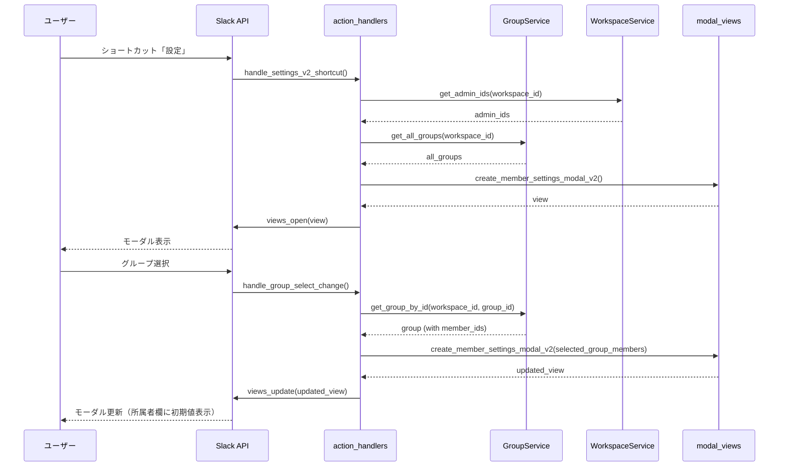
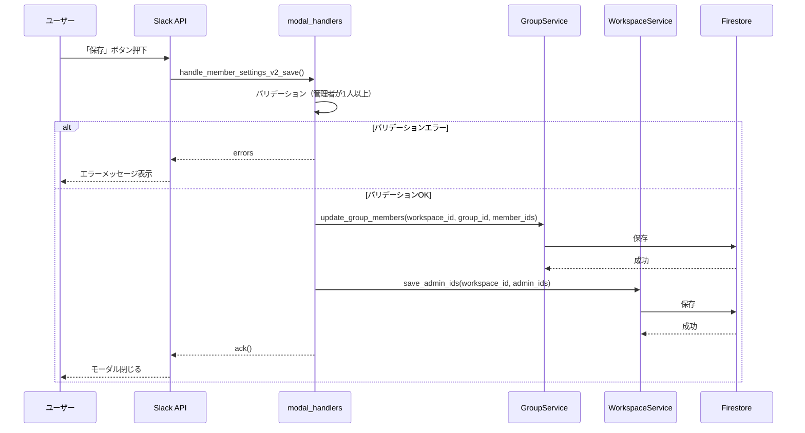
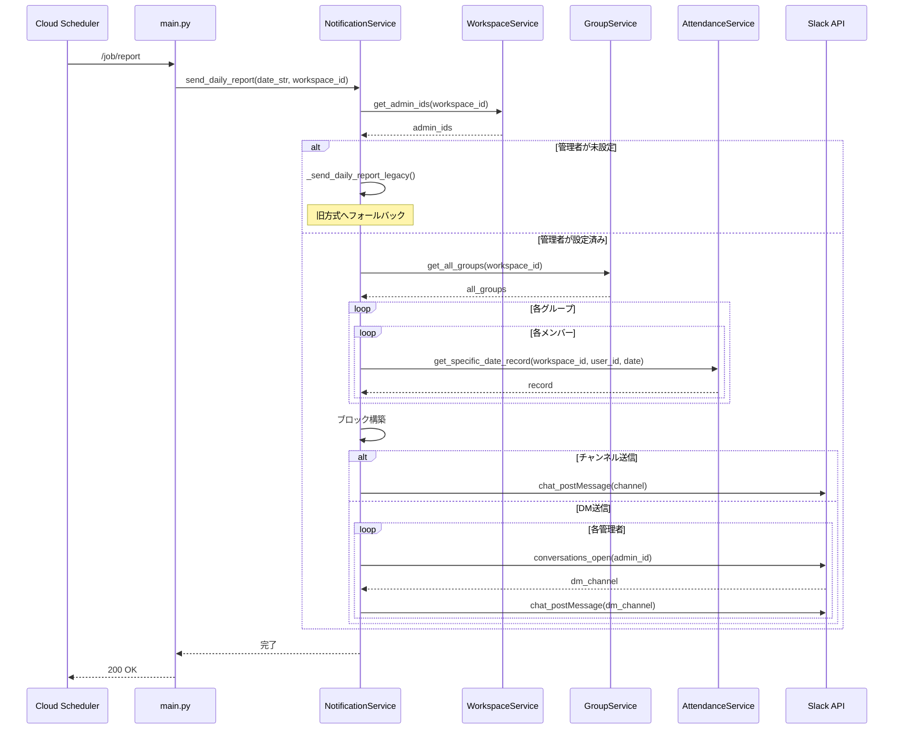

# v2.0 設定機能刷新 - 実装完了サマリー

## 概要

`docs/spec_v2.0.md` に基づき、既存の固定的な設定構造を廃止し、動的なグループ管理機能を実装しました。

## 実装日時

2026-01-21

## 主な変更点

### 1. 新規サービスの追加

#### A. GroupService (`resources/services/group_service.py`)

**目的**: 動的なグループ（課）の管理機能を提供

**主要メソッド**:
- `get_all_groups(workspace_id)`: ワークスペース内の全グループを取得
- `get_group_by_id(workspace_id, group_id)`: 特定のグループを取得
- `create_group(workspace_id, name, member_ids, created_by)`: 新しいグループを作成
- `update_group_members(workspace_id, group_id, member_ids)`: グループのメンバーを更新
- `delete_group(workspace_id, group_id)`: グループを削除（v2.1で実装予定）

**Firestoreパス**: `groups/{workspace_id}/groups/{group_id}`

**ドキュメント構造**:
```json
{
  "group_id": "group_a1b2c3d4",
  "name": "営業1課",
  "member_ids": ["U001", "U002", "U003"],
  "created_at": "2026-01-21T10:00:00",
  "updated_at": "2026-01-21T10:00:00",
  "created_by": "U000" // オプション
}
```

#### B. WorkspaceService (`resources/services/workspace_service.py`)

**目的**: ワークスペース全体の設定（管理者など）を管理

**主要メソッド**:
- `get_admin_ids(workspace_id)`: 管理者IDを取得
- `save_admin_ids(workspace_id, admin_ids)`: 管理者IDを保存
- `get_workspace_settings(workspace_id)`: ワークスペース設定をすべて取得

**Firestoreパス**: `workspace_settings/{workspace_id}`

**ドキュメント構造**:
```json
{
  "workspace_id": "T01234567",
  "admin_ids": ["U001", "U002"],
  "report_channel_id": "C01234567", // オプション
  "updated_at": "2026-01-21T10:00:00"
}
```

### 2. UI層の拡張

#### 新モーダル関数: `create_member_settings_modal_v2()`

**場所**: `resources/views/modal_views.py`

**特徴**:
- 動的なグループ選択（既存グループ + "➕ 新規グループを追加"）
- グループ選択に応じて所属者の初期値（`initial_users`）を切り替え
- 管理者の複数選択
- `private_metadata` に選択中のグループIDを保存

**引数**:
- `admin_ids`: 現在の管理者のユーザーID配列
- `all_groups`: 全グループ情報の配列
- `selected_group_id`: 現在選択されているグループID（初回はNone）
- `selected_group_members`: 選択されているグループのメンバーID配列

### 3. ハンドラー層の拡張

#### A. action_handlers.py

**追加されたハンドラー**:

1. `handle_settings_v2_shortcut()` - ショートカット: `open_member_setup_modal`
   - v2.0設定モーダルを開く
   - 管理者とグループ情報を取得して表示

2. `handle_group_select_change()` - アクション: `group_select_action`
   - グループ選択時の動的更新
   - "➕ 新規グループを追加" の場合は新規グループを作成
   - 選択されたグループのメンバーを取得し、モーダルを `views.update` で更新

#### B. modal_handlers.py

**追加されたハンドラー**:

1. `handle_member_settings_v2_save()` - callback_id: `member_settings_v2`
   - 管理者とグループメンバーの保存処理
   - バリデーション: 管理者が少なくとも1人必要
   - グループが選択されている場合のみメンバーを更新

### 4. 通知サービスの刷新

#### `send_daily_report()` のv2.0対応

**変更点**:
- `workspace_id` を引数として受け取る
- WorkspaceServiceから管理者IDを取得
- GroupServiceから全グループを取得
- グループごとにメンバーの勤怠記録を集約してレポート生成
- 管理者にDMまたは指定チャンネルに送信

**フォールバック機能**:
- 管理者またはグループが設定されていない場合、旧方式（`_send_daily_report_legacy()`）へフォールバック
- 既存の機能を壊さない互換性を維持

### 5. エントリポイントの更新

#### main.py

**変更点**:
- Cloud Schedulerからのレポート実行時に `workspace_id` を渡すように修正
- 環境変数 `SLACK_WORKSPACE_ID` から取得（デフォルト: "GLOBAL_WS"）

```python
workspace_id = os.environ.get("SLACK_WORKSPACE_ID", "GLOBAL_WS")
notification_service.send_daily_report(today_str, workspace_id)
```

### 6. サービスのエクスポート

#### resources/services/__init__.py

**追加されたエクスポート**:
- `GroupService`
- `WorkspaceService`

## データモデルの変更

### 新規コレクション

#### 1. `groups/{workspace_id}/groups/{group_id}`

各ワークスペースのグループ情報を格納します。

#### 2. `workspace_settings/{workspace_id}`

各ワークスペースの設定（管理者など）を格納します。

### 旧データモデルとの関係

- 旧方式の `system_metadata/member_config` は廃止予定ですが、互換性のため引き続き動作します
- v2.0の設定が存在しない場合、自動的に旧方式にフォールバックします
- 段階的な移行が可能な設計になっています

## 処理フロー

### 設定モーダルの表示と更新



### 設定の保存



### 9:00レポートの送信（v2.0版）



## テスト項目

### 必須テスト

1. **設定モーダルの表示**
   - [ ] グローバルショートカット「設定」でモーダルが開く
   - [ ] 既存のグループが選択肢に表示される
   - [ ] 「➕ 新規グループを追加」が表示される

2. **グループ選択の動的更新**
   - [ ] グループを選択すると、所属者欄にメンバーが初期表示される
   - [ ] 別のグループを選択すると、所属者欄が切り替わる
   - [ ] 「➕ 新規グループを追加」を選択すると、新規グループが作成される

3. **設定の保存**
   - [ ] 管理者が未選択の場合、エラーメッセージが表示される
   - [ ] 管理者とメンバーを選択して「保存」すると、Firestoreに保存される
   - [ ] 保存後、モーダルが閉じる

4. **9:00レポートの送信**
   - [ ] v2.0設定（管理者+グループ）がある場合、グループ単位でレポートが生成される
   - [ ] 管理者にDMまたはチャンネルに送信される
   - [ ] v2.0設定がない場合、旧方式でレポートが送信される

5. **既存機能の互換性**
   - [ ] 勤怠投稿機能（AI解析など）が正常に動作する
   - [ ] 履歴表示機能が正常に動作する
   - [ ] 旧方式のメンバー設定モーダルも引き続き動作する（削除していない場合）

### 推奨テスト

6. **エラーハンドリング**
   - [ ] Firestore接続エラー時、適切なログが出力される
   - [ ] グループが存在しない場合、適切なエラーメッセージが表示される

7. **パフォーマンス**
   - [ ] 大量のグループ（10+）がある場合でもモーダルが正常に表示される
   - [ ] 大量のメンバー（50+）がいる場合でもレポートが正常に生成される

## 既知の制限事項と今後の拡張

### v2.0での制限

1. **グループ名の編集**: 未実装（v2.1で追加予定）
2. **グループの削除**: 未実装（v2.1で追加予定）
3. **グループ名の重複チェック**: 未実装（v2.1で追加予定）
4. **楽観的ロック**: 未実装（将来的に追加予定）

### v2.1以降での拡張予定

1. **グループ名の編集機能**
   - モーダル内でグループ名を編集可能にする
   - 入力欄を追加し、`update_group_name()` メソッドを実装

2. **グループの削除機能**
   - 削除確認モーダルを表示
   - `delete_group()` メソッドの実装を完了

3. **グループ名の重複チェック**
   - `create_group()` および `update_group_name()` でチェック
   - 重複時はエラーメッセージを表示

4. **レポート送信先の柔軟な設定**
   - ワークスペース設定に `report_channel_id` フィールドを追加済み
   - UIでチャンネル選択機能を追加

5. **グループのアーカイブ機能**
   - 削除ではなくアーカイブ（非表示）にする機能
   - `is_archived` フィールドを追加

## 環境変数

### 必須

- `SLACK_BOT_TOKEN`: Slackボットトークン
- `SLACK_SIGNING_SECRET`: Slack署名検証シークレット

### オプション

- `SLACK_WORKSPACE_ID`: ワークスペースID（デフォルト: "GLOBAL_WS"）
- `REPORT_CHANNEL_ID`: レポート送信先チャンネルID（未設定の場合は管理者DM）

## マイグレーション

### 旧方式からv2.0への移行

1. **段階的移行**
   - v2.0を実装しても、旧方式のデータは削除しない
   - v2.0設定が存在しない場合、自動的に旧方式にフォールバック
   - ユーザーが任意のタイミングでv2.0設定を作成可能

2. **データ移行スクリプト（必要に応じて作成）**
   - 旧 `system_metadata/member_config` から v2.0の `groups` へデータを移行
   - v2.2以降で実装予定

## 補足

### Firestoreインデックス

v2.0では新しいクエリは追加されていないため、追加のインデックスは不要です。

### セキュリティ

- グループの作成・編集は認証されたSlackユーザーのみが実行可能
- `workspace_id` によるデータ隔離が徹底されている
- 将来的には、管理者権限チェックを追加することを推奨

### ログ

- すべての主要操作でログを出力
- エラー時は `exc_info=True` で詳細なスタックトレースを記録
- Cloud Loggingで確認可能

## 実装完了日

2026-01-21

## 実装者

AI Assistant (Claude Sonnet 4.5)

## レビュー状況

- [ ] コードレビュー完了
- [ ] 単体テスト実施
- [ ] 統合テスト実施
- [ ] 本番環境デプロイ
