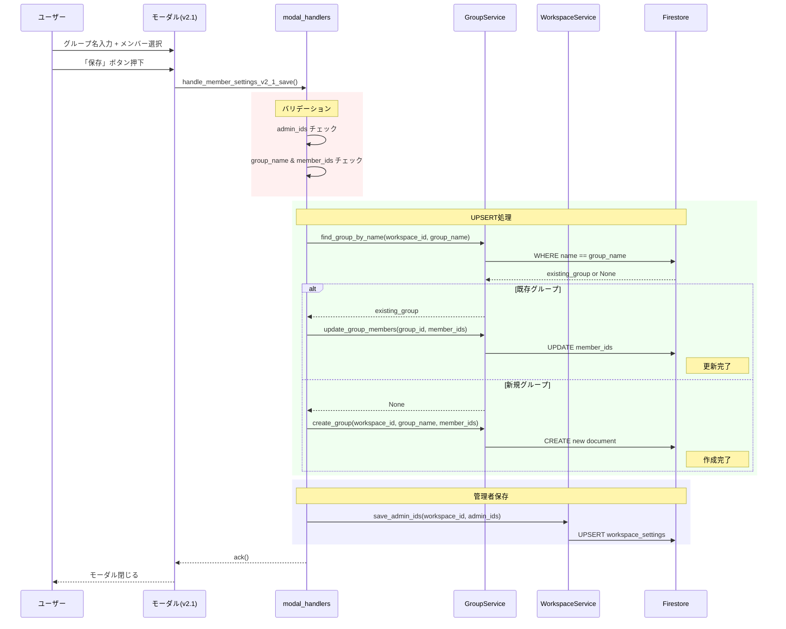

# v2.1 設定UI完全刷新 - 実装完了サマリー

## 概要

`docs/spec_v2.1.md` に基づき、v2.0のグループ選択ドロップダウン方式から、テキスト入力によるUPSERT方式へ完全に刷新しました。

## 実装日時

2026-01-21

## v2.0からの主な変更点

### UI/UXの改善

| 項目 | v2.0 | v2.1 | 改善効果 |
|------|------|------|---------|
| **グループ選択** | ドロップダウン | テキスト入力 | 直感的な操作 |
| **新規作成** | 「➕ 新規追加」選択 | グループ名入力で自動判定 | 操作ステップ削減 |
| **グループ一覧** | 選択肢のみ | モーダル内に常時表示 | 視認性向上 |
| **動的更新** | `views.update` 必須 | 不要 | 実装複雑度低減 |
| **callback_id** | `member_settings_v2` | `member_settings_v2_1` | バージョン識別 |

### 技術的な改善

| 項目 | v2.0 | v2.1 | 効果 |
|------|------|------|------|
| **アクションハンドラー** | `group_select_action` 必須 | 不要 | コード削減 |
| **モーダル更新** | 動的更新ロジック必要 | 不要 | バグリスク低減 |
| **UPSERT判定** | 手動（特殊値判定） | 自動（グループ名検索） | 保守性向上 |
| **Firestoreクエリ** | - | `WHERE name ==` 追加 | 検索機能拡張 |

## 実装した変更内容

### 1. サービス層の拡張

#### A. GroupService (`resources/services/group_service.py`)

**新規メソッド**: `find_group_by_name()`

```python
def find_group_by_name(self, workspace_id: str, name: str) -> Optional[Dict[str, Any]]:
    """
    グループ名でグループを検索します（v2.1で追加）。
    
    Returns:
        グループ情報の辞書（存在しない場合はNone）
    """
```

**機能**:
- グループ名（完全一致）でFirestoreを検索
- UPSERT処理の判定に使用
- 前後の空白を自動トリム

**Firestoreクエリ**:
```python
query = groups_ref.where("name", "==", name.strip()).limit(1)
```

**インデックス要件**:
- コレクション: `groups`
- フィールド: `name` (Ascending)
- 初回実行時に自動作成URLが表示されます

### 2. UI層の刷新

#### A. modal_views.py (`resources/views/modal_views.py`)

**新規関数**:

1. **`_generate_groups_list_text()`**

```python
def _generate_groups_list_text(groups: List[Dict[str, Any]]) -> str:
    """
    登録済みグループ一覧のテキストを生成します。
    
    Returns:
        • 営業1課 (3人)
        • 営業2課 (5人)
        • 開発課 (8人)
    """
```

**機能**:
- グループ名とメンバー数を箇条書きで表示
- グループが0件の場合: `_まだグループが登録されていません_`

2. **`create_member_settings_modal_v2_1()`**

```python
def create_member_settings_modal_v2_1(
    admin_ids: List[str],
    all_groups: List[Dict[str, Any]]
) -> Dict[str, Any]:
    """
    v2.1の設定モーダルを生成します（テキスト入力版・UPSERT方式）。
    """
```

**変更点**:
- グループ選択ドロップダウン → テキスト入力フィールド
- 登録済みグループ一覧を `context` ブロックで常時表示
- `private_metadata` が不要に（動的更新なし）
- `optional: True` でグループ名とメンバーを任意入力に

**Block構成**:
```json
{
  "blocks": [
    { "type": "input", "block_id": "admin_users_block" },      // 管理者選択
    { "type": "context" },                                      // 説明文
    { "type": "divider" },
    { "type": "section", "text": "登録済みグループ:" },       // 見出し
    { "type": "context", "block_id": "registered_groups_list" }, // 一覧表示
    { "type": "divider" },
    { "type": "section", "text": "グループを作成・更新する" },
    { "type": "input", "block_id": "group_name_input_block" }, // テキスト入力
    { "type": "context" },                                      // UPSERT説明
    { "type": "input", "block_id": "target_members_block" }    // メンバー選択
  ]
}
```

### 3. ハンドラー層の更新

#### A. action_handlers.py (`resources/handlers/action_handlers.py`)

**変更内容**:

1. **インポートの追加**:
```python
from resources.views.modal_views import (
    ...
    create_member_settings_modal_v2_1,  # 追加
    ...
)
```

2. **ショートカットハンドラーの更新**:

**関数名**: `handle_settings_v2_shortcut()` → `handle_settings_v2_1_shortcut()`

```python
@app.shortcut("open_member_setup_modal")
def handle_settings_v2_1_shortcut(ack, body, client):
    """
    グローバルショートカット「設定」の処理（v2.1版）。
    
    v2.0との違い:
    - グループ選択のドロップダウンを廃止
    - 動的更新が不要になったため、シンプルな実装
    """
    # v2.1モーダルを生成
    view = create_member_settings_modal_v2_1(
        admin_ids=admin_ids,
        all_groups=all_groups
    )
```

**変更点**:
- `selected_group_id` と `selected_group_members` 引数が不要に
- シンプルな2引数のみ

3. **グループ選択ハンドラーの非推奨化**:

```python
@app.action("group_select_action")
def handle_group_select_change(ack, body, client):
    """
    v2.0のみで使用。v2.1では不要。
    """
```

**Note**: v2.0との互換性のため削除せず残存。将来削除予定。

#### B. modal_handlers.py (`resources/handlers/modal_handlers.py`)

**新規ハンドラー**: `handle_member_settings_v2_1_save()`

```python
@app.view("member_settings_v2_1")
def handle_member_settings_v2_1_save(ack, body, view):
    """
    v2.1設定モーダルの「保存」ボタン押下時の処理。
    
    v2.0との違い:
    - グループ名をテキスト入力から取得
    - find_group_by_name() で既存グループを検索
    - UPSERT処理（既存なら更新、新規なら作成）
    """
```

**処理フロー**:

```
1. 入力値の取得
   ├─ admin_ids: 管理者のユーザーID配列
   ├─ group_name: グループ名（テキスト入力、trim処理）
   └─ member_ids: メンバーのユーザーID配列

2. バリデーション
   ├─ admin_ids が空 → エラー
   └─ group_name が空 & member_ids あり → エラー

3. グループのUPSERT
   ├─ find_group_by_name(workspace_id, group_name)
   │   ├─ 既存グループあり → update_group_members()
   │   └─ 既存グループなし → create_group()
   └─ group_name が空 → スキップ（管理者のみ保存）

4. 管理者の保存
   └─ save_admin_ids(workspace_id, admin_ids)

5. 成功
   └─ ack() でモーダルを閉じる
```

**エラーハンドリング**:
- `ValidationError`: ユーザー向けエラーメッセージを表示
- その他の例外: ログ出力してモーダルを閉じる

## データフロー図

### 設定保存のUPSERTフロー



## v2.0コードの残存と互換性

### 残存するv2.0コード

以下のコードは互換性のため残存していますが、将来的に削除予定です：

1. **`create_member_settings_modal_v2()`** - modal_views.py
   - v2.0のモーダル生成関数
   - v2.1で使用されていません

2. **`handle_group_select_change()`** - action_handlers.py
   - v2.0のグループ選択アクションハンドラー
   - v2.1では不要（コメントで明記）

3. **`handle_member_settings_v2_save()`** - modal_handlers.py
   - v2.0の保存ハンドラー
   - callback_id: `member_settings_v2`

### 互換性の保証

- **データ構造**: v2.0とv2.1で `groups` コレクションの構造は同一
- **既存グループ**: v2.0で作成したグループはv2.1でも使用可能
- **段階的移行**: v2.0とv2.1のモーダルは共存可能

## Firestoreインデックスの要件

### 新規インデックス

v2.1で追加されたグループ名検索のため、以下のインデックスが必要です：

**インデックス定義**:
```
コレクションID: groups
フィールド: name (Ascending), __name__ (Ascending)
クエリスコープ: コレクショングループ
```

### 作成方法

#### 方法1: 自動作成（推奨）

1. アプリを起動してv2.1の設定モーダルで保存を実行
2. Cloud Logsにインデックス作成URLが表示される
3. URLをクリックしてワンクリックで作成

#### 方法2: Firebase Consoleで手動作成

1. Firebase Console > Firestore > インデックス
2. 「複合インデックスを作成」をクリック
3. 上記の定義で作成

## テスト項目

### 必須テスト

#### 1. 設定モーダルの表示
- [ ] ショートカット「設定」でv2.1モーダルが開く
- [ ] 既存の管理者が初期表示される
- [ ] 登録済みグループ一覧が正しく表示される
- [ ] グループが0件の場合「まだ登録されていません」と表示される

#### 2. 新規グループの作成
- [ ] グループ名「テスト課」を入力
- [ ] メンバーを3人選択
- [ ] 「保存」ボタン押下で作成される
- [ ] Firestoreに正しく保存される
- [ ] 再度モーダルを開くと一覧に表示される

#### 3. 既存グループの更新
- [ ] 既存グループ名「テスト課」を入力
- [ ] メンバーを5人に変更
- [ ] 「保存」ボタン押下で更新される
- [ ] Firestoreのmember_idsが上書きされる
- [ ] グループIDは変わらない

#### 4. 管理者のみの保存
- [ ] グループ名を空にする
- [ ] メンバーも選択しない
- [ ] 管理者のみ選択
- [ ] 「保存」ボタン押下で管理者のみ保存される
- [ ] グループは変更されない

#### 5. バリデーション
- [ ] 管理者が未選択の場合、エラーメッセージが表示される
- [ ] グループ名が空でメンバーが選択されている場合、エラーメッセージが表示される
- [ ] エラー後も再入力可能

#### 6. 既存機能の互換性
- [ ] 勤怠投稿機能が正常に動作する
- [ ] AI解析が正常に動作する
- [ ] 履歴表示が正常に動作する
- [ ] 日次レポートがv2.1のグループで正常に生成される

### 推奨テスト

#### 7. エッジケース
- [ ] グループ名に特殊文字（絵文字など）を含む
- [ ] グループ名が非常に長い（100文字以上）
- [ ] メンバーを大量（50人以上）選択
- [ ] Firestoreインデックスが未作成の状態でエラーハンドリング

#### 8. パフォーマンス
- [ ] グループが20個以上ある場合でもモーダルが正常に表示される
- [ ] グループ一覧の表示が遅延しない
- [ ] 保存処理が5秒以内に完了する

## 実装完了チェックリスト

### コード実装

- [x] GroupService.find_group_by_name() 実装
- [x] modal_views._generate_groups_list_text() 実装
- [x] modal_views.create_member_settings_modal_v2_1() 実装
- [x] action_handlers.handle_settings_v2_1_shortcut() 実装
- [x] modal_handlers.handle_member_settings_v2_1_save() 実装
- [x] 関数名の統一確認（extract_attendance_from_text）
- [x] リンターエラーのチェック

### ドキュメント

- [x] spec_v2.1.md 作成
- [x] v2.1_implementation_summary.md 作成
- [x] v2.0コードの非推奨化コメント追加

### 未実施（次のステップ）

- [ ] Firestoreインデックスの作成
- [ ] 統合テストの実施
- [ ] 本番環境へのデプロイ
- [ ] v2.0コードの削除（v2.1安定後）

## 既知の制限事項

### v2.1での制限

1. **グループ名の重複チェック**: 未実装
   - 同じ名前のグループを複数作成できてしまう
   - v2.2で実装予定

2. **グループの削除機能**: 未実装
   - UIから削除できない
   - v2.2で実装予定

3. **グループ名の編集機能**: 未実装
   - グループ名を後から変更できない
   - v2.2で実装予定

4. **楽観的ロック**: 未実装
   - 同時編集時の競合検知なし
   - 将来的に実装予定

## v2.2以降での拡張予定

### 1. グループ削除機能

**UI**:
- 登録済みグループ一覧に「🗑️ 削除」ボタンを追加
- 削除確認モーダルを表示

**実装**:
```python
@app.action("delete_group_button")
def handle_delete_group(ack, body, client):
    # 削除確認モーダルを表示
    ...
```

### 2. グループ名の重複チェック

**実装箇所**: `GroupService.create_group()`

```python
def create_group(self, workspace_id: str, name: str, ...):
    # 重複チェック
    existing = self.find_group_by_name(workspace_id, name)
    if existing:
        raise ValidationError(f"グループ名「{name}」は既に存在します。")
    ...
```

### 3. グループ名の編集機能

**UI**:
- 登録済みグループ一覧に「✏️ 編集」ボタンを追加
- グループ名とメンバーを編集可能なモーダルを表示

**新規メソッド**:
```python
GroupService.update_group_name(workspace_id, group_id, new_name)
```

## 環境変数

### 必須

- `SLACK_BOT_TOKEN`: Slackボットトークン
- `SLACK_SIGNING_SECRET`: Slack署名検証シークレット
- `OPENAI_API_KEY`: OpenAI APIキー

### オプション

- `SLACK_WORKSPACE_ID`: ワークスペースID（デフォルト: "GLOBAL_WS"）
- `REPORT_CHANNEL_ID`: レポート送信先チャンネルID（未設定の場合は管理者DM）

## まとめ

### v2.1の主な成果

1. **実装の簡略化**: 動的更新（`views.update`）が不要になり、コードがシンプルに
2. **UXの向上**: グループ一覧を見ながら入力できるため、操作が直感的に
3. **保守性の向上**: アクションハンドラーが削減され、バグのリスクが低減
4. **機能の拡張**: グループ名検索機能が追加され、将来の機能拡張が容易に

### 次のステップ

1. **Firestoreインデックスの作成**: グループ名検索用
2. **統合テストの実施**: 全テスト項目を実施
3. **本番環境へのデプロイ**: Google Cloud Runにデプロイ
4. **v2.0コードの削除**: v2.1が安定したら削除
5. **v2.2の計画**: グループ削除・編集機能の実装を検討

---

**ドキュメント作成日**: 2026-01-21  
**実装者**: AI Assistant (Claude Sonnet 4.5)  
**実装ステータス**: ✅ 完了（テスト待ち）
